# Manual Tecnico - Practica 2: Red de Hospitales Metropolitano
 
**Nombre:** Jairo Adelso Gomez Hernandez  
**Carnet:** 201902672  
**Curso:** Redes de Computadoras 1  
**Practica:** Practica 2 - Red de Hospitales Metropolitano  
**Repositorio:** `Redes1_1S_2026_201902672/Practica2`  
**Entorno:** Cisco Packet Tracer  
**Archivo Packet Tracer:** `Practica2_201902672.pkt`  
 
---
 
## 1. Resumen Ejecutivo
 
Este manual documenta el diseno, implementacion y validacion de una red LAN de capa 2 para la Practica 2 "Red de Hospitales Metropolitano". La solucion fue desarrollada en **Cisco Packet Tracer** utilizando **switches Cisco 2960-24TT**, con segmentacion por **VLANs**, administracion por **VTP**, prevencion de bucles con **Rapid PVST+**, agregacion de enlaces mediante **EtherChannel con PAgP**, **VLAN nativa 99** para troncales y **VLAN 999** para puertos no utilizados.
 
La topologia adoptada es una **estrella**, con el switch `SW-CORE-201902672` en el centro, que interconecta los switches principales de los 6 hospitales. Cada hospital utiliza **hubs** para representar exactamente la cantidad de **dominios de colision** exigidos por el enunciado. Debido a que el enunciado permite no colocar la totalidad de hosts finales en la topologia, se utilizaron **2 equipos representativos por hub**, pero los calculos de subnetting y capacidad consideran los hosts minimos requeridos.
 
---
 
## 2. Datos de la Practica
 
| Parametro | Valor |
|---|---|
| Carnet | `201902672` |
| Ultimo digito del carnet (X) | `2` |
| Dominio VTP | `201902672` |
| Password VTP | `area1` |
| Modo STP | `Rapid PVST+` |
| VLAN nativa | `99` |
| VLAN blackhole | `999` |
| Topologia | `Estrella` |
| Protocolo EtherChannel | `PAgP` |
| Red base | `192.168.72.0/24` |
 
### 2.1 VLANs definidas por area funcional
 
| VLAN ID | Nombre | Descripcion |
|---:|---|---|
| 12 | QUIROFANOS | Segmento para area de quirofanos |
| 22 | UCI | Segmento para unidad de cuidados intensivos |
| 32 | ADMIN | Segmento administrativo |
| 42 | EMERGENCIAS | Segmento del area de emergencias |
| 99 | NATIVE | VLAN nativa de los troncales |
| 999 | BLACKHOLE | VLAN para puertos no utilizados |
 
---
 
## 3. Hospitales Seleccionados
 
| ID | Hospital | Nombre en topologia | Hosts minimos | DC requeridos |
|---|---|---|---:|---:|
| H1 | Hospital Roosevelt | SW-H1-ROOSEVELT | 63 | 3 |
| H2 | Hospital General San Juan de Dios | SW-H2-SANJUAN | 25 | 2 |
| H3 | Hospital General de Enfermedades IGSS | SW-H3-ENFERMEDADES | 32 | 3 |
| H4 | Hospital de Accidentes Ceibal | SW-H4-CEIBAL | 15 | 2 |
| H5 | Hospital de Gineco-Obstetricia IGSS | SW-H5-GINECO | 26 | 2 |
| H6 | Hospital de Rehabilitacion IGSS | SW-H6-REHABILITACION | 8 | 1 |
 
> **Nota:** En Packet Tracer se muestran 2 equipos representativos por hub. No se colocaron todos los hosts reales exigidos por el enunciado, pero si fueron considerados en el diseno logico, la segmentacion y el subnetting.
 
---
 
## 4. Topologia Utilizada
 
### 4.1 Topologia fisica
 
Se implemento una **topologia estrella**, con el switch `SW-CORE-201902672` en el centro. Desde el core salen enlaces EtherChannel de 3 enlaces fisicos hacia el switch principal de cada hospital.
 
### 4.2 Justificacion tecnica
 
La topologia estrella fue elegida porque:
 
- Centraliza la administracion de VLANs, trunks y STP en un unico punto.
- Facilita el control del Root Bridge desde el SW-CORE para todas las VLANs.
- Simplifica el diagnostico de fallos por hospital.
- Permite aplicar EtherChannel de forma ordenada entre el core y cada hospital.
- Es escalable: agregar un nuevo hospital solo requiere conectarlo al CORE.
 
### 4.3 Topologia completa
 
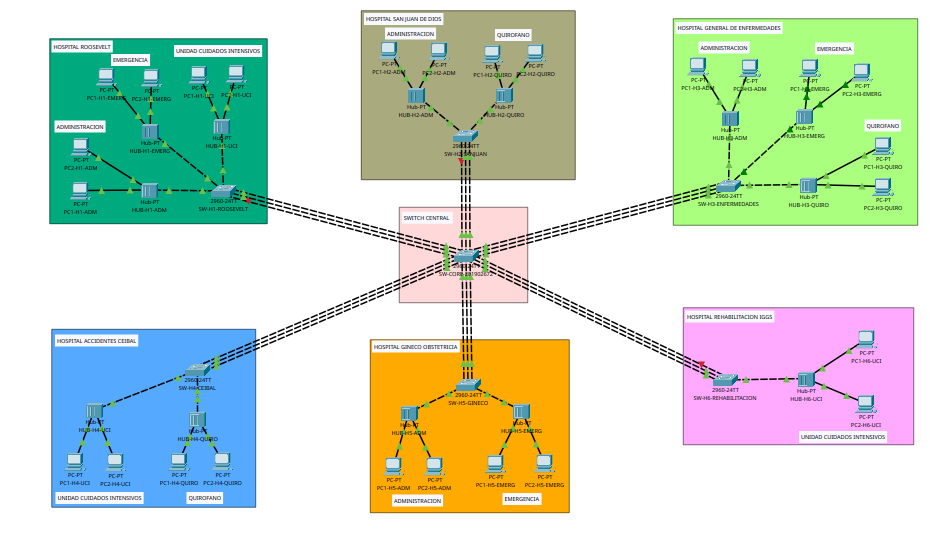
 
### 4.4 Topologia por hospital
 
#### H1 - Hospital Roosevelt
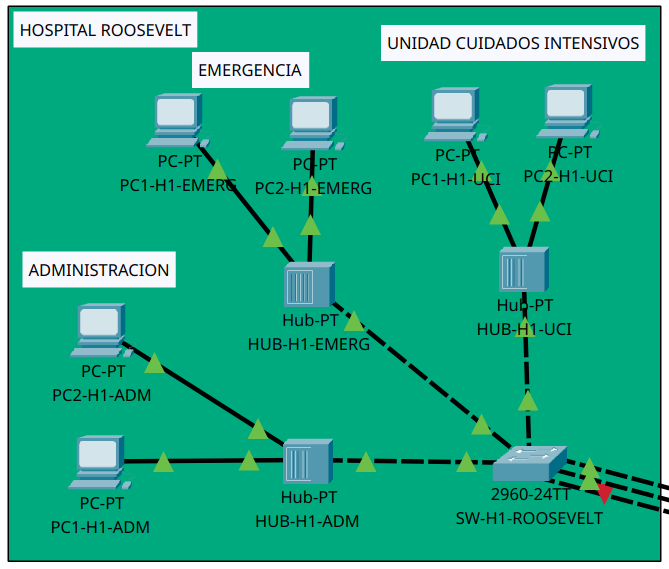
 
#### H2 - Hospital San Juan de Dios
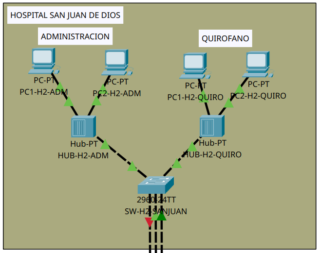
 
#### H3 - Hospital de Enfermedades IGSS
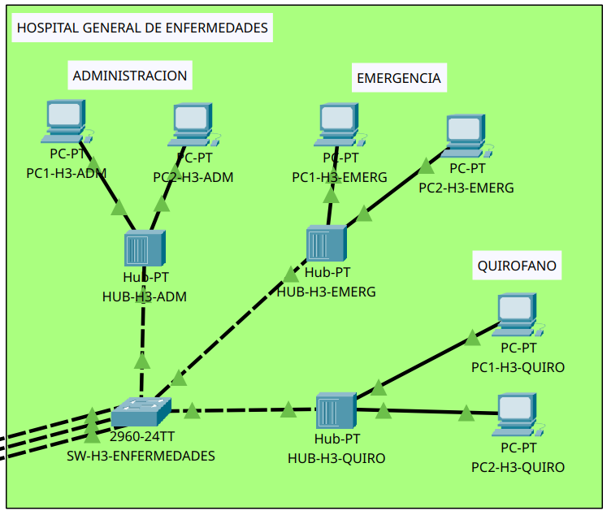
 
#### H4 - Hospital Accidentes Ceibal
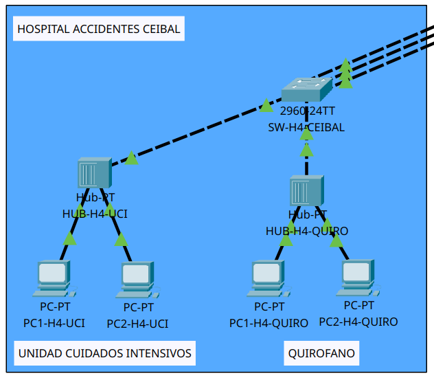
 
#### H5 - Hospital Gineco-Obstetricia IGSS
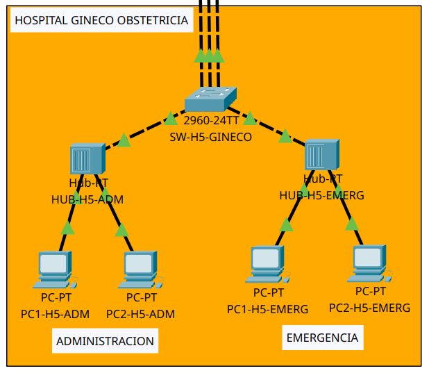
 
#### H6 - Hospital Rehabilitacion IGSS
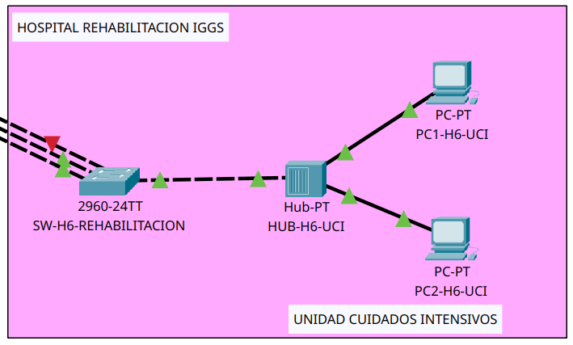
 
---
 
## 5. Inventario de Equipos
 
### 5.1 Switches
 
| Dispositivo | Nombre en topologia | Rol |
|---|---|---|
| Cisco 2960-24TT | SW-CORE-201902672 | Core / VTP Server / Root Bridge |
| Cisco 2960-24TT | SW-H1-ROOSEVELT | Hospital 1 / VTP Client |
| Cisco 2960-24TT | SW-H2-SANJUAN | Hospital 2 / VTP Client |
| Cisco 2960-24TT | SW-H3-ENFERMEDADES | Hospital 3 / VTP Client |
| Cisco 2960-24TT | SW-H4-CEIBAL | Hospital 4 / VTP Client |
| Cisco 2960-24TT | SW-H5-GINECO | Hospital 5 / VTP Client |
| Cisco 2960-24TT | SW-H6-REHABILITACION | Hospital 6 / VTP Client |
 
### 5.2 Hubs y PCs representativas
 
| Hospital | Switch | Hubs | Nombre de Hubs | PCs representativas |
|---|---|---:|---|---:|
| H1 | SW-H1-ROOSEVELT | 3 | HUB-H1-ADM, HUB-H1-UCI, HUB-H1-EMERG | 6 |
| H2 | SW-H2-SANJUAN | 2 | HUB-H2-ADM, HUB-H2-QUIR | 4 |
| H3 | SW-H3-ENFERMEDADES | 3 | HUB-H3-ADM, HUB-H3-EMERG, HUB-H3-QUIR | 6 |
| H4 | SW-H4-CEIBAL | 2 | HUB-H4-UCI, HUB-H4-QUIR | 4 |
| H5 | SW-H5-GINECO | 2 | HUB-H5-ADM, HUB-H5-EMERG | 4 |
| H6 | SW-H6-REHABILITACION | 1 | HUB-H6-UCI | 2 |
| **Total** | **7** | **13** | | **26** |
 
---
 
## 6. Cableado y Medios Utilizados
 
### 6.1 Criterio de cableado — Estandar TIA/EIA-568B
 
| Enlace | Tipo de cable | Justificacion |
|---|---|---|
| SW-CORE ↔ SW-Hx (EtherChannel) | **Copper Cross-Over** | Switch a Switch (MDI-X a MDI-X) |
| SW-Hx ↔ Hub | **Copper Cross-Over** | Switch (MDI-X) a Hub (MDI) |
| Hub ↔ PC | **Copper Straight-Through** | Hub (MDI) a PC (NIC MDI) |
 
### 6.2 Segmentos principales
 
| Segmento | Tipo de enlace | Descripcion |
|---|---|---|
| SW-CORE-201902672 ↔ SW-H1-ROOSEVELT | EtherChannel (3 crossover) | Backbone hacia Hospital Roosevelt |
| SW-CORE-201902672 ↔ SW-H2-SANJUAN | EtherChannel (3 crossover) | Backbone hacia Hospital San Juan |
| SW-CORE-201902672 ↔ SW-H3-ENFERMEDADES | EtherChannel (3 crossover) | Backbone hacia Hospital Enfermedades |
| SW-CORE-201902672 ↔ SW-H4-CEIBAL | EtherChannel (3 crossover) | Backbone hacia Hospital Ceibal |
| SW-CORE-201902672 ↔ SW-H5-GINECO | EtherChannel (3 crossover) | Backbone hacia Hospital Gineco |
| SW-CORE-201902672 ↔ SW-H6-REHABILITACION | EtherChannel (3 crossover) | Backbone hacia Hospital Rehabilitacion |
| SW-Hx ↔ Hub | 1 crossover por hub | Segmento de cada area funcional |
| Hub ↔ 2 PCs | 2 straight-through por hub | Hosts representativos por dominio |
 
---
 
## 7. Dominios de Colision por Hospital
 
Cada **hub** representa un dominio de colision compartido entre todos sus puertos. Cada puerto de un **switch** es un dominio de colision independiente.
 
| Hospital | Switch | Hubs | Dominios de colision logrados | Requeridos |
|---|---|---:|---:|---:|
| H1 Roosevelt | SW-H1-ROOSEVELT | 3 | 3 | 3  |
| H2 San Juan | SW-H2-SANJUAN | 2 | 2 | 2  |
| H3 Enfermedades | SW-H3-ENFERMEDADES | 3 | 3 | 3  |
| H4 Ceibal | SW-H4-CEIBAL | 2 | 2 | 2  |
| H5 Gineco | SW-H5-GINECO | 2 | 2 | 2  |
| H6 Rehabilitacion | SW-H6-REHABILITACION | 1 | 1 | 1  |
 
### 7.1 Detalle de hubs por hospital y VLAN asignada
 
| Hospital | Hub | Puerto en switch | VLAN asignada |
|---|---|---|---|
| H1 | HUB-H1-ADM | fa0/4 | 32 - ADMIN |
| H1 | HUB-H1-UCI | fa0/5 | 22 - UCI |
| H1 | HUB-H1-EMERG | fa0/6 | 42 - EMERGENCIAS |
| H2 | HUB-H2-ADM | fa0/4 | 32 - ADMIN |
| H2 | HUB-H2-QUIR | fa0/5 | 12 - QUIROFANOS |
| H3 | HUB-H3-ADM | fa0/4 | 32 - ADMIN |
| H3 | HUB-H3-EMERG | fa0/5 | 42 - EMERGENCIAS |
| H3 | HUB-H3-QUIR | fa0/6 | 12 - QUIROFANOS |
| H4 | HUB-H4-UCI | fa0/4 | 22 - UCI |
| H4 | HUB-H4-QUIR | fa0/5 | 12 - QUIROFANOS |
| H5 | HUB-H5-ADM | fa0/4 | 32 - ADMIN |
| H5 | HUB-H5-EMERG | fa0/5 | 42 - EMERGENCIAS |
| H6 | HUB-H6-UCI | fa0/4 | 22 - UCI |
 
---
 
## 8. Dominios de Broadcast (uno por VLAN)
 
Sin inter-VLAN routing, cada VLAN funciona como un dominio de broadcast independiente.
 
| VLAN | Nombre | Dominios de broadcast | Alcance |
|---:|---|---:|---|
| 12 | QUIROFANOS | 1 | PCs en HUB-H2-QUIR, HUB-H3-QUIR, HUB-H4-QUIR |
| 22 | UCI | 1 | PCs en HUB-H1-UCI, HUB-H4-UCI, HUB-H6-UCI |
| 32 | ADMIN | 1 | PCs en HUB-H1-ADM, HUB-H2-ADM, HUB-H3-ADM, HUB-H5-ADM |
| 42 | EMERGENCIAS | 1 | PCs en HUB-H1-EMERG, HUB-H3-EMERG, HUB-H5-EMERG |
 
Total de dominios de broadcast en la practica: **4**.
 
---
 
## 9. Plan de Subnetting Organizado por Area
 
### 9.1 Justificacion del prefijo /26
 
El hospital con mayor cantidad de hosts es H1-Roosevelt con **63 hosts minimos**. Un prefijo **/26 proporciona exactamente 62 hosts utiles**, siendo la mascara mas eficiente que cubre todos los hospitales. Todas las subredes se alojan dentro de la unica red base `192.168.72.0/24`, garantizando subredes contiguas y eficientes.
 
### 9.2 Tabla de subnetting
 
| VLAN | Area | Red | Mascara | Prefijo | Gateway | Rango usable | Broadcast | Hosts disponibles |
|---:|---|---|---|---|---|---|---|---:|
| 12 | QUIROFANOS | 192.168.72.0 | 255.255.255.192 | /26 | 192.168.72.1 | 192.168.72.2 — 192.168.72.62 | 192.168.72.63 | 62 |
| 22 | UCI | 192.168.72.64 | 255.255.255.192 | /26 | 192.168.72.65 | 192.168.72.66 — 192.168.72.126 | 192.168.72.127 | 62 |
| 32 | ADMIN | 192.168.72.128 | 255.255.255.192 | /26 | 192.168.72.129 | 192.168.72.130 — 192.168.72.190 | 192.168.72.191 | 62 |
| 42 | EMERGENCIAS | 192.168.72.192 | 255.255.255.192 | /26 | 192.168.72.193 | 192.168.72.194 — 192.168.72.254 | 192.168.72.255 | 62 |
| 99 | NATIVE | Sin IP de host | — | — | — | — | — | — |
| 999 | BLACKHOLE | Sin IP de host | — | — | — | — | — | — |
 
 
---
 
## 10. Tabla Completa de Direcciones IP
 
**Mascara universal para todas las PCs:** `255.255.255.192`  
 
### 10.1 VLAN 12 — QUIROFANOS (192.168.72.0/26)
 
| Hospital | Hub | PC | IP | Mascara | Gateway |
|---|---|---|---|---|---|
| H2 - San Juan | HUB-H2-QUIR | PC1-H2-QUIR | 192.168.72.2 | 255.255.255.192 | 192.168.72.1 |
| H2 - San Juan | HUB-H2-QUIR | PC2-H2-QUIR | 192.168.72.3 | 255.255.255.192 | 192.168.72.1 |
| H3 - Enfermedades | HUB-H3-QUIR | PC1-H3-QUIR | 192.168.72.4 | 255.255.255.192 | 192.168.72.1 |
| H3 - Enfermedades | HUB-H3-QUIR | PC2-H3-QUIR | 192.168.72.5 | 255.255.255.192 | 192.168.72.1 |
| H4 - Ceibal | HUB-H4-QUIR | PC1-H4-QUIR | 192.168.72.6 | 255.255.255.192 | 192.168.72.1 |
| H4 - Ceibal | HUB-H4-QUIR | PC2-H4-QUIR | 192.168.72.7 | 255.255.255.192 | 192.168.72.1 |
 
### 10.2 VLAN 22 — UCI (192.168.72.64/26)
 
| Hospital | Hub | PC | IP | Mascara | Gateway |
|---|---|---|---|---|---|
| H1 - Roosevelt | HUB-H1-UCI | PC1-H1-UCI | 192.168.72.66 | 255.255.255.192 | 192.168.72.65 |
| H1 - Roosevelt | HUB-H1-UCI | PC2-H1-UCI | 192.168.72.67 | 255.255.255.192 | 192.168.72.65 |
| H4 - Ceibal | HUB-H4-UCI | PC1-H4-UCI | 192.168.72.68 | 255.255.255.192 | 192.168.72.65 |
| H4 - Ceibal | HUB-H4-UCI | PC2-H4-UCI | 192.168.72.69 | 255.255.255.192 | 192.168.72.65 |
| H6 - Rehabilitacion | HUB-H6-UCI | PC1-H6-UCI | 192.168.72.70 | 255.255.255.192 | 192.168.72.65 |
| H6 - Rehabilitacion | HUB-H6-UCI | PC2-H6-UCI | 192.168.72.71 | 255.255.255.192 | 192.168.72.65 |
 
### 10.3 VLAN 32 — ADMIN (192.168.72.128/26)
 
| Hospital | Hub | PC | IP | Mascara | Gateway |
|---|---|---|---|---|---|
| H1 - Roosevelt | HUB-H1-ADM | PC1-H1-ADM | 192.168.72.131| 255.255.255.192 | 192.168.72.129 |
| H1 - Roosevelt | HUB-H1-ADM | PC2-H1-ADM | 192.168.72.132 | 255.255.255.192 | 192.168.72.129 |
| H2 - San Juan | HUB-H2-ADM | PC1-H2-ADM | 192.168.72.133 | 255.255.255.192 | 192.168.72.129 |
| H2 - San Juan | HUB-H2-ADM | PC2-H2-ADM | 192.168.72.134 | 255.255.255.192 | 192.168.72.129 |
| H3 - Enfermedades | HUB-H3-ADM | PC1-H3-ADM | 192.168.72.135 | 255.255.255.192 | 192.168.72.129 |
| H3 - Enfermedades | HUB-H3-ADM | PC2-H3-ADM | 192.168.72.136 | 255.255.255.192 | 192.168.72.129 |
| H5 - Gineco | HUB-H5-ADM | PC1-H5-ADM | 192.168.72.137 | 255.255.255.192 | 192.168.72.129 |
| H5 - Gineco | HUB-H5-ADM | PC2-H5-ADM | 192.168.72.138 | 255.255.255.192 | 192.168.72.129 |
 
### 10.4 VLAN 42 — EMERGENCIAS (192.168.72.192/26)
 
| Hospital | Hub | PC | IP | Mascara | Gateway |
|---|---|---|---|---|---|
| H1 - Roosevelt | HUB-H1-EMERG | PC1-H1-EMERG | 192.168.72.194 | 255.255.255.192 | 192.168.72.193 |
| H1 - Roosevelt | HUB-H1-EMERG | PC2-H1-EMERG | 192.168.72.195 | 255.255.255.192 | 192.168.72.193 |
| H3 - Enfermedades | HUB-H3-EMERG | PC1-H3-EMERG | 192.168.72.196 | 255.255.255.192 | 192.168.72.193 |
| H3 - Enfermedades | HUB-H3-EMERG | PC2-H3-EMERG | 192.168.72.197 | 255.255.255.192 | 192.168.72.193 |
| H5 - Gineco | HUB-H5-EMERG | PC1-H5-EMERG | 192.168.72.198 | 255.255.255.192 | 192.168.72.193 |
| H5 - Gineco | HUB-H5-EMERG | PC2-H5-EMERG | 192.168.72.199 | 255.255.255.192 | 192.168.72.193 |
 
---
 
## 11. Configuracion Base Comun para Todos los Switches
 
> Ajustar el `hostname` segun el equipo correspondiente.
 
```bash
enable
configure terminal
hostname SW-XXXX
no ip domain-lookup
service password-encryption
enable secret 201902672
banner motd ^C ACCESO SOLO AUTORIZADO - CARNET 201902672 ^C
spanning-tree mode rapid-pvst
 
line console 0
 password 201902672
 login
 exit
 
line vty 0 4
 password 201902672
 login
 exit
end
write memory
```
 
---
 
## 12. Configuracion Aplicada a Cada Switch
 
---
 
### 12.1 SW-CORE-201902672
 
**Rol:** VTP Server | Root Bridge para todas las VLANs | Hub EtherChannel de la estrella
 
```bash
enable
configure terminal
hostname SW-CORE-201902672
no ip domain-lookup
service password-encryption
enable secret 201902672
banner motd ^C ACCESO SOLO AUTORIZADO - CARNET 201902672 ^C
 
! --- VTP Server ---
vtp mode server
vtp domain 201902672
vtp password area1
vtp version 2
 
! --- STP: Root Bridge para todas las VLANs ---
spanning-tree mode rapid-pvst
spanning-tree vlan 12,22,32,42,99 priority 4096
 
! --- VLANs (solo se crean en el Server) ---
vlan 12
 name QUIROFANOS
vlan 22
 name UCI
vlan 32
 name ADMIN
vlan 42
 name EMERGENCIAS
vlan 99
 name NATIVE
vlan 999
 name BLACKHOLE
exit
 
line console 0
 password 201902672
 login
 exit
line vty 0 4
 password 201902672
 login
 exit
 
! --- EtherChannel Po1 hacia SW-H1-ROOSEVELT ---
interface range fa0/1-3
 description Po1-hacia-SW-H1-ROOSEVELT
 switchport mode trunk
 switchport trunk native vlan 99
 switchport trunk allowed vlan 12,22,32,42,99
 channel-group 1 mode desirable
 no shutdown
exit
interface port-channel 1
 description Po1-hacia-SW-H1-ROOSEVELT
 switchport mode trunk
 switchport trunk native vlan 99
 switchport trunk allowed vlan 12,22,32,42,99
 no shutdown
exit
 
! --- EtherChannel Po2 hacia SW-H2-SANJUAN ---
interface range fa0/4-6
 description Po2-hacia-SW-H2-SANJUAN
 switchport mode trunk
 switchport trunk native vlan 99
 switchport trunk allowed vlan 12,22,32,42,99
 channel-group 2 mode desirable
 no shutdown
exit
interface port-channel 2
 description Po2-hacia-SW-H2-SANJUAN
 switchport mode trunk
 switchport trunk native vlan 99
 switchport trunk allowed vlan 12,22,32,42,99
 no shutdown
exit
 
! --- EtherChannel Po3 hacia SW-H3-ENFERMEDADES ---
interface range fa0/7-9
 description Po3-hacia-SW-H3-ENFERMEDADES
 switchport mode trunk
 switchport trunk native vlan 99
 switchport trunk allowed vlan 12,22,32,42,99
 channel-group 3 mode desirable
 no shutdown
exit
interface port-channel 3
 description Po3-hacia-SW-H3-ENFERMEDADES
 switchport mode trunk
 switchport trunk native vlan 99
 switchport trunk allowed vlan 12,22,32,42,99
 no shutdown
exit
 
! --- EtherChannel Po4 hacia SW-H4-CEIBAL ---
interface range fa0/10-12
 description Po4-hacia-SW-H4-CEIBAL
 switchport mode trunk
 switchport trunk native vlan 99
 switchport trunk allowed vlan 12,22,32,42,99
 channel-group 4 mode desirable
 no shutdown
exit
interface port-channel 4
 description Po4-hacia-SW-H4-CEIBAL
 switchport mode trunk
 switchport trunk native vlan 99
 switchport trunk allowed vlan 12,22,32,42,99
 no shutdown
exit
 
! --- EtherChannel Po5 hacia SW-H5-GINECO ---
interface range fa0/13-15
 description Po5-hacia-SW-H5-GINECO
 switchport mode trunk
 switchport trunk native vlan 99
 switchport trunk allowed vlan 12,22,32,42,99
 channel-group 5 mode desirable
 no shutdown
exit
interface port-channel 5
 description Po5-hacia-SW-H5-GINECO
 switchport mode trunk
 switchport trunk native vlan 99
 switchport trunk allowed vlan 12,22,32,42,99
 no shutdown
exit
 
! --- EtherChannel Po6 hacia SW-H6-REHABILITACION ---
interface range fa0/16-18
 description Po6-hacia-SW-H6-REHABILITACION
 switchport mode trunk
 switchport trunk native vlan 99
 switchport trunk allowed vlan 12,22,32,42,99
 channel-group 6 mode desirable
 no shutdown
exit
interface port-channel 6
 description Po6-hacia-SW-H6-REHABILITACION
 switchport mode trunk
 switchport trunk native vlan 99
 switchport trunk allowed vlan 12,22,32,42,99
 no shutdown
exit
 
! --- Puertos no utilizados: VLAN 999 Blackhole ---
interface range fa0/19-24
 description NO_USADO_BLACKHOLE
 switchport mode access
 switchport access vlan 999
 shutdown
exit
interface range gig0/1-2
 description NO_USADO_BLACKHOLE
 switchport mode access
 switchport access vlan 999
 shutdown
exit
 
end
write memory
```
 
#### Evidencia requerida — SW-CORE-201902672
 
```bash
show vtp status
show vlan brief
show interfaces trunk
show etherchannel summary
show spanning-tree
show running-config
```

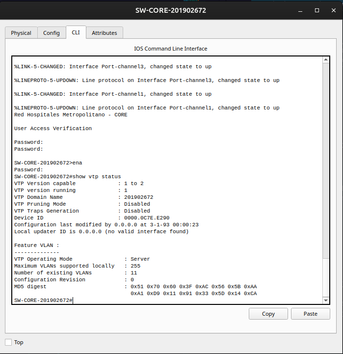
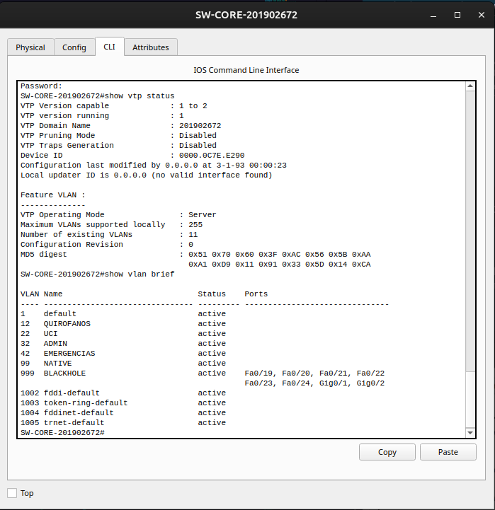
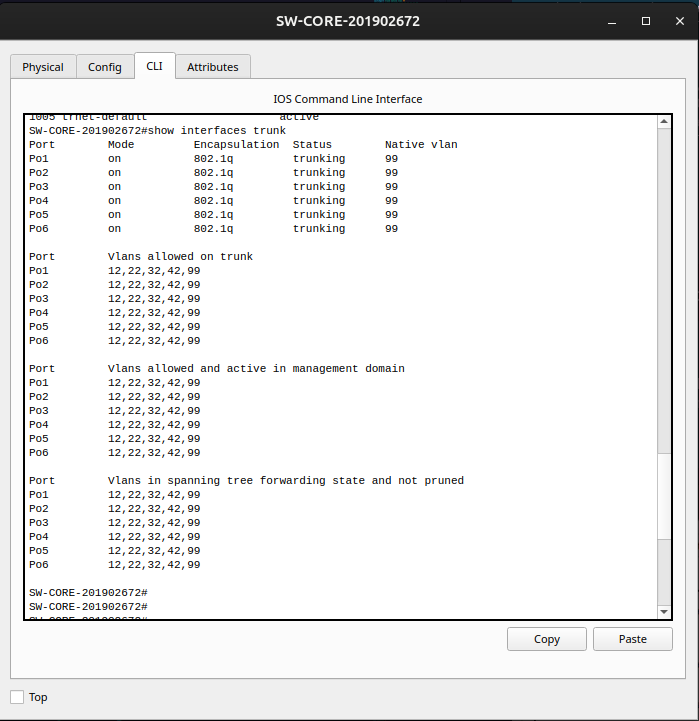
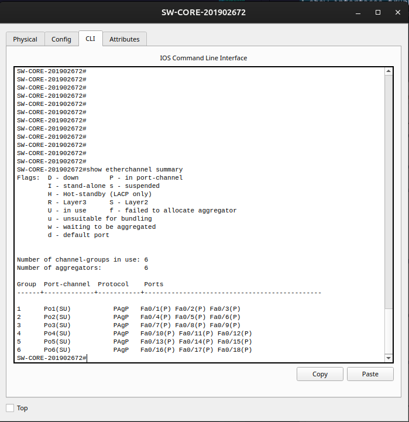
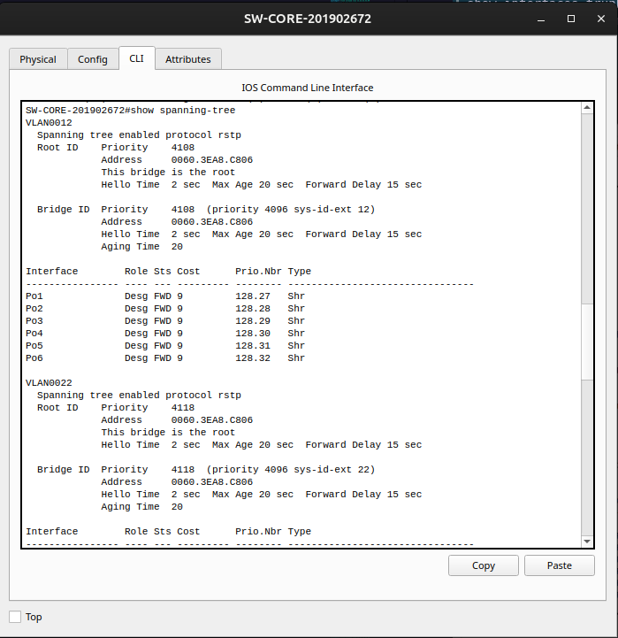
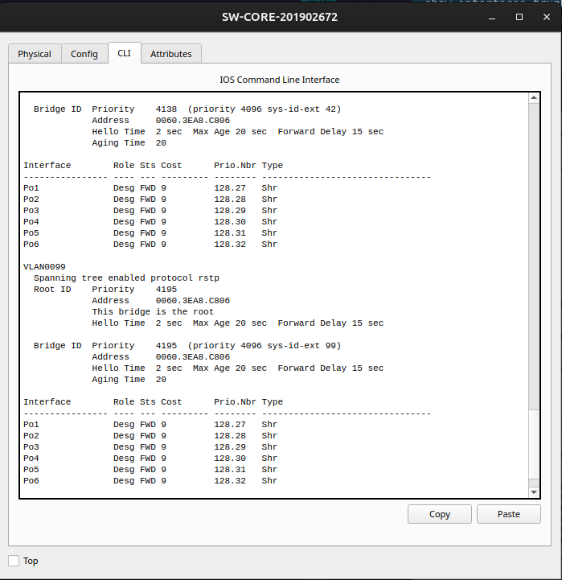

---
 
### 12.2 SW-H1-ROOSEVELT
 
**Rol:** VTP Client | Hospital Roosevelt  
**Hubs conectados:** HUB-H1-ADM (VLAN 32, fa0/4) · HUB-H1-UCI (VLAN 22, fa0/5) · HUB-H1-EMERG (VLAN 42, fa0/6)  
**Dominios de colision:** 3
 
```bash
enable
configure terminal
hostname SW-H1-ROOSEVELT
no ip domain-lookup
service password-encryption
enable secret 201902672
banner motd ^C ACCESO SOLO AUTORIZADO - CARNET 201902672 ^C
 
! --- VTP Client (recibe VLANs del CORE automaticamente) ---
vtp mode client
vtp domain 201902672
vtp password area1
vtp version 2
 
spanning-tree mode rapid-pvst
 
line console 0
 password 201902672
 login
 exit
line vty 0 4
 password 201902672
 login
 exit
 
! --- EtherChannel Po1 hacia SW-CORE-201902672 ---
interface range fa0/1-3
 description Po1-hacia-SW-CORE-201902672
 switchport mode trunk
 switchport trunk native vlan 99
 switchport trunk allowed vlan 12,22,32,42,99
 channel-group 1 mode auto
 no shutdown
exit
interface port-channel 1
 description Po1-hacia-SW-CORE-201902672
 switchport mode trunk
 switchport trunk native vlan 99
 switchport trunk allowed vlan 12,22,32,42,99
 no shutdown
exit
 
! --- Puertos de acceso hacia hubs ---
interface fa0/4
 description HUB-H1-ADM-VLAN32
 switchport mode access
 switchport access vlan 32
 spanning-tree portfast
 no shutdown
exit
interface fa0/5
 description HUB-H1-UCI-VLAN22
 switchport mode access
 switchport access vlan 22
 spanning-tree portfast
 no shutdown
exit
interface fa0/6
 description HUB-H1-EMERG-VLAN42
 switchport mode access
 switchport access vlan 42
 spanning-tree portfast
 no shutdown
exit
 
! --- Puertos no utilizados: VLAN 999 Blackhole ---
interface range fa0/7-24
 description NO_USADO_BLACKHOLE
 switchport mode access
 switchport access vlan 999
 shutdown
exit
interface range gig0/1-2
 description NO_USADO_BLACKHOLE
 switchport mode access
 switchport access vlan 999
 shutdown
exit
 
end
write memory
```
 
#### Evidencia requerida — SW-H1-ROOSEVELT
 
```bash
show vtp status
show vlan brief
show interfaces trunk
show etherchannel summary
show interfaces fa0/4 switchport
show interfaces fa0/5 switchport
show interfaces fa0/6 switchport
show running-config
```

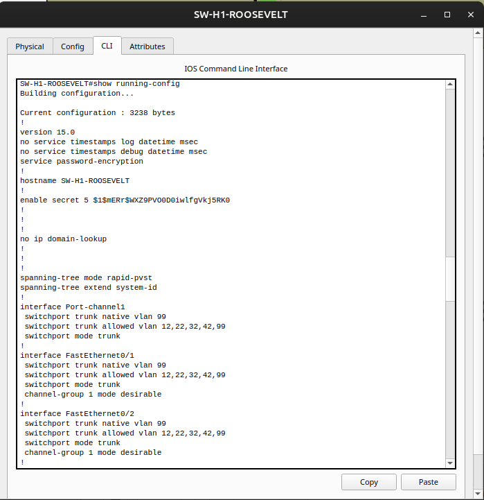
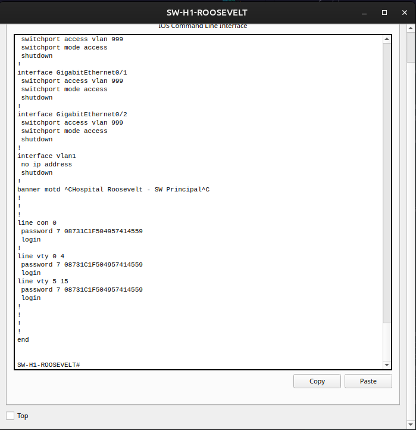
---
 
### 12.3 SW-H2-SANJUAN
 
**Rol:** VTP Client | Hospital San Juan de Dios  
**Hubs conectados:** HUB-H2-ADM (VLAN 32, fa0/4) · HUB-H2-QUIR (VLAN 12, fa0/5)  
**Dominios de colision:** 2
 
```bash
enable
configure terminal
hostname SW-H2-SANJUAN
no ip domain-lookup
service password-encryption
enable secret 201902672
banner motd ^C ACCESO SOLO AUTORIZADO - CARNET 201902672 ^C
 
vtp mode client
vtp domain 201902672
vtp password area1
vtp version 2
 
spanning-tree mode rapid-pvst
 
line console 0
 password 201902672
 login
 exit
line vty 0 4
 password 201902672
 login
 exit
 
! --- EtherChannel Po1 hacia SW-CORE-201902672 ---
interface range fa0/1-3
 description Po1-hacia-SW-CORE-201902672
 switchport mode trunk
 switchport trunk native vlan 99
 switchport trunk allowed vlan 12,22,32,42,99
 channel-group 1 mode auto
 no shutdown
exit
interface port-channel 1
 description Po1-hacia-SW-CORE-201902672
 switchport mode trunk
 switchport trunk native vlan 99
 switchport trunk allowed vlan 12,22,32,42,99
 no shutdown
exit
 
interface fa0/4
 description HUB-H2-ADM-VLAN32
 switchport mode access
 switchport access vlan 32
 spanning-tree portfast
 no shutdown
exit
interface fa0/5
 description HUB-H2-QUIR-VLAN12
 switchport mode access
 switchport access vlan 12
 spanning-tree portfast
 no shutdown
exit
 
interface range fa0/6-24
 description NO_USADO_BLACKHOLE
 switchport mode access
 switchport access vlan 999
 shutdown
exit
interface range gig0/1-2
 description NO_USADO_BLACKHOLE
 switchport mode access
 switchport access vlan 999
 shutdown
exit
 
end
write memory
```
 
#### Evidencia requerida — SW-H2-SANJUAN
 
```bash
show vtp status
show vlan brief
show interfaces trunk
show etherchannel summary
show interfaces fa0/4 switchport
show interfaces fa0/5 switchport
show running-config
```
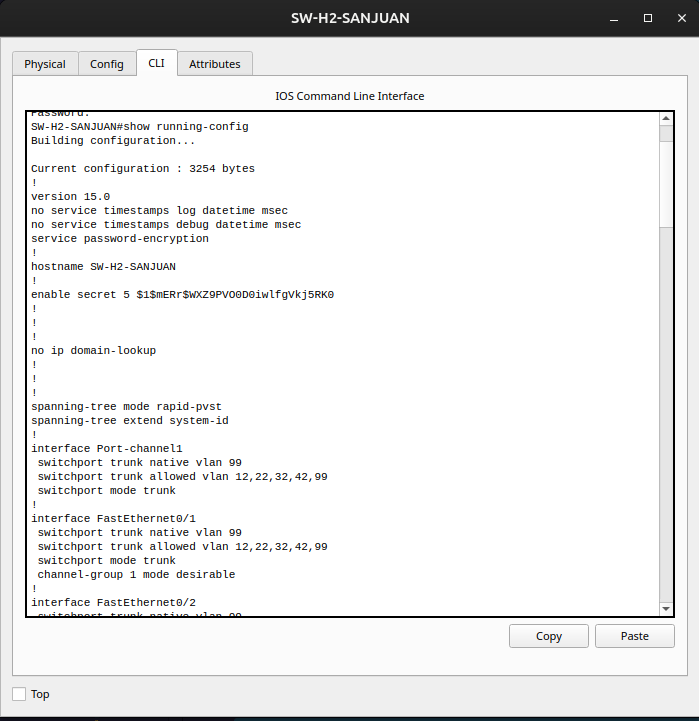
 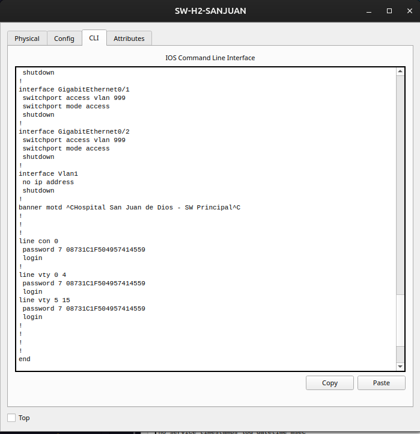
---
 
### 12.4 SW-H3-ENFERMEDADES
 
**Rol:** VTP Client | Hospital de Enfermedades IGSS  
**Hubs conectados:** HUB-H3-ADM (VLAN 32, fa0/4) · HUB-H3-EMERG (VLAN 42, fa0/5) · HUB-H3-QUIR (VLAN 12, fa0/6)  
**Dominios de colision:** 3
 
```bash
enable
configure terminal
hostname SW-H3-ENFERMEDADES
no ip domain-lookup
service password-encryption
enable secret 201902672
banner motd ^C ACCESO SOLO AUTORIZADO - CARNET 201902672 ^C
 
vtp mode client
vtp domain 201902672
vtp password area1
vtp version 2
 
spanning-tree mode rapid-pvst
 
line console 0
 password 201902672
 login
 exit
line vty 0 4
 password 201902672
 login
 exit
 
! --- EtherChannel Po1 hacia SW-CORE-201902672 ---
interface range fa0/1-3
 description Po1-hacia-SW-CORE-201902672
 switchport mode trunk
 switchport trunk native vlan 99
 switchport trunk allowed vlan 12,22,32,42,99
 channel-group 1 mode auto
 no shutdown
exit
interface port-channel 1
 description Po1-hacia-SW-CORE-201902672
 switchport mode trunk
 switchport trunk native vlan 99
 switchport trunk allowed vlan 12,22,32,42,99
 no shutdown
exit
 
interface fa0/4
 description HUB-H3-ADM-VLAN32
 switchport mode access
 switchport access vlan 32
 spanning-tree portfast
 no shutdown
exit
interface fa0/5
 description HUB-H3-EMERG-VLAN42
 switchport mode access
 switchport access vlan 42
 spanning-tree portfast
 no shutdown
exit
interface fa0/6
 description HUB-H3-QUIR-VLAN12
 switchport mode access
 switchport access vlan 12
 spanning-tree portfast
 no shutdown
exit
 
interface range fa0/7-24
 description NO_USADO_BLACKHOLE
 switchport mode access
 switchport access vlan 999
 shutdown
exit
interface range gig0/1-2
 description NO_USADO_BLACKHOLE
 switchport mode access
 switchport access vlan 999
 shutdown
exit
 
end
write memory
```
 
#### Evidencia requerida — SW-H3-ENFERMEDADES
 
```bash
show vtp status
show vlan brief
show interfaces trunk
show etherchannel summary
show interfaces fa0/4 switchport
show interfaces fa0/5 switchport
show interfaces fa0/6 switchport
show running-config
```
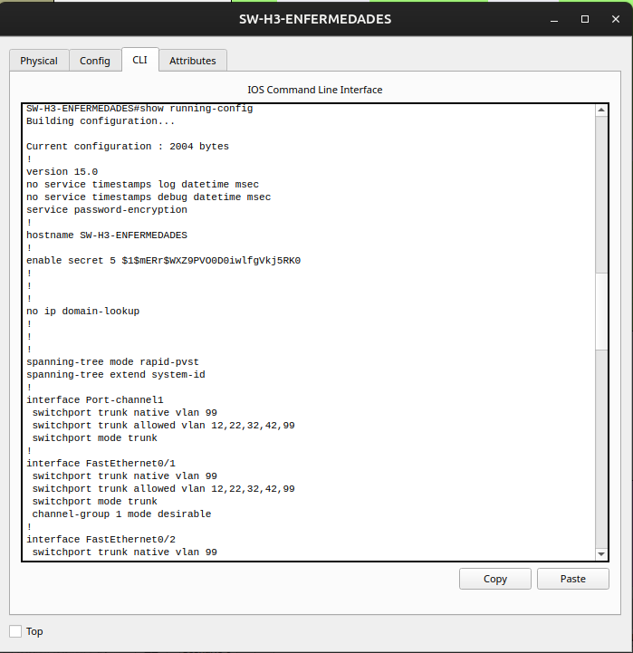
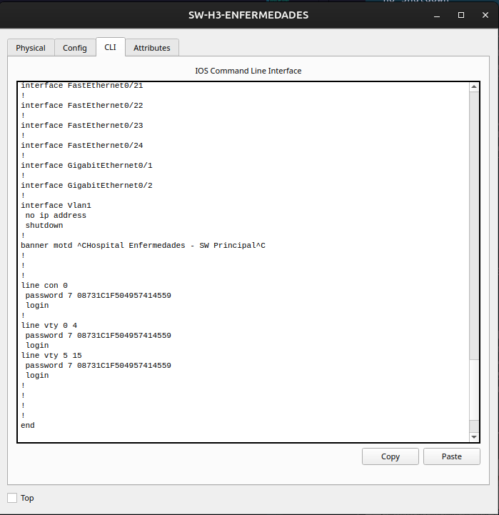
 
---
 
### 12.5 SW-H4-CEIBAL
 
**Rol:** VTP Client | Hospital de Accidentes Ceibal  
**Hubs conectados:** HUB-H4-UCI (VLAN 22, fa0/4) · HUB-H4-QUIR (VLAN 12, fa0/5)  
**Dominios de colision:** 2
 
```bash
enable
configure terminal
hostname SW-H4-CEIBAL
no ip domain-lookup
service password-encryption
enable secret 201902672
banner motd ^C ACCESO SOLO AUTORIZADO - CARNET 201902672 ^C
 
vtp mode client
vtp domain 201902672
vtp password area1
vtp version 2
 
spanning-tree mode rapid-pvst
 
line console 0
 password 201902672
 login
 exit
line vty 0 4
 password 201902672
 login
 exit
 
! --- EtherChannel Po1 hacia SW-CORE-201902672 ---
interface range fa0/1-3
 description Po1-hacia-SW-CORE-201902672
 switchport mode trunk
 switchport trunk native vlan 99
 switchport trunk allowed vlan 12,22,32,42,99
 channel-group 1 mode auto
 no shutdown
exit
interface port-channel 1
 description Po1-hacia-SW-CORE-201902672
 switchport mode trunk
 switchport trunk native vlan 99
 switchport trunk allowed vlan 12,22,32,42,99
 no shutdown
exit
 
interface fa0/4
 description HUB-H4-UCI-VLAN22
 switchport mode access
 switchport access vlan 22
 spanning-tree portfast
 no shutdown
exit
interface fa0/5
 description HUB-H4-QUIR-VLAN12
 switchport mode access
 switchport access vlan 12
 spanning-tree portfast
 no shutdown
exit
 
interface range fa0/6-24
 description NO_USADO_BLACKHOLE
 switchport mode access
 switchport access vlan 999
 shutdown
exit
interface range gig0/1-2
 description NO_USADO_BLACKHOLE
 switchport mode access
 switchport access vlan 999
 shutdown
exit
 
end
write memory
```
 
#### Evidencia requerida — SW-H4-CEIBAL
 
```bash
show vtp status
show vlan brief
show interfaces trunk
show etherchannel summary
show interfaces fa0/4 switchport
show interfaces fa0/5 switchport
show running-config
```

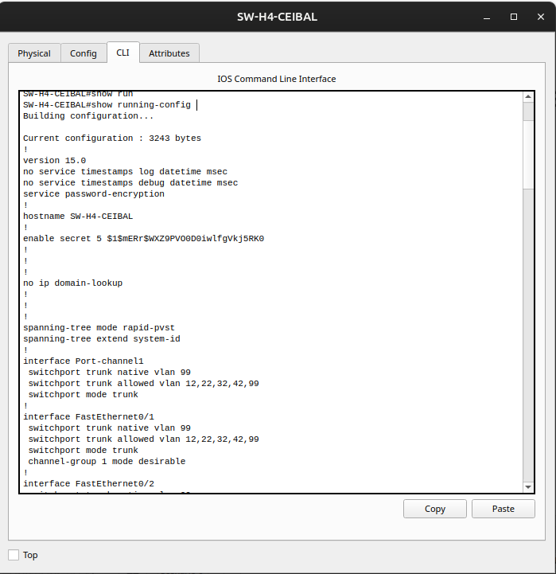

---
 
### 12.6 SW-H5-GINECO
 
**Rol:** VTP Client | Hospital de Gineco-Obstetricia IGSS  
**Hubs conectados:** HUB-H5-ADM (VLAN 32, fa0/4) · HUB-H5-EMERG (VLAN 42, fa0/5)  
**Dominios de colision:** 2
 
```bash
enable
configure terminal
hostname SW-H5-GINECO
no ip domain-lookup
service password-encryption
enable secret 201902672
banner motd ^C ACCESO SOLO AUTORIZADO - CARNET 201902672 ^C
 
vtp mode client
vtp domain 201902672
vtp password area1
vtp version 2
 
spanning-tree mode rapid-pvst
 
line console 0
 password 201902672
 login
 exit
line vty 0 4
 password 201902672
 login
 exit
 
! --- EtherChannel Po1 hacia SW-CORE-201902672 ---
interface range fa0/1-3
 description Po1-hacia-SW-CORE-201902672
 switchport mode trunk
 switchport trunk native vlan 99
 switchport trunk allowed vlan 12,22,32,42,99
 channel-group 1 mode auto
 no shutdown
exit
interface port-channel 1
 description Po1-hacia-SW-CORE-201902672
 switchport mode trunk
 switchport trunk native vlan 99
 switchport trunk allowed vlan 12,22,32,42,99
 no shutdown
exit
 
interface fa0/4
 description HUB-H5-ADM-VLAN32
 switchport mode access
 switchport access vlan 32
 spanning-tree portfast
 no shutdown
exit
interface fa0/5
 description HUB-H5-EMERG-VLAN42
 switchport mode access
 switchport access vlan 42
 spanning-tree portfast
 no shutdown
exit
 
interface range fa0/6-24
 description NO_USADO_BLACKHOLE
 switchport mode access
 switchport access vlan 999
 shutdown
exit
interface range gig0/1-2
 description NO_USADO_BLACKHOLE
 switchport mode access
 switchport access vlan 999
 shutdown
exit
 
end
write memory
```
 
#### Evidencia requerida — SW-H5-GINECO
 
```bash
show vtp status
show vlan brief
show interfaces trunk
show etherchannel summary
show interfaces fa0/4 switchport
show interfaces fa0/5 switchport
show running-config
```

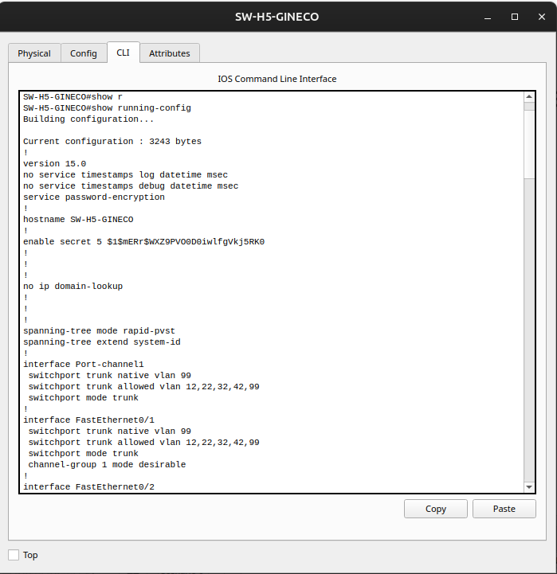
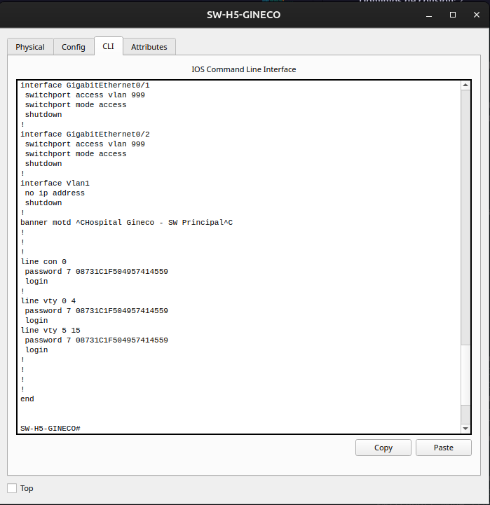
---
 
### 12.7 SW-H6-REHABILITACION
 
**Rol:** VTP Client | Hospital de Rehabilitacion IGSS  
**Hubs conectados:** HUB-H6-UCI (VLAN 22, fa0/4)  
**Dominios de colision:** 1
 
```bash
enable
configure terminal
hostname SW-H6-REHABILITACION
no ip domain-lookup
service password-encryption
enable secret 201902672
banner motd ^C ACCESO SOLO AUTORIZADO - CARNET 201902672 ^C
 
vtp mode client
vtp domain 201902672
vtp password area1
vtp version 2
 
spanning-tree mode rapid-pvst
 
line console 0
 password 201902672
 login
 exit
line vty 0 4
 password 201902672
 login
 exit
 
! --- EtherChannel Po1 hacia SW-CORE-201902672 ---
interface range fa0/1-3
 description Po1-hacia-SW-CORE-201902672
 switchport mode trunk
 switchport trunk native vlan 99
 switchport trunk allowed vlan 12,22,32,42,99
 channel-group 1 mode auto
 no shutdown
exit
interface port-channel 1
 description Po1-hacia-SW-CORE-201902672
 switchport mode trunk
 switchport trunk native vlan 99
 switchport trunk allowed vlan 12,22,32,42,99
 no shutdown
exit
 
interface fa0/4
 description HUB-H6-UCI-VLAN22
 switchport mode access
 switchport access vlan 22
 spanning-tree portfast
 no shutdown
exit
 
interface range fa0/5-24
 description NO_USADO_BLACKHOLE
 switchport mode access
 switchport access vlan 999
 shutdown
exit
interface range gig0/1-2
 description NO_USADO_BLACKHOLE
 switchport mode access
 switchport access vlan 999
 shutdown
exit
 
end
write memory
```
 
#### Evidencia requerida — SW-H6-REHABILITACION
 
```bash
show vtp status
show vlan brief
show interfaces trunk
show etherchannel summary
show interfaces fa0/4 switchport
show running-config
```

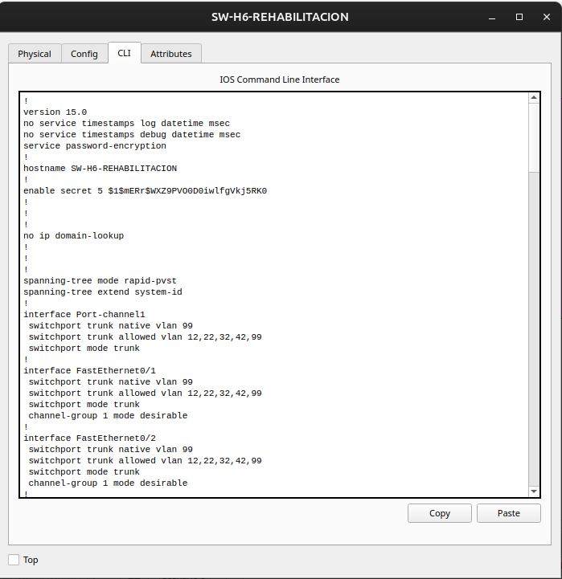
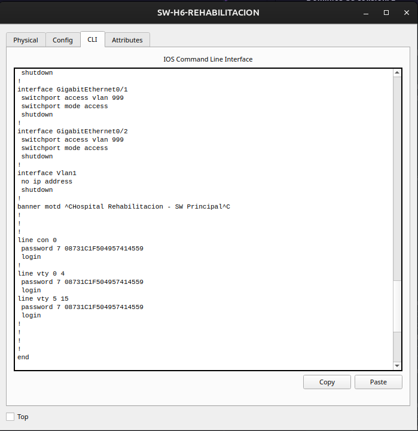
---
 
## 13. Verificacion del Uso Correcto de la Configuracion
 
---
 
### 13.1 VLANs
 
```bash
show vlan brief
```
 
**Resultado esperado:**
- Existen las VLAN `12`, `22`, `32`, `42`, `99` y `999`.
- Los puertos fa0/4, fa0/5, fa0/6 estan asignados a la VLAN correcta segun su hub.
- Los puertos no utilizados (fa0/7-24, gig0/1-2) estan en VLAN 999.
 
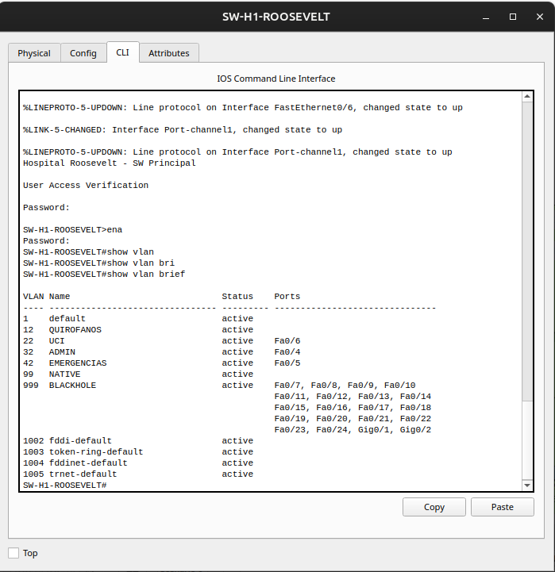

---
 
### 13.2 Troncales
 
```bash
show interfaces trunk
```
 
**Resultado esperado:**
- Los Port-Channels Po1-Po6 (en el CORE) y Po1 (en cada hospital) aparecen como trunk.
- La VLAN nativa en todos los troncales es `99`.
- Las VLANs permitidas y activas son `12, 22, 32, 42, 99`.
 
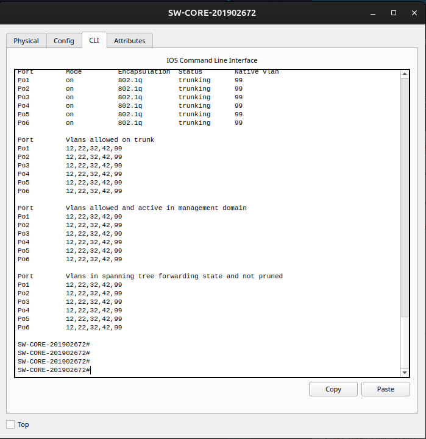

---
 
### 13.3 EtherChannel
 
```bash
show etherchannel summary
```
 
**Resultado esperado en SW-CORE-201902672:**
 
```
Group  Port-channel  Protocol  Ports
------+-------------+---------+----------------------------------------------
1      Po1(SU)       PAgP      Fa0/1(P) Fa0/2(P) Fa0/3(P)
2      Po2(SU)       PAgP      Fa0/4(P) Fa0/5(P) Fa0/6(P)
3      Po3(SU)       PAgP      Fa0/7(P) Fa0/8(P) Fa0/9(P)
4      Po4(SU)       PAgP      Fa0/10(P) Fa0/11(P) Fa0/12(P)
5      Po5(SU)       PAgP      Fa0/13(P) Fa0/14(P) Fa0/15(P)
6      Po6(SU)       PAgP      Fa0/16(P) Fa0/17(P) Fa0/18(P)
```
 
- `SU` = Layer 2, en uso.
- `P` = puerto correctamente agregado al bundle.
 
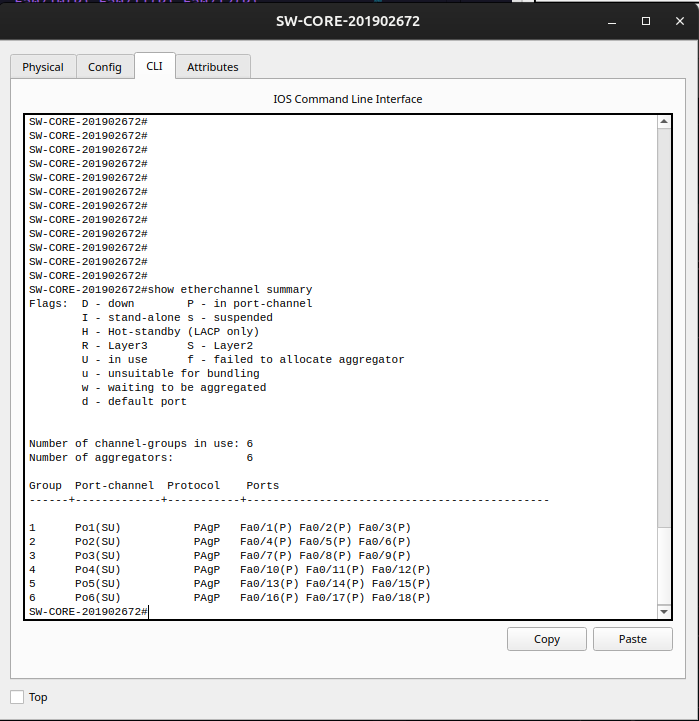

---
 
### 13.4 STP — Rapid PVST+
 
```bash
show spanning-tree
show spanning-tree vlan 12
show spanning-tree vlan 22
show spanning-tree vlan 32
show spanning-tree vlan 42
```
 
**Resultado esperado:**
- Modo: `Rapid PVST+`
- El SW-CORE-201902672 es el Root Bridge para todas las VLANs (`This bridge is the root`).
- Priority del CORE: 4096 para VLANs 12, 22, 32, 42.

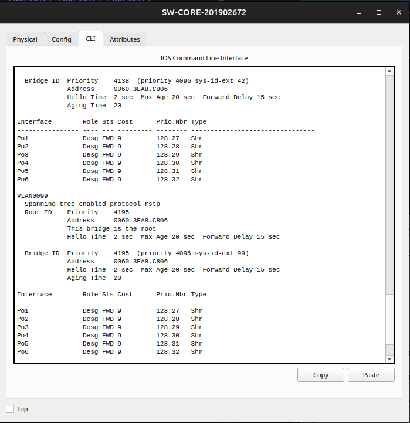
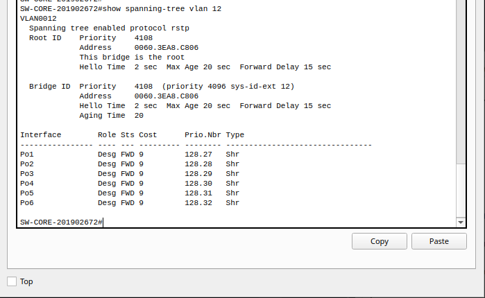

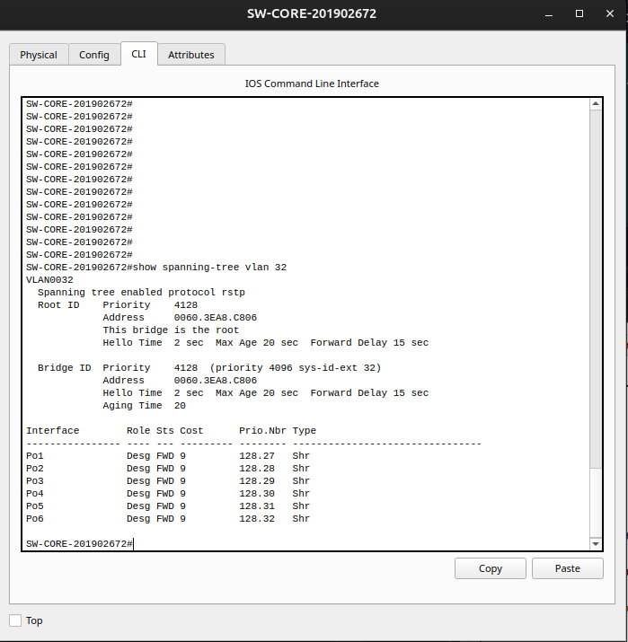
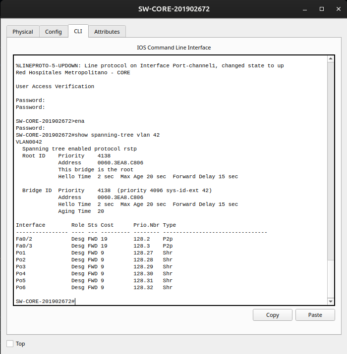

---
 
### 13.5 VTP
 
```bash
show vtp status
show vtp password
```
 
**Resultado esperado:**
- SW-CORE-201902672: `VTP Operating Mode: Server`
- Switches hospitalarios: `VTP Operating Mode: Client`
- Dominio: `201902672`
- VLANs propagadas en todos los clientes.
 
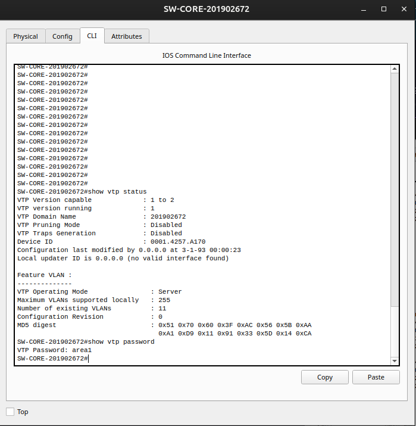

---
 
### 13.6 Verificacion de puertos de acceso
 
```bash
show interfaces fa0/4 switchport
show interfaces fa0/5 switchport
show interfaces fa0/6 switchport
```
 
**Resultado esperado:**
- `Operational Mode: static access`
- `Access Mode VLAN` coincide con la VLAN del hub conectado.
 
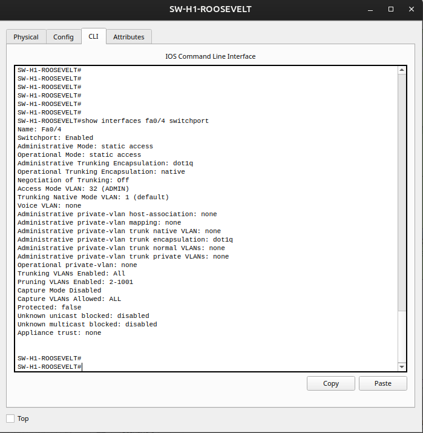

---
 
### 13.7 Verificacion de aprendizaje MAC
 
```bash
show mac address-table dynamic
show mac address-table dynamic vlan 12
show mac address-table dynamic vlan 22
show mac address-table dynamic vlan 32
show mac address-table dynamic vlan 42
```
 
**Resultado esperado:**
- Se aprenden las MAC de las PCs conectadas a los hubs.
- El CORE aprende las MACs a traves de sus Port-Channels.
 
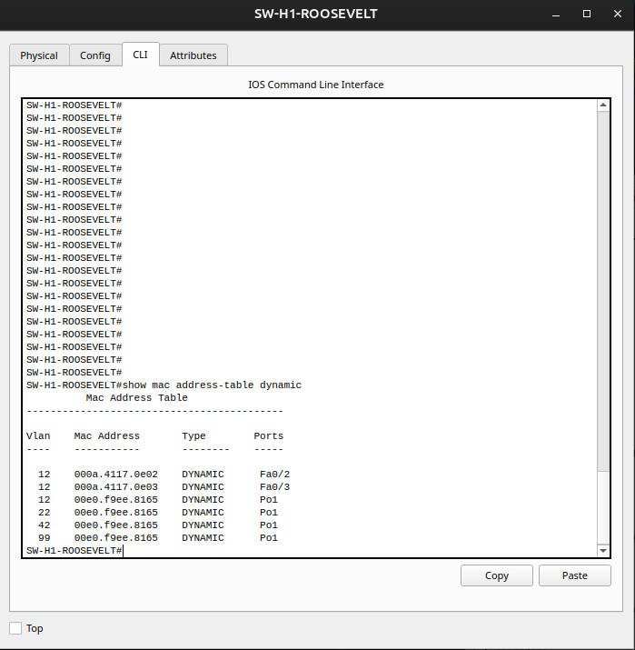

---
 
## 14. Pruebas de Conectividad
 
> La practica demuestra conectividad **entre equipos de la misma VLAN** en hospitales distintos, y ausencia de comunicacion entre VLANs distintas (sin routing inter-VLAN).
 
| # | Tipo | Origen | IP Origen | Destino | IP Destino | VLAN | Resultado esperado |
|---|---|---|---|---|---|---|---|
| 1 | Exitoso | PC1-H1-ADM | 192.168.72.130 | PC1-H2-ADM | 192.168.72.132 | 32 | Responde |
| 2 | Exitoso | PC1-H1-UCI | 192.168.72.66 | PC1-H4-UCI | 192.168.72.68 | 22 | Responde |
| 3 | Exitoso | PC1-H6-UCI | 192.168.72.70 | PC2-H1-UCI | 192.168.72.67 | 22 | Responde |
| 4 | Exitoso | PC1-H2-QUIR | 192.168.72.2 | PC1-H3-QUIR | 192.168.72.4 | 12 | Responde |
| 5 | Exitoso | PC1-H4-QUIR | 192.168.72.6 | PC2-H2-QUIR | 192.168.72.3 | 12 | Responde |
| 6 | Exitoso | PC1-H1-EMERG | 192.168.72.194 | PC1-H3-EMERG | 192.168.72.196 | 42 | Responde |
| 7 | Exitoso | PC1-H5-EMERG | 192.168.72.198 | PC2-H1-EMERG | 192.168.72.195 | 42 | Responde |
| 8 | Exitoso | PC1-H3-ADM | 192.168.72.134 | PC1-H5-ADM | 192.168.72.136 | 32 | Responde |
| 9 | Fallido | PC1-H1-ADM | 192.168.72.130 | PC1-H1-UCI | 192.168.72.66 | 32→22 | No responde |
| 10 | Fallido | PC1-H2-QUIR | 192.168.72.2 | PC1-H1-EMERG | 192.168.72.194 | 12→42 | No responde |
 
### Espacios para evidencia de pings
 
#### Ping 1 — VLAN 32: PC1-H1-ADM → PC1-H2-ADM
```bash
ping 192.168.72.132
```
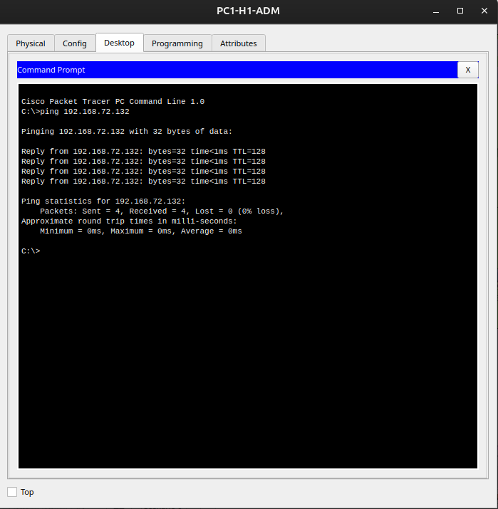

#### Ping 2 — VLAN 22: PC1-H1-UCI → PC1-H4-UCI
```bash
ping 192.168.72.68
``` 

 
#### Ping 3 — VLAN 22: PC1-H6-UCI → PC2-H1-UCI
```bash
ping 192.168.72.67
```

 
#### Ping 4 — VLAN 12: PC1-H2-QUIR → PC1-H3-QUIR
```bash
ping 192.168.72.4
``` 

 
#### Ping 5 — VLAN 12: PC1-H4-QUIR → PC2-H2-QUIR
```bash
ping 192.168.72.3
```
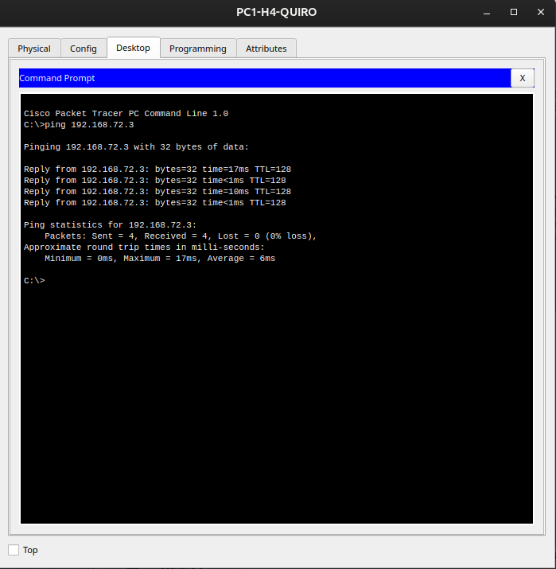
 
#### Ping 6 — VLAN 42: PC1-H1-EMERG → PC1-H3-EMERG
```bash 
ping 192.168.72.196
```

 
#### Ping 7 — VLAN 42: PC1-H5-EMERG → PC2-H1-EMERG
```bash
ping 192.168.72.195
``` 

 
#### Ping 8 — VLAN 32: PC1-H3-ADM → PC1-H5-ADM
```bash
ping 192.168.72.136
``` 

 
#### Ping 9 — VLAN 32: PC2-H1-UCI → PC1-H6-UCI
```bash
ping 192.168.72.70
```
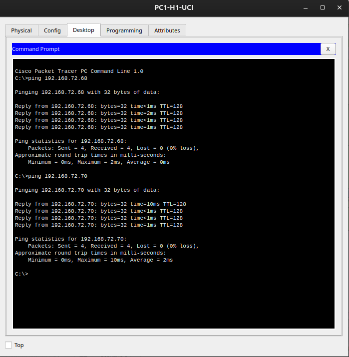
 
#### Ping 10 — VLAN 12: PC2-H2-QUIR → PC2-H4-QUIR
```bash
ping 192.168.72.194
```


 
 ### ICMP Echo Request / Reply

 ### Ping 1 - PC1-UCI-H1 → PC1-UCI-H6
 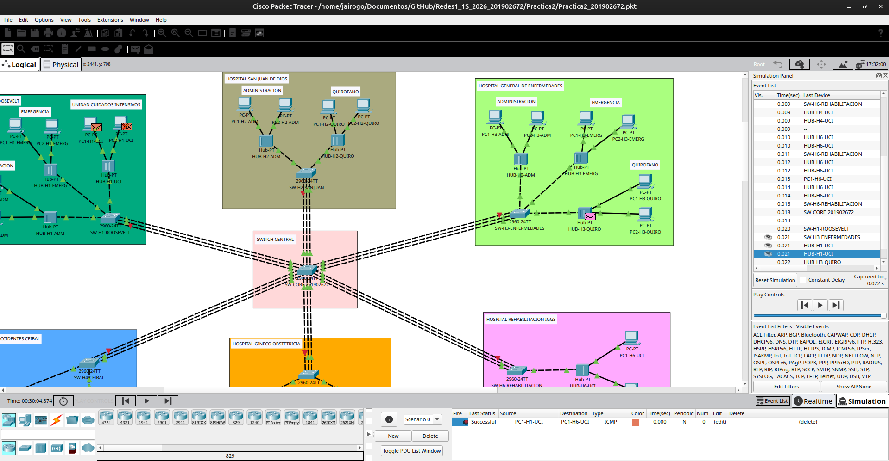

---
 
### 16 Conclusion
 
- El host origen genera primero una solicitud ARP para resolver la MAC del destino dentro de la misma VLAN.
- Una vez resuelta la MAC, se encapsula el paquete ICMP Echo Request y viaja a traves del EtherChannel.
- El trafico se propaga unicamente dentro de la misma VLAN — el switch no reenvía frames a puertos de otras VLANs.
- Si los hosts pertenecen a VLANs distintas y no existe routing inter-VLAN, el ping falla porque el ARP no puede resolverse fuera del dominio de broadcast.
  
---
 
