# Manual Tecnico - Proyecto 2: BanTech GT

**Nombre:** Jairo Adelso Gomez Hernandez  
**Carnet:** 201902672  
**Curso:** Redes de Computadoras 1  
**Entorno:** Cisco Packet Tracer  
**Proyecto:** Diseno, configuracion y validacion de red multisede para BanTech GT

---

## 1. Resumen Ejecutivo

Este manual documenta el diseno, direccionamiento, configuracion y validacion de la red multisede de **BanTech GT**. La solucion integra cuatro sedes principales: **Occidente**, **Norte**, **Oriente** y **Central - Datacenter**, conectadas a un **Nucleo Nacional** formado por tres equipos CORE.

La red utiliza segmentacion mediante VLANs, subneteo VLSM, enrutamiento dinamico y redundancia en los puntos criticos. En el backbone nacional se utiliza OSPF como protocolo principal. Las sedes Occidente y Norte se integran mediante EIGRP, la sede Oriente utiliza una infraestructura redundante con HSRP, trunks 802.1Q y RIPv2, y la sede Central utiliza OSPF entre el CORE3 y R-CENTRAL1, ademas de rutas estaticas entre R-CENTRAL1 y R-CENTRAL2.

---

## 2. Parametros Asignados por Carnet

Para el carnet **201902672**, se utilizaron los siguientes parametros:

| Parametro | Valor usado |
|---|---|
| Carnet | 201902672 |
| Valor XX | 72 |
| Valor Y | 2 |
| Red base WAN principal | 10.72.0.0/24 |
| Red WAN adicional Datacenter | 10.72.20.0/24 |
| VLANs derivadas de Y | 12, 22, 32, 42, 52, 62, 72, 82, 92 |
| AS EIGRP | 72 |
| Backbone nacional | OSPF area 0 |
| Entorno de simulacion | Cisco Packet Tracer |

---

## 3. Topología general implementada

La red se divide en un **Backbone Core** y cuatro sedes conectadas al núcleo nacional:

1. **Backbone Core / Núcleo Nacional**
   - Dispositivos principales: CORE1, CORE2 y CORE3.
   - Protocolo principal: OSPF.
   - Enlace de agregación: EtherChannel entre CORE1 y CORE2.
   - Enlaces redundantes entre dispositivos del núcleo.
   - Integración con dominios EIGRP, RIP y rutas estáticas.

2. **Sede Occidente - Agencia Regional Comercial**
   - Conectada al router R-OCCIDENTE.
   - Implementa Router-on-a-Stick para inter-VLAN.
   - VLANs: Cajas, Asesores, Gerencia y Seguridad.

3. **Sede Norte - Centro de Autorización de Créditos**
   - Conectada al router R-NORTE.
   - Usa redundancia de Capa 2 con Rapid PVST+.
   - VLANs: Análisis, Auditoría y Legal.

4. **Sede Oriente - Centro Financiero Legado**
   - Conectada simultáneamente a MS1 y MS2.
   - Usa HSRP como redundancia de gateway.
   - VLANs: Bóveda y Plataforma.

5. **Sede Central / Data Center**
   - Conectada a R-CENTRAL2 y al segmento estático por medio de R-CENTRAL1.
   - Usa EtherChannel LACP entre SW-DC-ACC1 y SW-DC-DIST.
   - VLANs: Core_BD, Web_Apps y NOC.


---

### 3.1 Sedes implementadas

| Sede | Red base | Tecnologia principal | Descripcion |
|---|---|---|---|
| Occidente | 192.168.72.0/24 | VLANs + Router-on-a-stick + EIGRP | Segmentacion por departamentos |
| Norte | 192.168.73.0/24 | VLANs + Router-on-a-stick + EIGRP | Segmentacion por areas administrativas |
| Oriente | 192.168.74.0/24 | HSRP + Trunks + RIPv2 | Alta disponibilidad para Boveda y Plataforma |
| Central - Datacenter | 192.168.75.0/24 | EtherChannel + Router-on-a-stick + rutas estaticas + OSPF | Servicios internos y NOC |

### 3.2 Topologia Completa

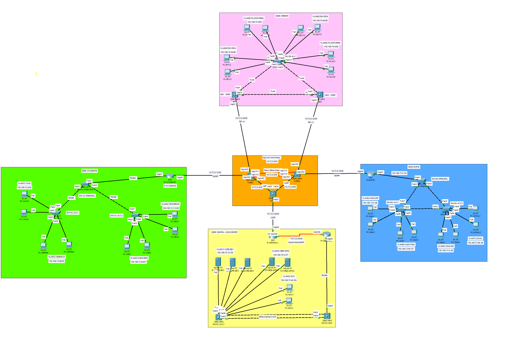

---

## 4. Etiquetado Recomendado en la Topologia

Para que el diseno sea entendible, se recomienda colocar etiquetas sobre los enlaces indicando protocolo, tipo de enlace y red utilizada.

### 4.1 Etiquetas del Backbone Nacional

| Enlace | Etiqueta recomendada | Tipo de enlace |
|---|---|---|
| CORE1 <-> CORE2 | `OSPF Area 0 - PortChannel / EtherChannel - 10.72.0.0/30` | Capa 3 redundante |
| CORE1 <-> CORE3 | `OSPF Area 0 - 10.72.0.4/30` | Capa 3 punto a punto |
| CORE2 <-> CORE3 | `OSPF Area 0 - 10.72.0.8/30` | Capa 3 punto a punto |
| CORE1 <-> R-OCCIDENTE | `EIGRP AS 72 - 10.72.0.12/30` | WAN punto a punto |
| CORE2 <-> R-NORTE | `EIGRP AS 72 - 10.72.0.16/30` | WAN punto a punto |
| CORE3 <-> R-CENTRAL1 | `OSPF Area 0 - 10.72.20.0/30` | WAN punto a punto |

### 4.2 Etiquetas de Sede Oriente

| Enlace | Etiqueta recomendada |
|---|---|
| MS1 <-> SW-OR-ACC | `TRUNK 802.1Q - VLAN 82,92` |
| MS2 <-> SW-OR-ACC | `TRUNK 802.1Q - VLAN 82,92` |
| MS1 <-> MS2 | `TRUNK 802.1Q redundante - VLAN 82,92` |
| VLAN 82 | `HSRP Grupo 82 - VIP 192.168.74.65` |
| VLAN 92 | `HSRP Grupo 92 - VIP 192.168.74.1` |
| CORE1 <-> MS1 | `RIPv2 / WAN - 10.72.0.28/30` |
| CORE2 <-> MS2 | `RIPv2 / WAN - 10.72.0.32/30` |

### 4.3 Etiquetas de Sede Central - Datacenter

| Enlace | Etiqueta recomendada |
|---|---|
| R-CENTRAL1 <-> CORE3 | `OSPF Area 0 - 10.72.20.0/30` |
| R-CENTRAL1 <-> R-CENTRAL2 | `Serial WAN - Rutas estaticas - 10.72.20.4/30` |
| R-CENTRAL2 <-> SW-DC-DIST | `TRUNK 802.1Q - VLAN 12,22,32` |
| SW-DC-DIST <-> SW-DC-ACC1 | `EtherChannel LACP Po1 - TRUNK VLAN 12,22,32` |
| SW-DC-ACC1 <-> Servidores/PCs | `ACCESS - VLAN correspondiente` |

---

## 5. Tabla general de VLANs

| Sede | VLAN | Nombre configurado | Área funcional | Hosts requeridos | Método de enrutamiento inter-VLAN |
|---|---:|---|---|---:|---|
| Occidente | 12 | CAJAS | Transacciones críticas | 45 | Router-on-a-Stick en R-OCCIDENTE |
| Occidente | 22 | ASESORES | Servicio al cliente | 30 | Router-on-a-Stick en R-OCCIDENTE |
| Occidente | 32 | GERENCIA | Administración local | 10 | Router-on-a-Stick en R-OCCIDENTE |
| Occidente | 42 | SEGURIDAD | Cámaras y biométricos | 12 | Router-on-a-Stick en R-OCCIDENTE |
| Norte | 52 | ANALISIS | Analistas de riesgo | 50 | Router-on-a-Stick / gateway de sede |
| Norte | 62 | AUDITORIA | Revisión de cuentas | 25 | Router-on-a-Stick / gateway de sede |
| Norte | 72 | LEGAL | Contratos | 14 | Router-on-a-Stick / gateway de sede |
| Oriente | 82 | BOVEDA | Operaciones de valores | 40 | SVIs en MS1/MS2 con HSRP |
| Oriente | 92 | PLATAFORMA | Atención VIP | 60 | SVIs en MS1/MS2 con HSRP |
| Central | 12 | CORE_BD | Servidores de base de datos | 14 | Subinterfaces en R-CENTRAL2 |
| Central | 22 | WEB_APPS | Servidores de banca virtual | 28 | Subinterfaces en R-CENTRAL2 |
| Central | 32 | NOC | Monitoreo central | 10 | Subinterfaces en R-CENTRAL2 |

> Nota: Las VLAN 12, 22 y 32 se repiten en Occidente y Central, pero pertenecen a dominios de Capa 2 distintos, por lo que no generan conflicto en la topología implementada.

---

## 6. Justificación técnica de elección de topologías

### 6.1 Backbone Core / Núcleo Nacional

Para el Backbone Core se eligió una topología redundante con tres dispositivos de Capa 3, interconectados mediante enlaces punto a punto y un EtherChannel principal entre CORE1 y CORE2. Esta estructura permite que el tráfico entre sedes no dependa de un solo equipo o enlace físico. El uso de OSPF como protocolo principal permite convergencia dinámica dentro del núcleo, mientras que la redistribución con EIGRP, RIPv2 y rutas estáticas permite integrar sedes con distintos requerimientos tecnológicos. Esta arquitectura responde a la necesidad del banco de mantener continuidad operativa, tolerancia a fallos y comunicación entre dominios de enrutamiento diferentes.

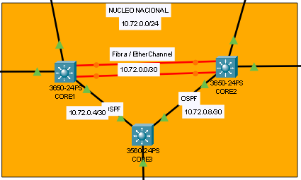

### 6.2 Sede Occidente - Agencia Regional Comercial

En Sede Occidente se utilizó una topología jerárquica simple con un router de borde, R-OCCIDENTE, y un switch principal de acceso/distribución para las VLANs de Cajas, Asesores, Gerencia y Seguridad. La elección de Router-on-a-Stick es eficiente para esta agencia porque permite centralizar el enrutamiento inter-VLAN en un solo router, reduciendo complejidad y manteniendo segmentación lógica. La segmentación evita que problemas en áreas administrativas o de asesores afecten directamente a la VLAN de Cajas, que representa transacciones críticas. Si se agregan más switches de acceso, VTP permite administrar las VLANs de forma centralizada.

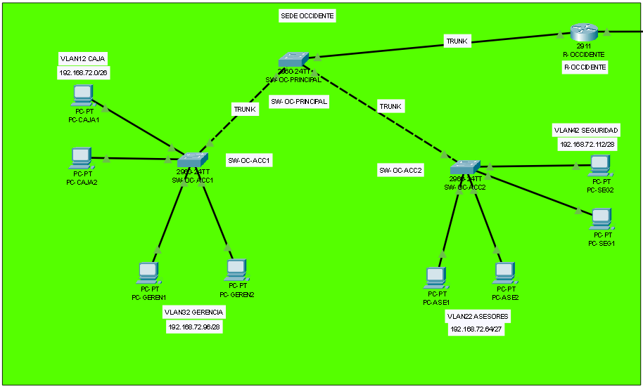

### 6.3 Sede Norte - Centro de Autorización de Créditos

En Sede Norte se eligió una topología con redundancia física de Capa 2, utilizando enlaces alternos entre switches y Rapid PVST+ para evitar bucles y tormentas de broadcast. Esta sede requiere alta disponibilidad porque si los analistas de riesgo pierden conexión, los créditos no pueden aprobarse a nivel nacional. Por esa razón, se forzó un switch principal como Root Bridge para controlar el camino lógico preferido del tráfico. El uso de Rapid PVST+ permite mantener enlaces de respaldo bloqueados y habilitarlos automáticamente ante una falla, ofreciendo tolerancia a fallos sin comprometer la estabilidad de la red.

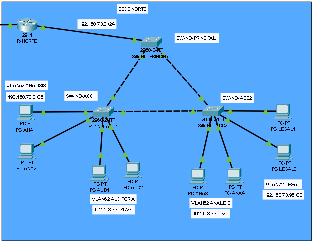

### 6.4 Sede Oriente - Centro Financiero Legado

En Sede Oriente se utilizó una topología redundante con un switch de acceso conectado simultáneamente a dos switches multicapa, MS1 y MS2. Esta elección responde al requerimiento de alta disponibilidad del gateway, debido a que la sede es crítica y no puede perder conexión si falla MS1. Se implementó HSRP para que las PCs usen una IP virtual como puerta de enlace, permitiendo que MS2 tome el rol activo automáticamente ante una caída de MS1. Además, se usó un enlace troncal entre MS1 y MS2 y Rapid PVST+ para mantener rutas lógicas por VLAN, reduciendo riesgos de bucles.

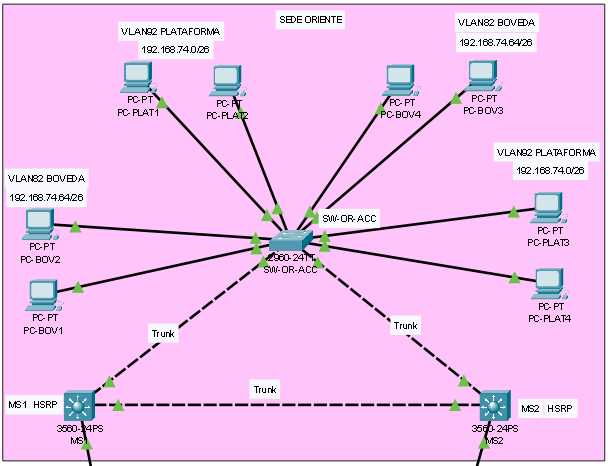

### 6.5 Sede Central / Data Center

En Sede Central se utilizó una topología de acceso y distribución con SW-DC-ACC1 conectado a SW-DC-DIST mediante EtherChannel LACP. Esta topología es adecuada para un Data Center porque los servidores de bases de datos, aplicaciones web y NOC pueden generar ráfagas de tráfico superiores a la capacidad de un único enlace. EtherChannel permite sumar ancho de banda y, además, mantiene conectividad si uno de los enlaces físicos falla. El segmento se maneja con rutas estáticas por seguridad, y R-CENTRAL1 redistribuye dichas rutas hacia OSPF para que el resto del backbone conozca las redes del Data Center.

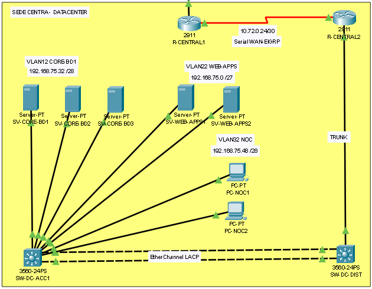

---

## 7. Subneteo Utilizado

### 7.1 Criterio de subneteo VLSM

Para cada sede se partio de una red /24 y se aplico VLSM segun la cantidad de hosts requeridos. La herramienta utilizada fue `https://www.arcadio.gq/calculadora-subredes-vlsm.html`

### 7.2 Subneteo por sede

#### Sede Occidente - Red base 192.168.72.0/24

| VLAN | Área | Red | Máscara | Rango útil | Broadcast | Gateway sugerido |
|---:|---|---|---|---|---|---|
| 12 | Cajas | 192.168.72.0/26 | 255.255.255.192 | 192.168.72.1 - 192.168.72.62 | 192.168.72.63 | 192.168.72.1 |
| 22 | Asesores | 192.168.72.64/27 | 255.255.255.224 | 192.168.72.65 - 192.168.72.94 | 192.168.72.95 | 192.168.72.65 |
| 42 | Seguridad | 192.168.72.96/28 | 255.255.255.240 | 192.168.72.97 - 192.168.72.110 | 192.168.72.111 | 192.168.72.97 |
| 32 | Gerencia | 192.168.72.112/28 | 255.255.255.240 | 192.168.72.113 - 192.168.72.126 | 192.168.72.127 | 192.168.72.113 |

#### Sede Norte - Red base 192.168.73.0/24

| VLAN | Área | Red | Máscara | Rango útil | Broadcast | Gateway sugerido |
|---:|---|---|---|---|---|---|
| 52 | Análisis | 192.168.73.0/26 | 255.255.255.192 | 192.168.73.1 - 192.168.73.62 | 192.168.73.63 | 192.168.73.1 |
| 62 | Auditoría | 192.168.73.64/27 | 255.255.255.224 | 192.168.73.65 - 192.168.73.94 | 192.168.73.95 | 192.168.73.65 |
| 72 | Legal | 192.168.73.96/28 | 255.255.255.240 | 192.168.73.97 - 192.168.73.110 | 192.168.73.111 | 192.168.73.97 |

#### Sede Oriente - Red base 192.168.74.0/24

| VLAN | Área | Red | Máscara | Rango útil | Broadcast | Gateway virtual HSRP |
|---:|---|---|---|---|---|---|
| 92 | Plataforma | 192.168.74.0/26 | 255.255.255.192 | 192.168.74.1 - 192.168.74.62 | 192.168.74.63 | 192.168.74.1 |
| 82 | Bóveda | 192.168.74.64/26 | 255.255.255.192 | 192.168.74.65 - 192.168.74.126 | 192.168.74.127 | 192.168.74.65 |

#### Sede Central / Data Center - Red base 192.168.75.0/24

| VLAN | Área | Red | Máscara | Rango útil | Broadcast | Gateway en R-CENTRAL2 |
|---:|---|---|---|---|---|---|
| 22 | Web_Apps | 192.168.75.0/27 | 255.255.255.224 | 192.168.75.1 - 192.168.75.30 | 192.168.75.31 | 192.168.75.1 |
| 12 | Core_BD | 192.168.75.32/28 | 255.255.255.240 | 192.168.75.33 - 192.168.75.46 | 192.168.75.47 | 192.168.75.33 |
| 32 | NOC | 192.168.75.48/28 | 255.255.255.240 | 192.168.75.49 - 192.168.75.62 | 192.168.75.63 | 192.168.75.49 |


### 7.3 Subneteo WAN / Backbone

Los enlaces WAN y de backbone se configuraron con mascara **/30**, ya que son enlaces punto a punto y solo requieren dos IP utiles.

| Segmento | Red /30 | Dispositivo A | IP A | Dispositivo B | IP B | Protocolo |
|---|---|---|---|---|---|---|
| CORE1 - CORE2 | 10.72.0.0/30 | CORE1 | 10.72.0.1 | CORE2 | 10.72.0.2 | OSPF |
| CORE1 - CORE3 | 10.72.0.4/30 | CORE1 | 10.72.0.5 | CORE3 | 10.72.0.6 | OSPF |
| CORE2 - CORE3 | 10.72.0.8/30 | CORE2 | 10.72.0.9 | CORE3 | 10.72.0.10 | OSPF |
| CORE1 - R-OCCIDENTE | 10.72.0.12/30 | CORE1 | 10.72.0.13 | R-OCCIDENTE | 10.72.0.14 | EIGRP AS 72 |
| CORE2 - R-NORTE | 10.72.0.16/30 | CORE2 | 10.72.0.17 | R-NORTE | 10.72.0.18 | EIGRP AS 72 |
| CORE3 - R-CENTRAL1 | 10.72.20.0/30 | CORE3 | 10.72.20.1 | R-CENTRAL1 | 10.72.20.2 | OSPF |
| R-CENTRAL1 - R-CENTRAL2 | 10.72.20.4/30 | R-CENTRAL1 | 10.72.20.5 | R-CENTRAL2 | 10.72.20.6 | Rutas estaticas |
| CORE1 - MS1 | 10.72.0.28/30 | CORE1 | 10.72.0.29 | MS1 | 10.72.0.30 | RIPv2 |
| CORE2 - MS2 | 10.72.0.32/30 | CORE2 | 10.72.0.33 | MS2 | 10.72.0.34 | RIPv2 |

---

## 8. Tabla de IPs asignadas por sede

### 8.1 Sede Oriente

| Dispositivo | Interfaz / VLAN | IP | Máscara | Gateway / Rol |
|---|---|---|---|---|
| MS1 | VLAN 82 | 192.168.74.66 | 255.255.255.192 | HSRP activo VLAN 82 |
| MS2 | VLAN 82 | 192.168.74.67 | 255.255.255.192 | HSRP standby VLAN 82 |
| Gateway virtual | VLAN 82 | 192.168.74.65 | 255.255.255.192 | Gateway PCs Bóveda |
| MS1 | VLAN 92 | 192.168.74.2 | 255.255.255.192 | HSRP standby VLAN 92 |
| MS2 | VLAN 92 | 192.168.74.3 | 255.255.255.192 | HSRP activo VLAN 92 |
| Gateway virtual | VLAN 92 | 192.168.74.1 | 255.255.255.192 | Gateway PCs Plataforma |
| PC-BOV1 a PC-BOV4 | Fa0 | 192.168.74.68 - 192.168.74.71 | 255.255.255.192 | 192.168.74.65 |
| PC-PLAT1 a PC-PLAT4 | Fa0 | 192.168.74.4 - 192.168.74.7 | 255.255.255.192 | 192.168.74.1 |
| MS1 | Enlace a CORE1 | 10.72.0.30 | 255.255.255.252 | Next-hop CORE1 10.72.0.29 |
| MS2 | Enlace a CORE2 | 10.72.0.34 | 255.255.255.252 | Next-hop CORE2 10.72.0.33 |

### 8.2 Sede Central / Data Center

| Dispositivo | Interfaz / VLAN | IP | Máscara | Gateway / Rol |
|---|---|---|---|---|
| R-CENTRAL2 | G0/0.22 | 192.168.75.1 | 255.255.255.224 | Gateway VLAN 22 |
| R-CENTRAL2 | G0/0.12 | 192.168.75.33 | 255.255.255.240 | Gateway VLAN 12 |
| R-CENTRAL2 | G0/0.32 | 192.168.75.49 | 255.255.255.240 | Gateway VLAN 32 |
| R-CENTRAL2 | S0/3/0 | 10.72.20.6 | 255.255.255.252 | Hacia R-CENTRAL1 |
| R-CENTRAL1 | S0/3/0 | 10.72.20.5 | 255.255.255.252 | Hacia R-CENTRAL2 |
| R-CENTRAL1 | G0/0 | 10.72.20.2 | 255.255.255.252 | Hacia CORE3 |
| SV-CORE-BD1 | Fa0 | 192.168.75.34 | 255.255.255.240 | 192.168.75.33 |
| SV-CORE-BD2 | Fa0 | 192.168.75.35 | 255.255.255.240 | 192.168.75.33 |
| SV-CORE-BD3 | Fa0 | 192.168.75.36 | 255.255.255.240 | 192.168.75.33 |
| SV-WEB-APPS1 | Fa0 | 192.168.75.2 | 255.255.255.224 | 192.168.75.1 |
| SV-WEB-APPS2 | Fa0 | 192.168.75.3 | 255.255.255.224 | 192.168.75.1 |
| PC-NOC1 | Fa0 | 192.168.75.50 | 255.255.255.240 | 192.168.75.49 |
| PC-NOC2 | Fa0 | 192.168.75.51 | 255.255.255.240 | 192.168.75.49 |

### 8.3 Sede Occidente

| Área | VLAN | Red | Gateway | Rango sugerido para dispositivos finales |
|---|---:|---|---|---|
| Cajas | 12 | 192.168.72.0/26 | 192.168.72.1 | 192.168.72.2 - 192.168.72.62 |
| Asesores | 22 | 192.168.72.64/27 | 192.168.72.65 | 192.168.72.66 - 192.168.72.94 |
| Seguridad | 42 | 192.168.72.96/28 | 192.168.72.97 | 192.168.72.98 - 192.168.72.110 |
| Gerencia | 32 | 192.168.72.112/28 | 192.168.72.113 | 192.168.72.114 - 192.168.72.126 |

### 8.4 Sede Norte

| Área | VLAN | Red | Gateway | Rango sugerido para dispositivos finales |
|---|---:|---|---|---|
| Análisis | 52 | 192.168.73.0/26 | 192.168.73.1 | 192.168.73.2 - 192.168.73.62 |
| Auditoría | 62 | 192.168.73.64/27 | 192.168.73.65 | 192.168.73.66 - 192.168.73.94 |
| Legal | 72 | 192.168.73.96/28 | 192.168.73.97 | 192.168.73.98 - 192.168.73.110 |

---

## 9. Configuraciones completas, verificaciones y espacios de captura


### 9.1 Backbone Core - CORE1

#### Configuración aplicada

```bash
enable
configure terminal
hostname CORE1
ip routing

! =========================
! EtherChannel LACP hacia CORE2
! Red 10.72.0.0/30
! =========================
interface range GigabitEthernet1/1/1 - 2
 description LACP_TO_CORE2
 no switchport
 channel-group 1 mode active
 no shutdown
exit

interface Port-channel1
 description BACKBONE_LACP_TO_CORE2_10.72.0.0_30
 no switchport
 ip address 10.72.0.1 255.255.255.252
 no shutdown
exit

! =========================
! Enlace OSPF hacia CORE3
! Red 10.72.0.4/30
! =========================
interface GigabitEthernet1/0/1
 description OSPF_TO_CORE3
 no switchport
 ip address 10.72.0.5 255.255.255.252
 no shutdown
exit

! =========================
! Enlace EIGRP hacia R-OCCIDENTE
! Red 10.72.0.12/30
! =========================
interface GigabitEthernet1/0/2
 description EIGRP_TO_R-OCCIDENTE
 no switchport
 ip address 10.72.0.13 255.255.255.252
 no shutdown
exit

! =========================
! Enlace RIP hacia MS1 / Sede Oriente
! Red 10.72.0.28/30
! =========================
interface GigabitEthernet1/0/3
 description RIP_TO_MS1_ORIENTE
 no switchport
 ip address 10.72.0.29 255.255.255.252
 no shutdown
exit

! =========================
! OSPF Backbone
! =========================
router ospf 1
 router-id 1.1.1.1
 network 10.72.0.0 0.0.0.3 area 0
 network 10.72.0.4 0.0.0.3 area 0
 network 10.72.0.28 0.0.0.3 area 0
 redistribute eigrp 72 subnets
 redistribute rip subnets
exit

! =========================
! EIGRP hacia Occidente
! =========================
router eigrp 72
 no auto-summary
 network 10.72.0.12 0.0.0.3
 redistribute ospf 1 metric 10000 100 255 1 1500
exit

! =========================
! RIPv2 hacia Oriente
! =========================
router rip
 version 2
 no auto-summary
 network 10.0.0.0
 default-metric 2
 redistribute ospf 1
 redistribute eigrp 72
 passive-interface default
 no passive-interface GigabitEthernet1/0/3
exit

end
write memory
```

#### Comandos de verificación

```bash
show ip interface brief
show etherchannel summary
show interfaces trunk
show ip ospf neighbor
show ip protocols
show ip route
show ip route | include 192.168
show running-config | section router ospf
show running-config | section router eigrp
show running-config | section router rip
```

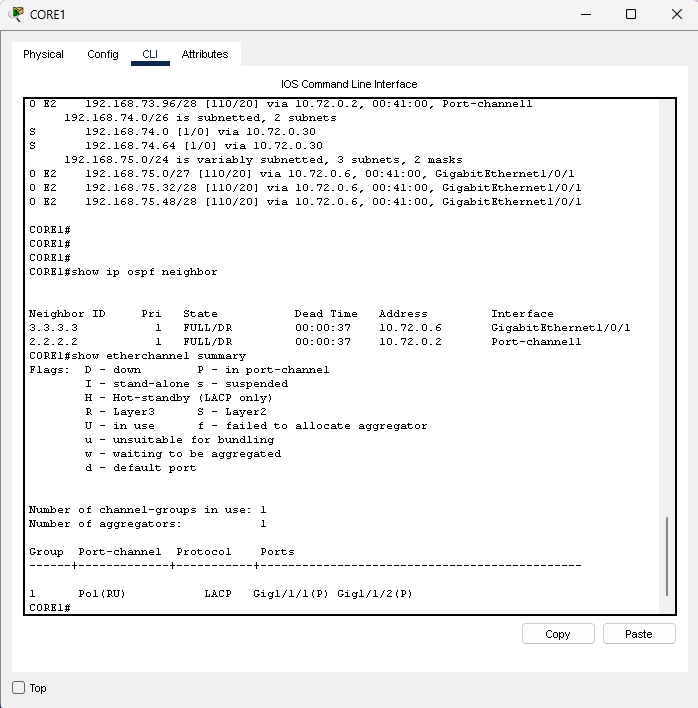

---

### 9.2 Backbone Core - CORE2

#### Configuración aplicada

```bash
enable
configure terminal
hostname CORE2
ip routing

! =========================
! EtherChannel LACP hacia CORE1
! Red 10.72.0.0/30
! =========================
interface range GigabitEthernet1/1/1 - 2
 description LACP_TO_CORE1
 no switchport
 channel-group 1 mode active
 no shutdown
exit

interface Port-channel1
 description BACKBONE_LACP_TO_CORE1_10.72.0.0_30
 no switchport
 ip address 10.72.0.2 255.255.255.252
 no shutdown
exit

! =========================
! Enlace OSPF hacia CORE3
! Red 10.72.0.8/30
! =========================
interface GigabitEthernet1/0/1
 description OSPF_TO_CORE3
 no switchport
 ip address 10.72.0.9 255.255.255.252
 no shutdown
exit

! =========================
! Enlace EIGRP hacia R-NORTE
! Red 10.72.0.16/30
! =========================
interface GigabitEthernet1/0/2
 description EIGRP_TO_R-NORTE
 no switchport
 ip address 10.72.0.17 255.255.255.252
 no shutdown
exit

! =========================
! Enlace RIP hacia MS2 / Sede Oriente
! Red 10.72.0.32/30
! =========================
interface GigabitEthernet1/0/3
 description RIP_TO_MS2_ORIENTE
 no switchport
 ip address 10.72.0.33 255.255.255.252
 no shutdown
exit

! =========================
! OSPF Backbone
! =========================
router ospf 1
 router-id 2.2.2.2
 network 10.72.0.0 0.0.0.3 area 0
 network 10.72.0.8 0.0.0.3 area 0
 network 10.72.0.32 0.0.0.3 area 0
 redistribute eigrp 72 subnets
 redistribute rip subnets
exit

! =========================
! EIGRP hacia Norte
! =========================
router eigrp 72
 no auto-summary
 network 10.72.0.16 0.0.0.3
 redistribute ospf 1 metric 10000 100 255 1 1500
exit

! =========================
! RIPv2 hacia Oriente
! =========================
router rip
 version 2
 no auto-summary
 network 10.0.0.0
 default-metric 2
 redistribute ospf 1
 redistribute eigrp 72
 passive-interface default
 no passive-interface GigabitEthernet1/0/3
exit

end
write memory
```

#### Comandos de verificación

```bash
show ip interface brief
show etherchannel summary
show interfaces trunk
show ip ospf neighbor
show ip protocols
show ip route
show ip route | include 192.168
show running-config | section router ospf
show running-config | section router eigrp
show running-config | section router rip
```

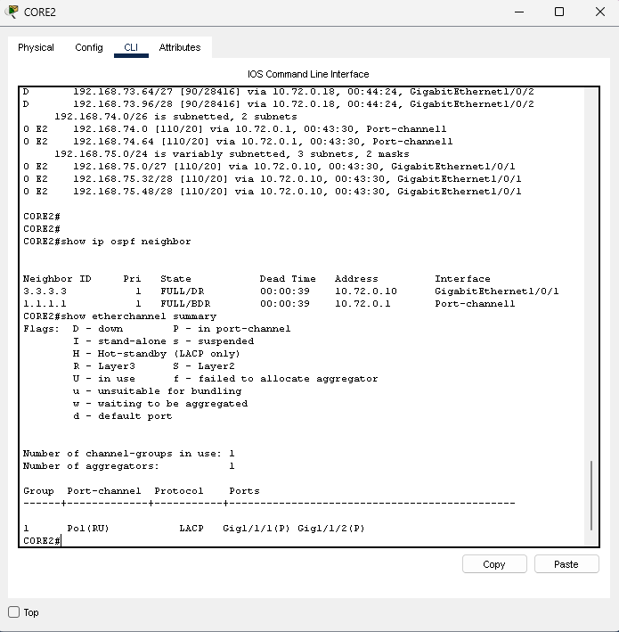

---

### 9.3 Backbone Core - CORE3

#### Configuración aplicada

```bash
enable
configure terminal
hostname CORE3
ip routing

! =========================
! Enlace OSPF hacia CORE1
! Red 10.72.0.4/30
! =========================
interface FastEthernet0/1
 description OSPF_TO_CORE1
 no switchport
 ip address 10.72.0.6 255.255.255.252
 no shutdown
exit

! =========================
! Enlace OSPF hacia CORE2
! Red 10.72.0.8/30
! =========================
interface FastEthernet0/2
 description OSPF_TO_CORE2
 no switchport
 ip address 10.72.0.10 255.255.255.252
 no shutdown
exit

! =========================
! Enlace OSPF hacia R-CENTRAL1
! Red 10.72.20.0/30
! =========================
interface FastEthernet0/3
 description OSPF_TO_R-CENTRAL1
 no switchport
 ip address 10.72.20.1 255.255.255.252
 no shutdown
exit

router ospf 1
 router-id 3.3.3.3
 network 10.72.0.4 0.0.0.3 area 0
 network 10.72.0.8 0.0.0.3 area 0
 network 10.72.20.0 0.0.0.3 area 0
exit

end
write memory
```

#### Comandos de verificación

```bash
show ip interface brief
show ip ospf neighbor
show ip protocols
show ip route
show ip route | include 192.168.72
show ip route | include 192.168.73
show ip route | include 192.168.74
show ip route | include 192.168.75
show running-config | section router ospf
```

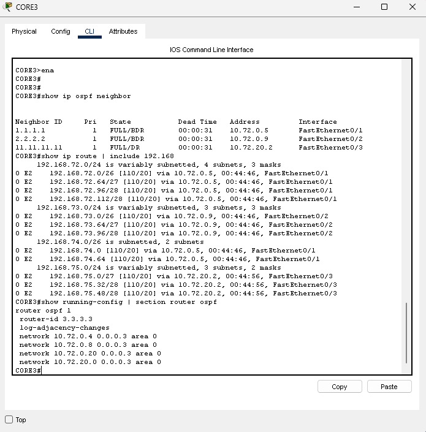

---

### 9.4 Sede Occidente - R-OCCIDENTE

#### Configuración aplicada

```bash
enable
configure terminal
hostname R-OCCIDENTE

! =========================
! Enlace WAN hacia CORE1
! Red 10.72.0.12/30
! =========================
interface GigabitEthernet0/1
 description EIGRP_TO_CORE1
 ip address 10.72.0.14 255.255.255.252
 no shutdown
exit

! =========================
! Trunk hacia SW-OC-PRINCIPAL
! Router-on-a-Stick
! =========================
interface GigabitEthernet0/0
 description TRUNK_TO_SW-OC-PRINCIPAL
 no ip address
 no shutdown
exit

interface GigabitEthernet0/0.12
 description GW_VLAN12_CAJAS
 encapsulation dot1Q 12
 ip address 192.168.72.1 255.255.255.192
exit

interface GigabitEthernet0/0.22
 description GW_VLAN22_ASESORES
 encapsulation dot1Q 22
 ip address 192.168.72.65 255.255.255.224
exit

interface GigabitEthernet0/0.42
 description GW_VLAN42_SEGURIDAD
 encapsulation dot1Q 42
 ip address 192.168.72.97 255.255.255.240
exit

interface GigabitEthernet0/0.32
 description GW_VLAN32_GERENCIA
 encapsulation dot1Q 32
 ip address 192.168.72.113 255.255.255.240
exit

! =========================
! EIGRP hacia Backbone
! =========================
router eigrp 72
 no auto-summary
 network 10.72.0.12 0.0.0.3
 network 192.168.72.0 0.0.0.63
 network 192.168.72.64 0.0.0.31
 network 192.168.72.96 0.0.0.15
 network 192.168.72.112 0.0.0.15
exit

end
write memory
```

#### Comandos de verificación

```bash
show ip interface brief
show running-config | section interface
show ip protocols
show ip eigrp neighbors
show ip route
show ip route | include 192.168.72
show cdp neighbors
```

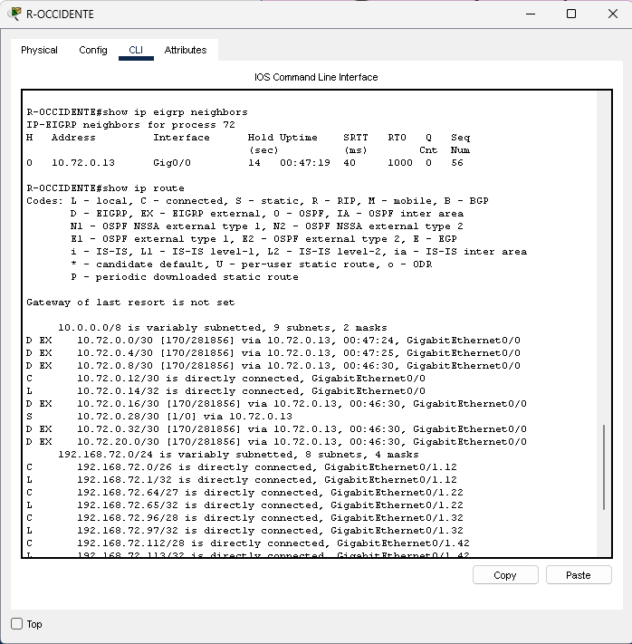

---

### 9.5 Sede Occidente - SW-OC-PRINCIPAL

#### Configuración aplicada

```bash
enable
configure terminal
hostname SW-OC-PRINCIPAL

! =========================
! VLANs de Sede Occidente
! =========================
vlan 12
 name CAJAS
exit
vlan 22
 name ASESORES
exit
vlan 32
 name GERENCIA
exit
vlan 42
 name SEGURIDAD
exit

! =========================
! Trunk hacia R-OCCIDENTE
! =========================
interface GigabitEthernet0/1
 description TRUNK_TO_R-OCCIDENTE
 switchport mode trunk
 switchport trunk allowed vlan 12,22,32,42
 no shutdown
exit

! =========================
! Puertos de acceso por VLAN
! Ajustar rangos si se usaron puertos distintos.
! =========================
interface range FastEthernet0/1 - 7
 description ACCESS_VLAN12_CAJAS
 switchport mode access
 switchport access vlan 12
 spanning-tree portfast
 no shutdown
exit

interface range FastEthernet0/8 - 14
 description ACCESS_VLAN22_ASESORES
 switchport mode access
 switchport access vlan 22
 spanning-tree portfast
 no shutdown
exit

interface range FastEthernet0/15 - 20
 description ACCESS_VLAN32_GERENCIA
 switchport mode access
 switchport access vlan 32
 spanning-tree portfast
 no shutdown
exit

interface range FastEthernet0/21 - 24
 description ACCESS_VLAN42_SEGURIDAD
 switchport mode access
 switchport access vlan 42
 spanning-tree portfast
 no shutdown
exit

end
write memory
```

#### Comandos de verificación

```bash
show vlan brief
show interfaces trunk
show spanning-tree vlan 12
show spanning-tree vlan 22
show spanning-tree vlan 32
show spanning-tree vlan 42
show cdp neighbors
show running-config | section vlan
show running-config | section interface
```

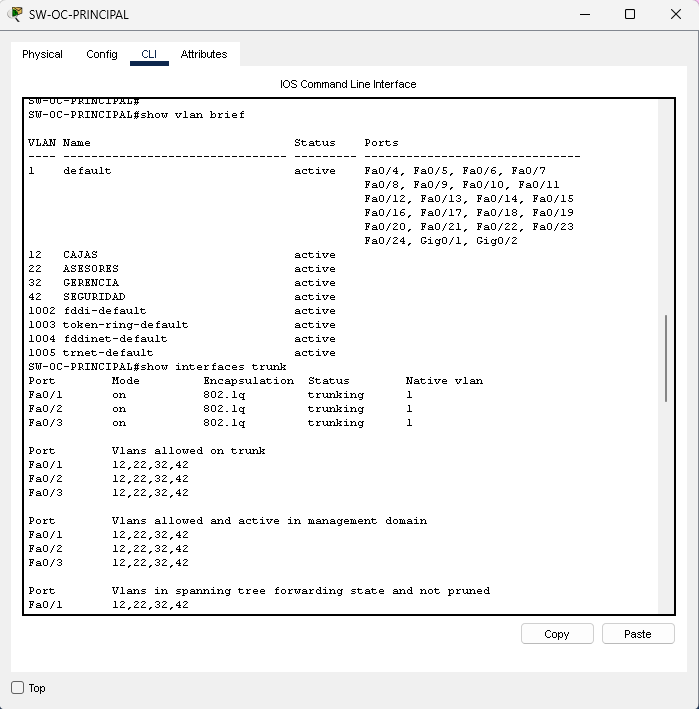

---

### 9.6 Sede Norte - R-NORTE

#### Configuración aplicada

```bash
enable
configure terminal
hostname R-NORTE

! =========================
! Enlace WAN hacia CORE2
! Red 10.72.0.16/30
! =========================
interface GigabitEthernet0/1
 description EIGRP_TO_CORE2
 ip address 10.72.0.18 255.255.255.252
 no shutdown
exit

! =========================
! Trunk hacia switch principal de Norte
! Router-on-a-Stick
! =========================
interface GigabitEthernet0/0
 description TRUNK_TO_SW-NORTE-ROOT
 no ip address
 no shutdown
exit

interface GigabitEthernet0/0.52
 description GW_VLAN52_ANALISIS
 encapsulation dot1Q 52
 ip address 192.168.73.1 255.255.255.192
exit

interface GigabitEthernet0/0.62
 description GW_VLAN62_AUDITORIA
 encapsulation dot1Q 62
 ip address 192.168.73.65 255.255.255.224
exit

interface GigabitEthernet0/0.72
 description GW_VLAN72_LEGAL
 encapsulation dot1Q 72
 ip address 192.168.73.97 255.255.255.240
exit

! =========================
! EIGRP hacia Backbone
! =========================
router eigrp 72
 no auto-summary
 network 10.72.0.16 0.0.0.3
 network 192.168.73.0 0.0.0.63
 network 192.168.73.64 0.0.0.31
 network 192.168.73.96 0.0.0.15
exit

end
write memory
```

#### Comandos de verificación

```bash
show ip interface brief
show running-config | section interface
show ip protocols
show ip eigrp neighbors
show ip route
show ip route | include 192.168.73
show cdp neighbors
```

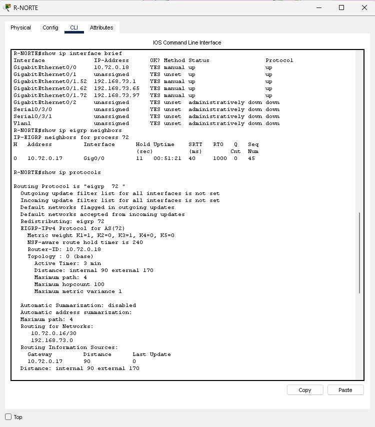

---

### 9.7 Sede Norte - SW-NORTE-ROOT

#### Configuración aplicada

```bash
enable
configure terminal
hostname SW-NORTE-ROOT

! =========================
! VLANs de Sede Norte
! =========================
vlan 52
 name ANALISIS
exit
vlan 62
 name AUDITORIA
exit
vlan 72
 name LEGAL
exit

! =========================
! Rapid PVST+ y Root Bridge
! =========================
spanning-tree mode rapid-pvst
spanning-tree vlan 52 root primary
spanning-tree vlan 62 root primary
spanning-tree vlan 72 root primary

! =========================
! Trunk hacia R-NORTE
! =========================
interface GigabitEthernet0/1
 description TRUNK_TO_R-NORTE
 switchport mode trunk
 switchport trunk allowed vlan 52,62,72
 no shutdown
exit

! =========================
! Trunks hacia switches de acceso de Norte
! Ajustar rangos si se usaron puertos distintos.
! =========================
interface range FastEthernet0/1 - 3
 description TRUNKS_TO_ACCESS_SWITCHES_NORTE
 switchport mode trunk
 switchport trunk allowed vlan 52,62,72
 no shutdown
exit

! =========================
! Puertos de acceso de ejemplo
! =========================
interface range FastEthernet0/4 - 10
 description ACCESS_VLAN52_ANALISIS
 switchport mode access
 switchport access vlan 52
 spanning-tree portfast
 no shutdown
exit

interface range FastEthernet0/11 - 17
 description ACCESS_VLAN62_AUDITORIA
 switchport mode access
 switchport access vlan 62
 spanning-tree portfast
 no shutdown
exit

interface range FastEthernet0/18 - 24
 description ACCESS_VLAN72_LEGAL
 switchport mode access
 switchport access vlan 72
 spanning-tree portfast
 no shutdown
exit

end
write memory
```

#### Comandos de verificación

```bash
show vlan brief
show interfaces trunk
show spanning-tree vlan 52
show spanning-tree vlan 62
show spanning-tree vlan 72
show cdp neighbors
show running-config | section spanning-tree
show running-config | section interface
```

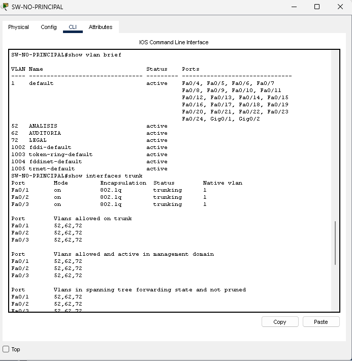

---

### 9.8 Sede Oriente - MS1

#### Configuración aplicada

```bash
enable
configure terminal
hostname MS1
ip routing

! =========================
! VLANs de Oriente
! =========================
vlan 82
 name BOVEDA
exit
vlan 92
 name PLATAFORMA
exit

spanning-tree mode rapid-pvst

! =========================
! Trunk hacia SW-OR-ACC
! =========================
interface FastEthernet0/1
 description TRUNK_TO_SW-OR-ACC
 switchport mode trunk
 switchport trunk allowed vlan 82,92
 no shutdown
exit

! =========================
! Trunk hacia MS2
! =========================
interface GigabitEthernet0/2
 description TRUNK_TO_MS2
 switchport mode trunk
 switchport trunk allowed vlan 82,92
 no shutdown
exit

! =========================
! Enlace Capa 3 hacia CORE1
! Red 10.72.0.28/30
! =========================
interface GigabitEthernet0/1
 description RIP_TO_CORE1
 no switchport
 ip address 10.72.0.30 255.255.255.252
 no shutdown
exit

! =========================
! SVI VLAN 82 - BOVEDA
! MS1 activo para Boveda
! =========================
interface Vlan82
 description GW_REAL_MS1_VLAN82_BOVEDA
 ip address 192.168.74.66 255.255.255.192
 standby 82 ip 192.168.74.65
 standby 82 priority 110
 standby 82 preempt
 no shutdown
exit

! =========================
! SVI VLAN 92 - PLATAFORMA
! MS1 standby para Plataforma
! =========================
interface Vlan92
 description GW_REAL_MS1_VLAN92_PLATAFORMA
 ip address 192.168.74.2 255.255.255.192
 standby 92 ip 192.168.74.1
 standby 92 priority 90
 standby 92 preempt
 no shutdown
exit

! =========================
! RIPv2 hacia Backbone
! =========================
router rip
 version 2
 no auto-summary
 network 10.0.0.0
 network 192.168.74.0
exit

end
write memory
```

#### Comandos de verificación

```bash
show ip interface brief
show interfaces trunk
show standby brief
show standby
show ip protocols
show ip route
show spanning-tree vlan 82
show spanning-tree vlan 92
show cdp neighbors
show running-config | section interface Vlan82
show running-config | section interface Vlan92
```

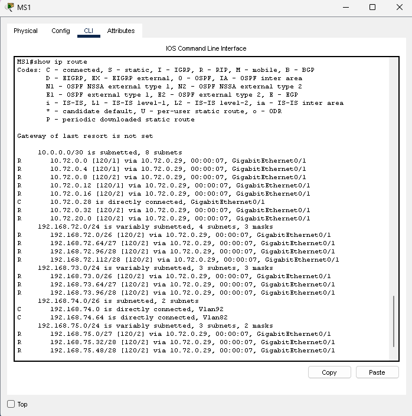

---

### 9.9 Sede Oriente - MS2

#### Configuración aplicada

```bash
enable
configure terminal
hostname MS2
ip routing

! =========================
! VLANs de Oriente
! =========================
vlan 82
 name BOVEDA
exit
vlan 92
 name PLATAFORMA
exit

spanning-tree mode rapid-pvst

! =========================
! Trunk hacia SW-OR-ACC
! =========================
interface FastEthernet0/1
 description TRUNK_TO_SW-OR-ACC
 switchport mode trunk
 switchport trunk allowed vlan 82,92
 no shutdown
exit

! =========================
! Trunk hacia MS1
! =========================
interface GigabitEthernet0/2
 description TRUNK_TO_MS1
 switchport mode trunk
 switchport trunk allowed vlan 82,92
 no shutdown
exit

! =========================
! Enlace Capa 3 hacia CORE2
! Red 10.72.0.32/30
! =========================
interface GigabitEthernet0/1
 description RIP_TO_CORE2
 no switchport
 ip address 10.72.0.34 255.255.255.252
 no shutdown
exit

! =========================
! SVI VLAN 82 - BOVEDA
! MS2 standby para Boveda
! =========================
interface Vlan82
 description GW_REAL_MS2_VLAN82_BOVEDA
 ip address 192.168.74.67 255.255.255.192
 standby 82 ip 192.168.74.65
 standby 82 priority 100
 standby 82 preempt
 no shutdown
exit

! =========================
! SVI VLAN 92 - PLATAFORMA
! MS2 activo para Plataforma
! =========================
interface Vlan92
 description GW_REAL_MS2_VLAN92_PLATAFORMA
 ip address 192.168.74.3 255.255.255.192
 standby 92 ip 192.168.74.1
 standby 92 priority 110
 standby 92 preempt
 no shutdown
exit

! =========================
! RIPv2 hacia Backbone
! =========================
router rip
 version 2
 no auto-summary
 network 10.0.0.0
 network 192.168.74.0
exit

end
write memory
```

#### Comandos de verificación

```bash
show ip interface brief
show interfaces trunk
show standby brief
show standby
show ip protocols
show ip route
show spanning-tree vlan 82
show spanning-tree vlan 92
show cdp neighbors
show running-config | section interface Vlan82
show running-config | section interface Vlan92
```

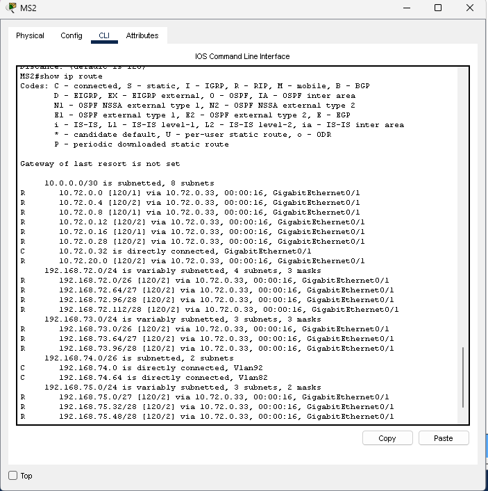

---

### 9.10 Sede Oriente - SW-OR-ACC

#### Configuración aplicada

```bash
enable
configure terminal
hostname SW-OR-ACC

! =========================
! VLANs de Oriente
! =========================
vlan 82
 name BOVEDA
exit
vlan 92
 name PLATAFORMA
exit

spanning-tree mode rapid-pvst

! =========================
! Trunks hacia MS1 y MS2
! =========================
interface FastEthernet0/1
 description TRUNK_TO_MS1
 switchport mode trunk
 switchport trunk allowed vlan 82,92
 no shutdown
exit

interface FastEthernet0/2
 description TRUNK_TO_MS2
 switchport mode trunk
 switchport trunk allowed vlan 82,92
 no shutdown
exit

! =========================
! PCs de Boveda
! Fa0/3 -> PC-BOV1
! Fa0/4 -> PC-BOV2
! Fa0/7 -> PC-BOV4
! Fa0/8 -> PC-BOV3
! =========================
interface FastEthernet0/3
 description PC-BOV1_ACCESS_VLAN82
 switchport mode access
 switchport access vlan 82
 spanning-tree portfast
 no shutdown
exit

interface FastEthernet0/4
 description PC-BOV2_ACCESS_VLAN82
 switchport mode access
 switchport access vlan 82
 spanning-tree portfast
 no shutdown
exit

interface FastEthernet0/7
 description PC-BOV4_ACCESS_VLAN82
 switchport mode access
 switchport access vlan 82
 spanning-tree portfast
 no shutdown
exit

interface FastEthernet0/8
 description PC-BOV3_ACCESS_VLAN82
 switchport mode access
 switchport access vlan 82
 spanning-tree portfast
 no shutdown
exit

! =========================
! PCs de Plataforma
! Fa0/5 -> PC-PLAT1
! Fa0/6 -> PC-PLAT2
! Fa0/9 -> PC-PLAT3
! Fa0/10 -> PC-PLAT4
! =========================
interface FastEthernet0/5
 description PC-PLAT1_ACCESS_VLAN92
 switchport mode access
 switchport access vlan 92
 spanning-tree portfast
 no shutdown
exit

interface FastEthernet0/6
 description PC-PLAT2_ACCESS_VLAN92
 switchport mode access
 switchport access vlan 92
 spanning-tree portfast
 no shutdown
exit

interface FastEthernet0/9
 description PC-PLAT3_ACCESS_VLAN92
 switchport mode access
 switchport access vlan 92
 spanning-tree portfast
 no shutdown
exit

interface FastEthernet0/10
 description PC-PLAT4_ACCESS_VLAN92
 switchport mode access
 switchport access vlan 92
 spanning-tree portfast
 no shutdown
exit

end
write memory
```

#### Comandos de verificación

```bash
show vlan brief
show interfaces trunk
show spanning-tree vlan 82
show spanning-tree vlan 92
show cdp neighbors
show running-config | section interface FastEthernet0/1
show running-config | section interface FastEthernet0/2
show running-config | section interface FastEthernet0/3
show running-config | section interface FastEthernet0/10
```

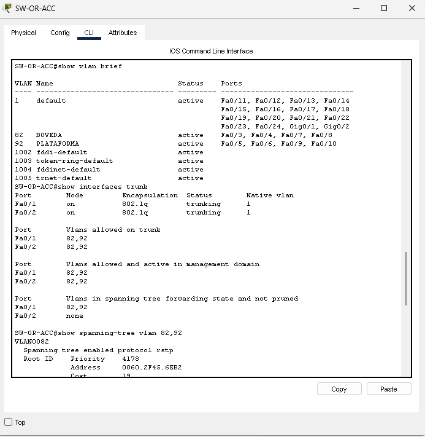

---

### 9.11 Sede Central / Data Center - SW-DC-ACC1

#### Configuración aplicada

```bash
enable
configure terminal
hostname SW-DC-ACC1

! =========================
! VLANs de Data Center
! =========================
vlan 12
 name CORE_BD
exit
vlan 22
 name WEB_APPS
exit
vlan 32
 name NOC
exit

spanning-tree mode rapid-pvst

! =========================
! EtherChannel LACP hacia SW-DC-DIST
! Fa0/1 y Fa0/2 forman Po1
! =========================
interface range FastEthernet0/1 - 2
 description LACP_TO_SW-DC-DIST
 switchport mode trunk
 switchport trunk allowed vlan 12,22,32
 channel-group 1 mode active
 no shutdown
exit

interface Port-channel1
 description LACP_TRUNK_TO_SW-DC-DIST
 switchport mode trunk
 switchport trunk allowed vlan 12,22,32
 no shutdown
exit

! =========================
! Servidores VLAN 12 - CORE_BD
! Fa0/3 -> SV-CORE-BD1
! Fa0/4 -> SV-CORE-BD2
! Fa0/5 -> SV-CORE-BD3
! =========================
interface range FastEthernet0/3 - 5
 description SERVERS_CORE_BD_ACCESS_VLAN12
 switchport mode access
 switchport access vlan 12
 spanning-tree portfast
 no shutdown
exit

! =========================
! Servidores VLAN 22 - WEB_APPS
! Fa0/6 -> SV-WEB-APPS1
! Fa0/7 -> SV-WEB-APPS2
! =========================
interface range FastEthernet0/6 - 7
 description SERVERS_WEB_APPS_ACCESS_VLAN22
 switchport mode access
 switchport access vlan 22
 spanning-tree portfast
 no shutdown
exit

! =========================
! PCs NOC VLAN 32
! Fa0/8 -> PC-NOC1
! Fa0/9 -> PC-NOC2
! =========================
interface range FastEthernet0/8 - 9
 description NOC_ACCESS_VLAN32
 switchport mode access
 switchport access vlan 32
 spanning-tree portfast
 no shutdown
exit

end
write memory
```

#### Comandos de verificación

```bash
show vlan brief
show interfaces trunk
show etherchannel summary
show spanning-tree vlan 12
show spanning-tree vlan 22
show spanning-tree vlan 32
show cdp neighbors
show running-config | section interface Port-channel1
show running-config | section interface FastEthernet0/1
show running-config | section interface FastEthernet0/3
```

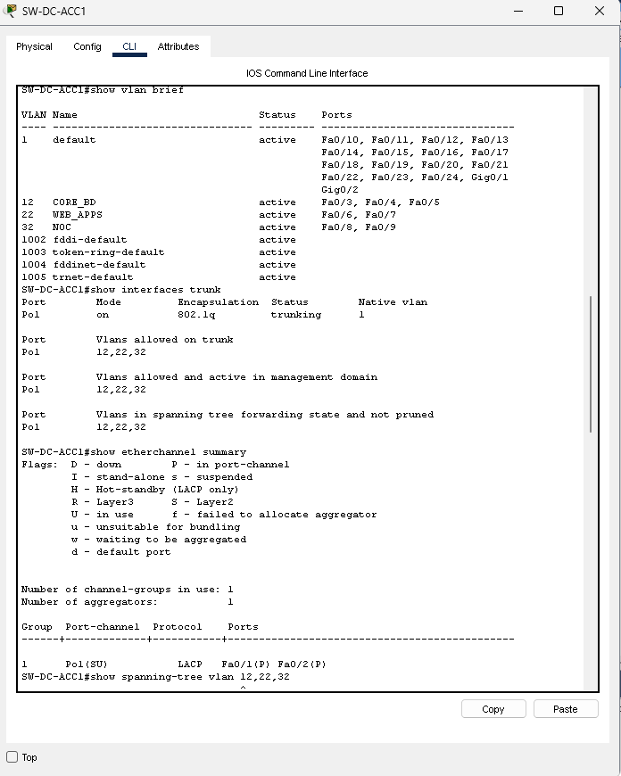

---

### 9.12 Sede Central / Data Center - SW-DC-DIST

#### Configuración aplicada

```bash
enable
configure terminal
hostname SW-DC-DIST

! =========================
! VLANs de Data Center
! =========================
vlan 12
 name CORE_BD
exit
vlan 22
 name WEB_APPS
exit
vlan 32
 name NOC
exit

spanning-tree mode rapid-pvst

! SW-DC-DIST será Root Bridge para las VLANs del Data Center
spanning-tree vlan 12 priority 4096
spanning-tree vlan 22 priority 4096
spanning-tree vlan 32 priority 4096

! =========================
! EtherChannel LACP hacia SW-DC-ACC1
! Fa0/1 y Fa0/2 forman Po1
! =========================
interface range FastEthernet0/1 - 2
 description LACP_TO_SW-DC-ACC1
 switchport mode trunk
 switchport trunk allowed vlan 12,22,32
 channel-group 1 mode active
 no shutdown
exit

interface Port-channel1
 description LACP_TRUNK_TO_SW-DC-ACC1
 switchport mode trunk
 switchport trunk allowed vlan 12,22,32
 no shutdown
exit

! =========================
! Trunk hacia R-CENTRAL2
! =========================
interface GigabitEthernet0/1
 description TRUNK_TO_R-CENTRAL2_G0/0
 switchport mode trunk
 switchport trunk allowed vlan 12,22,32
 no shutdown
exit

end
write memory
```

#### Comandos de verificación

```bash
show vlan brief
show interfaces trunk
show etherchannel summary
show spanning-tree vlan 12
show spanning-tree vlan 22
show spanning-tree vlan 32
show cdp neighbors
show running-config | section spanning-tree
show running-config | section interface Port-channel1
```

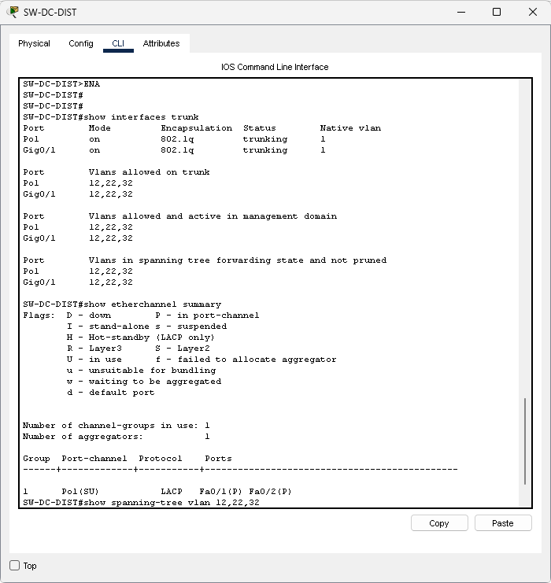

---

### 9.13 Sede Central / Data Center - R-CENTRAL2

#### Configuración aplicada

```bash
enable
configure terminal
hostname R-CENTRAL2

! =========================
! Trunk hacia SW-DC-DIST
! Router-on-a-Stick
! =========================
interface GigabitEthernet0/0
 description TRUNK_TO_SW-DC-DIST
 no ip address
 no shutdown
exit

interface GigabitEthernet0/0.22
 description GW_VLAN22_WEB_APPS
 encapsulation dot1Q 22
 ip address 192.168.75.1 255.255.255.224
exit

interface GigabitEthernet0/0.12
 description GW_VLAN12_CORE_BD
 encapsulation dot1Q 12
 ip address 192.168.75.33 255.255.255.240
exit

interface GigabitEthernet0/0.32
 description GW_VLAN32_NOC
 encapsulation dot1Q 32
 ip address 192.168.75.49 255.255.255.240
exit

! =========================
! Enlace serial hacia R-CENTRAL1
! Red 10.72.20.4/30
! =========================
interface Serial0/3/0
 description SERIAL_WAN_TO_R-CENTRAL1
 ip address 10.72.20.6 255.255.255.252
 no shutdown
exit

! Ruta por defecto hacia R-CENTRAL1
no ip route 0.0.0.0 0.0.0.0 10.72.0.25
ip route 0.0.0.0 0.0.0.0 10.72.20.5

end
write memory
```

#### Comandos de verificación

```bash
show ip interface brief
show running-config | section interface
show running-config | section ip route
show ip route
show cdp neighbors
```
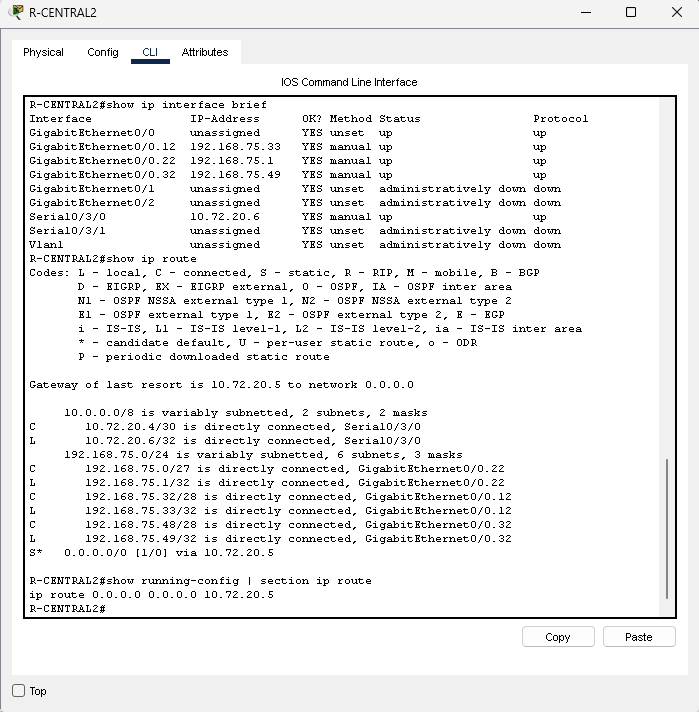

---

### 9.14 Sede Central / Data Center - R-CENTRAL1

#### Configuración aplicada

```bash
enable
configure terminal
hostname R-CENTRAL1

! =========================
! Enlace OSPF hacia CORE3
! Red 10.72.20.0/30
! =========================
interface GigabitEthernet0/0
 description OSPF_TO_CORE3
 ip address 10.72.20.2 255.255.255.252
 no shutdown
exit

! =========================
! Enlace serial hacia R-CENTRAL2
! Red 10.72.20.4/30
! =========================
interface Serial0/3/0
 description SERIAL_WAN_TO_R-CENTRAL2
 ip address 10.72.20.5 255.255.255.252
 no shutdown
exit

! =========================
! Rutas estáticas hacia redes del Data Center
! =========================
ip route 192.168.75.0 255.255.255.224 10.72.20.6
ip route 192.168.75.32 255.255.255.240 10.72.20.6
ip route 192.168.75.48 255.255.255.240 10.72.20.6

! =========================
! OSPF hacia Backbone y redistribución de estáticas
! =========================
router ospf 1
 router-id 11.11.11.11
 network 10.72.20.0 0.0.0.3 area 0
 redistribute static subnets
exit

end
write memory
```

#### Comandos de verificación

```bash
show ip interface brief
show ip ospf neighbor
show ip protocols
show ip route
show ip route | include 192.168.75
show running-config | section router ospf
show running-config | section ip route
show cdp neighbors
```

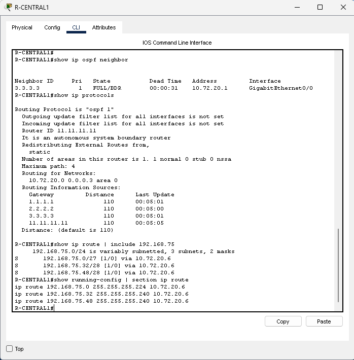

---

### 9.15 Verificación general de convergencia y ruteo

#### Backbone Core

```bash
! En CORE1, CORE2 y CORE3
show ip protocols
show ip ospf neighbor
show ip route
show ip route | include 192.168.72
show ip route | include 192.168.73
show ip route | include 192.168.74
show ip route | include 192.168.75
```

#### Routers frontera de sedes

```bash
! R-OCCIDENTE
show ip route
show ip protocols
show ip eigrp neighbors

! R-NORTE
show ip route
show ip protocols
show ip eigrp neighbors

! R-CENTRAL1
show ip route
show ip protocols
show ip ospf neighbor

! R-CENTRAL2
show ip route
show running-config | section ip route
```

#### Switches de capa 2 y capa 3

```bash
show vlan brief
show interfaces trunk
show spanning-tree vlan <ID_VLAN>
show etherchannel summary
show standby brief
show cdp neighbors
```

#### Espacio para captura

[R-OCCIDENTE](./img/evidencia-r-occidente.png)
[R-NORTE](./img/evidencia-r-norte.png)
[R-CENTRAL1](./img/evidencia-r-central1.png)
[R-CENTRAL2](./img/evidencia-r-central2.png)
[R-ORIENTE](./img/evidencia-r-oriente.png)

---

### 9.16 Pruebas de alta disponibilidad

#### HSRP en Sede Oriente

```bash
! Antes de la falla
show standby brief

! Apagar enlace o switch activo según prueba
interface FastEthernet0/1
 shutdown

! Después de la falla
show standby brief
show ip route

! Restaurar enlace
interface FastEthernet0/1
 no shutdown
```

#### Espacio para captura HSRP

1. Antes de la falla:
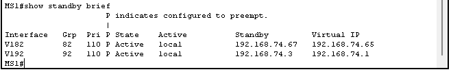

2. Apagado de MS1:
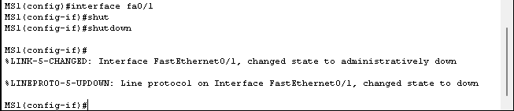

3. Verificación de rutas después de la falla:
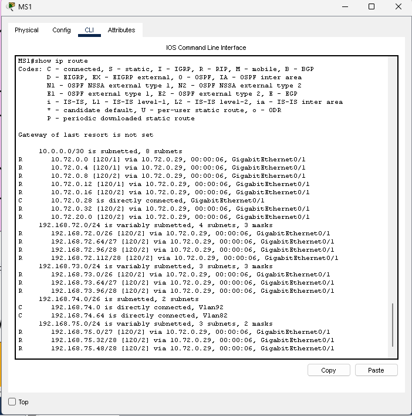

---

#### STP / Rapid PVST+ en Sede Norte

```bash
show spanning-tree vlan 52
show spanning-tree vlan 62
show spanning-tree vlan 72

! Apagar un enlace troncal redundante
interface <INTERFAZ_TRONCAL>
 shutdown

show spanning-tree vlan 52
show spanning-tree vlan 62
show spanning-tree vlan 72

! Restaurar enlace
interface <INTERFAZ_TRONCAL>
 no shutdown
```

1. Antes de la falla:
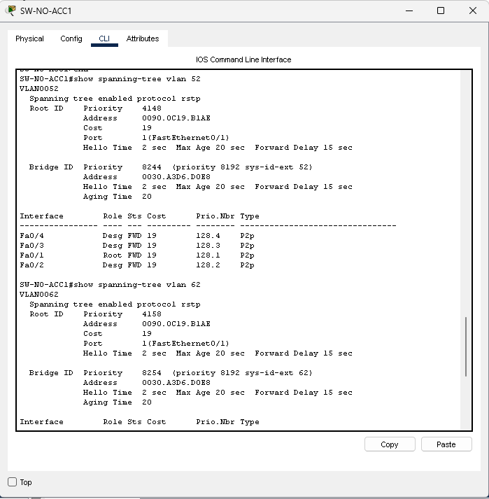

2. Después de apagar el enlace troncal redundante:
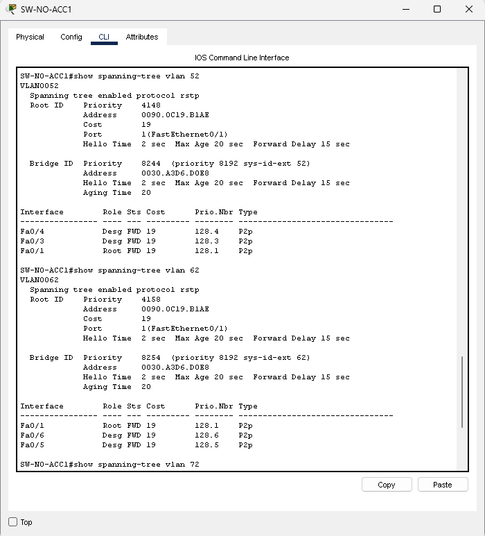

---

### 9.17 Evidencia de Alta Disponibilidad y Ruteo

Esta seccion consolida la evidencia obligatoria de conectividad, redistribucion de rutas y tolerancia a fallos.

#### 9.17.1 Convergencia total de la red (Pings end-to-end)

##### Objetivo

Demostrar conectividad de extremo a extremo entre sedes, incluyendo al menos una prueba desde Occidente hacia el Data Center.

##### Matriz minima de pruebas

| Origen | IP origen | Destino | IP destino | Ruta/protocolos esperados | Resultado |
|---|---|---|---|---|---|
| PC-CAJAS (Occidente) | 192.168.72.2 | SV-WEB-APPS1 (Data Center) | 192.168.75.2 | EIGRP + OSPF + Estaticas | Exitoso |
| PC-ANALISIS (Norte) | 192.168.73.2 | PC-PLAT1 (Oriente) | 192.168.74.4 | EIGRP + OSPF + RIP | Exitoso |
| PC-BOV1 (Oriente) | 192.168.74.68 | PC-NOC1 (Data Center) | 192.168.75.50 | RIP + OSPF + Estaticas | Exitoso |
| SV-CORE-BD1 (Data Center) | 192.168.75.34 | PC-ASESORES (Occidente) | 192.168.72.66 | Estaticas + OSPF + EIGRP | Exitoso |

##### Comandos sugeridos para evidencia

```bash
ping <IP_DESTINO>
tracert <IP_DESTINO>
```

##### Espacios para captura

> Insertar captura de ping exitoso Occidente -> Data Center (0% perdida o convergencia estable despues del primer eco).

#### PING ENTRE MISMA VLAN

1. PC-CAJAS1 (Occidente) -> PC-CAJA2 (Occidente):
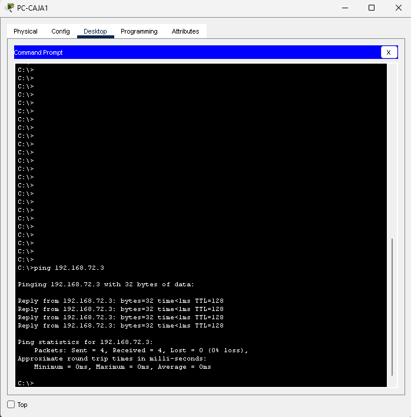

#### PING ENTRE DIFERENTES VLANs MISMA SEDE

2. PC-CAJAS1 (Occidente) -> PC-GERENCIA1 (Occidente):
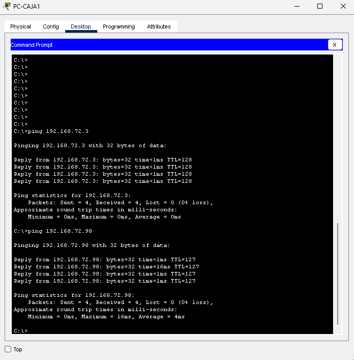

##### PING ENTRE DIFERENTES SEDES

3. PC-CAJAS1 (Occidente) -> SV-WEB-APPS1 (Data Center):
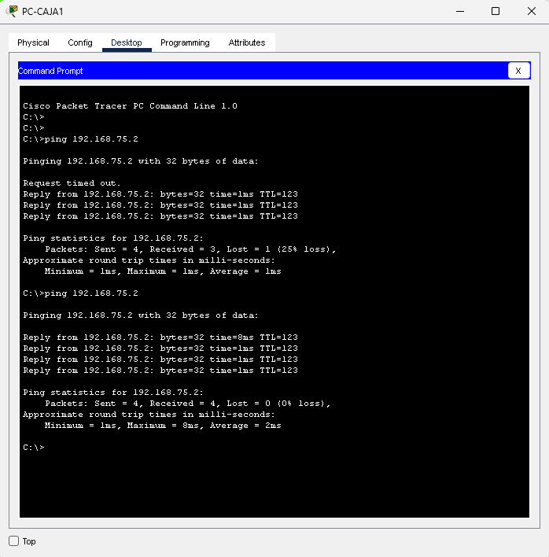

4. PC-GERENCIA1 (Occidente) -> PC-LEGAL2 (Norte):
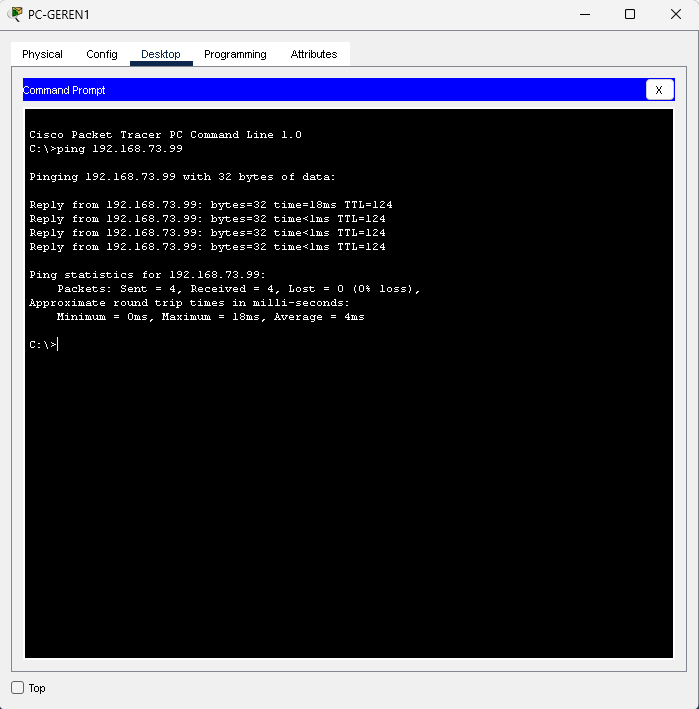
 
5. PC-PLATAFORMA1 (Oriente) -> PC-ANALISIS4 (Norte):
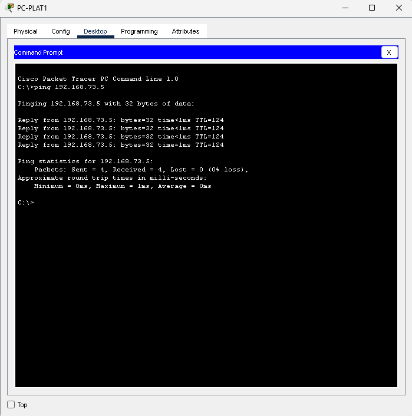

6. PC-LEGAL1 (Norte) -> PC-NOC2 (Data Center):
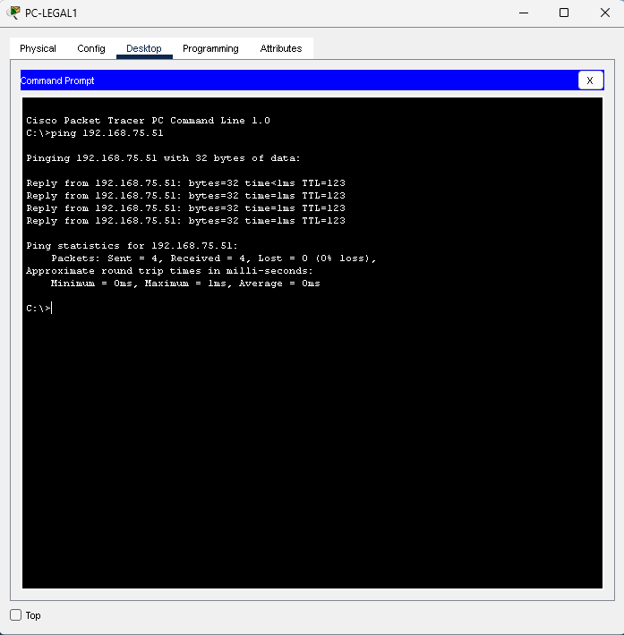

7. PC-BOVEDA1 (Oriente) -> SV-CORE-BD1 (CENTRAL):
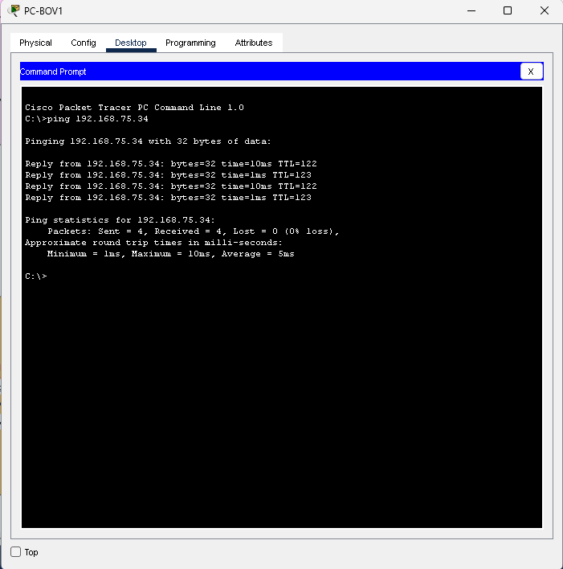

---

### 9.18 Guardado final de configuraciones

> Ejecutar este comando en todos los routers y switches después de finalizar la práctica.

```bash
copy running-config startup-config
```

O también:

```bash
write memory
```

---

## 10. Conclusiones Tecnicas

La red implementada cumple con una arquitectura multisede donde cada ubicacion tiene una segmentacion propia mediante VLANs y direccionamiento VLSM. El uso de /30 en enlaces WAN permite ahorrar direcciones y mantener enlaces punto a punto claros. En el backbone nacional, OSPF facilita la propagacion de rutas entre los CORE, mientras que EIGRP, RIP y rutas estaticas se integran mediante redistribucion en los puntos necesarios.

La sede Oriente se diseno con redundancia de puerta de enlace mediante HSRP, permitiendo que las VLANs Boveda y Plataforma tengan una puerta de enlace virtual estable. La sede Central utiliza EtherChannel LACP entre el switch de acceso y distribucion, aumentando disponibilidad y capacidad logica del enlace. Finalmente, las rutas estaticas del datacenter se redistribuyen hacia OSPF desde R-CENTRAL1, permitiendo que el resto de sedes alcance los servidores y equipos NOC.

---

## 11. Anexos de Evidencia

### 11.1 Captura de topologia completa


### 11.2 Captura de tablas de enrutamiento


### 11.3 Captura de pruebas de ping


### 11.4 Captura de HSRP


### 11.5 Captura de EtherChannel


### 11.6 Captura de STP


