# Manual - Proyecto 2: Parte Fisica

**Nombre:** Jairo Adelso Gomez Hernandez  
**Carnet:** 201902672  
**Curso:** Redes de Computadoras 1  
**Entorno:** VirtualBox + Maquinas Virtuales  
**Proyecto:** Red fisica simulada mediante virtualizacion con Kali Router, Linux Cliente y Windows Host

---

## 1. Resumen Ejecutivo

Este manual tecnico documenta la implementacion de una red fisica simulada mediante virtualizacion. La solucion utiliza una maquina virtual con **Kali Linux** configurada como router, una maquina virtual con **Lubuntu** configurada como cliente final y la computadora fisica con **Windows** como host local.

La practica tiene como finalidad demostrar comunicacion entre dos redes diferentes mediante enrutamiento en Linux. Para lograrlo, Kali utiliza dos interfaces principales: una interfaz **Host-Only** para comunicarse con Windows y una interfaz de **Red Interna** para comunicarse con la VM Lubuntu. Adicionalmente, se utilizo una tercera interfaz **NAT** en Kali de forma opcional para acceso a internet.

La comunicacion final esperada es:

```text
Windows Host 192.168.52.1
        |
        | Host-Only
        |
Kali Router 192.168.52.10 / 192.168.102.1
        |
        | Red Interna LAN_GOMEZ
        |
Lubuntu Cliente 192.168.102.20
```

El resultado final fue exitoso, ya que Windows logro comunicarse con la VM Lubuntu mediante el router Kali. La prueba `tracert` evidencio que el primer salto fue Kali y el segundo salto fue Lubuntu, demostrando el funcionamiento correcto del enrutamiento entre redes.

---

## 2. Objetivo del Proyecto

Implementar y configurar una red fisica simulada utilizando virtualizacion, donde Kali funcione como router Linux entre dos segmentos de red distintos:

- Red Host-Only: comunicacion entre Windows y Kali.
- Red Interna: comunicacion entre Kali y Lubuntu.

La solucion debe permitir conectividad real entre Windows y Lubuntu pasando obligatoriamente por Kali, utilizando direccionamiento IP estatico, rutas estaticas, reenvio IPv4 y pruebas de conectividad.

---

## 3. Parametros utilizados

Para el carnet **201902672**, se utilizo el ultimo digito del carnet como valor **X = 2**.

| Parametro | Valor utilizado |
|---|---|
| Carnet | 201902672 |
| Ultimo digito X | 2 |
| Red Host-Only | 192.168.52.0/24 |
| Red Interna | 192.168.102.0/24 |
| Red Interna VirtualBox | LAN_GOMEZ |
| Router Linux | Kali |
| Cliente Linux | Lubuntu |
| Host fisico | Windows |

---

## 4. Topologia implementada

### 4.1 Diagrama logico

```text
+-----------------------------+
| Windows Host Fisico         |
| VirtualBox Host-Only        |
| IP: 192.168.52.1/24         |
+-------------+---------------+
              |
              | Red Host-Only 192.168.52.0/24
              |
+-------------+---------------+
| VM Kali Router              |
| eth0: 192.168.52.10/24      |
| eth1: 192.168.102.1/24      |
| eth2: 10.0.4.15/24 NAT      |
+-------------+---------------+
              |
              | Red Interna LAN_GOMEZ
              | 192.168.102.0/24
              |
+-------------+---------------+
| VM Lubuntu Cliente          |
| enp0s3: 192.168.102.20/24   |
| Gateway: 192.168.102.1      |
+-----------------------------+
```


## 5. Dispositivos utilizados

| Dispositivo | Tipo | Sistema operativo | Funcion |
|---|---|---|---|
| Computadora fisica | Host | Windows | Equipo principal desde donde se realizan pruebas y captura con Wireshark |
| VM Kali | Maquina virtual | Kali Linux | Router Linux entre la red Host-Only y la red interna |
| VM Lubuntu | Maquina virtual | Lubuntu Linux | Cliente final ubicado en una red diferente a Windows |

---

## 6. Recursos asignados a las maquinas virtuales

### 6.1 VM Kali Router

| Recurso | Valor utilizado / recomendado |
|---|---|
| RAM | 2 GB recomendado |
| CPU | 1 o 2 nucleos |
| Disco | 20 GB dinamico recomendado |
| Adaptadores | 2 obligatorios + 1 NAT opcional |
| Entorno grafico | Opcional |

### 6.2 VM Lubuntu Cliente

| Recurso | Valor utilizado / recomendado |
|---|---|
| RAM | 1 GB o 2 GB |
| CPU | 1 nucleo |
| Disco | 10 GB o 20 GB dinamico |
| Adaptadores | 1 adaptador de Red Interna |
| Entorno grafico | Si, por ser Lubuntu |

---

## 7. Configuracion de adaptadores en VirtualBox

### 7.1 Adaptadores de VM Kali

| Adaptador | Tipo de red | Nombre | Proposito |
|---|---|---|---|
| Adaptador 1 | Adaptador solo-anfitrion / Host-Only | VirtualBox Host-Only Ethernet Adapter | Comunicacion con Windows |
| Adaptador 2 | Red Interna | LAN_GOMEZ | Comunicacion con Lubuntu |
| Adaptador 3 | NAT | NAT | Acceso opcional a internet |

#### Adaptador 1 de Kali

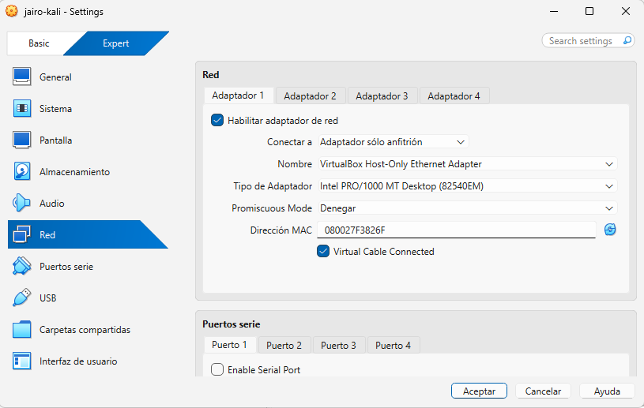

#### Adaptador 2 de Kali

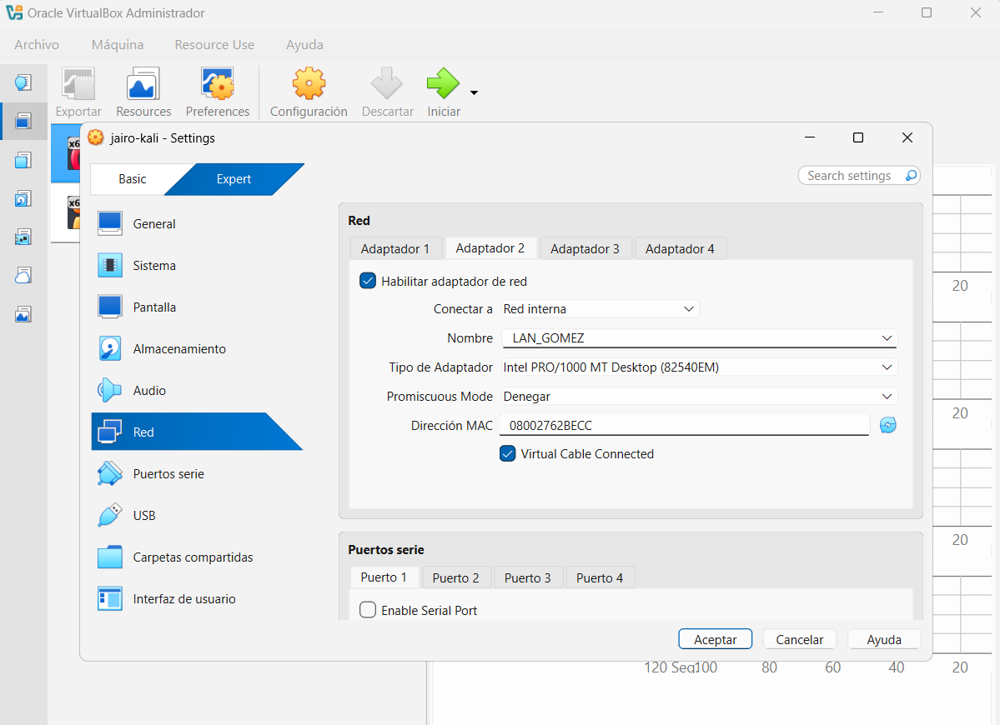

### 7.2 Adaptadores de VM Lubuntu

| Adaptador | Tipo de red | Nombre | Proposito |
|---|---|---|---|
| Adaptador 1 | Red Interna | LAN_GOMEZ | Comunicacion exclusiva con Kali |

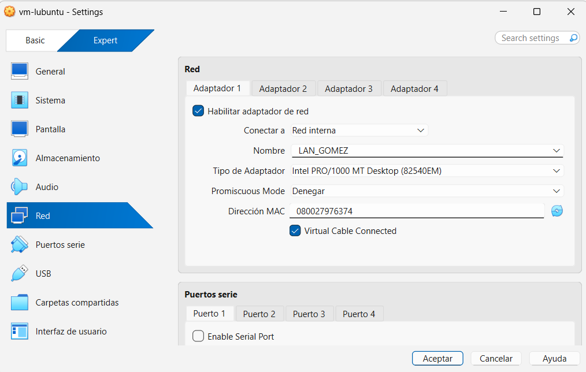

### 7.3 Adaptador Host-Only en Windows

El adaptador de VirtualBox en Windows se configuro manualmente con una IP estatica.

| Adaptador | IP | Mascara | Gateway |
|---|---|---|---|
| VirtualBox Host-Only Ethernet Adapter | 192.168.52.1 | 255.255.255.0 | Vacio |


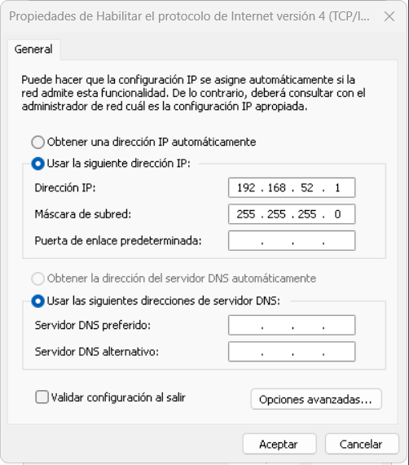

---

## 8. Tabla de direccionamiento IP

### 8.1 Resumen de redes

| Red | CIDR | Mascara | Gateway | Uso |
|---|---|---|---|---|
| Host-Only | 192.168.52.0/24 | 255.255.255.0 | 192.168.52.10 | Windows <-> Kali |
| Red Interna (LAN_GOMEZ) | 192.168.102.0/24 | 255.255.255.0 | 192.168.102.1 | Kali <-> Lubuntu |
| NAT | 10.0.4.0/24 | 255.255.255.0 | 10.0.4.2 | Salida opcional a Internet |

### 8.2 Direccionamiento por equipo

| Equipo | Interfaz | Red | IP/CIDR | Mascara | Gateway | Rol |
|---|---|---|---|---|---|---|
| Windows Host | VirtualBox Host-Only Ethernet Adapter | Host-Only | 192.168.52.1/24 | 255.255.255.0 | No aplica | Host local |
| Kali Router | eth0 | Host-Only | 192.168.52.10/24 | 255.255.255.0 | No aplica | Router (lado Host-Only) |
| Kali Router | eth1 | Red Interna (LAN_GOMEZ) | 192.168.102.1/24 | 255.255.255.0 | No aplica | Router (lado LAN interna) |
| Kali Router | eth2 | NAT | 10.0.4.15/24 | 255.255.255.0 | 10.0.4.2 | Salida a Internet (opcional) |
| Lubuntu Cliente | enp0s3 | Red Interna (LAN_GOMEZ) | 192.168.102.20/24 | 255.255.255.0 | 192.168.102.1 | Cliente final |

---

## 9. Configuracion aplicada en Kali Router

### 9.1 Verificacion inicial de interfaces

Comando utilizado:

```bash
ip -br addr
```

Resultado esperado despues de la configuracion:

```text
lo      UNKNOWN  127.0.0.1/8 ::1/128
eth0    UP       192.168.52.10/24
eth1    UP       192.168.102.1/24
eth2    UP       10.0.4.15/24
```

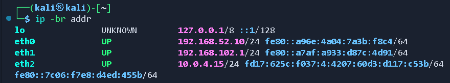

---

### 9.2 Configuracion de interfaces con nmcli

Para evitar que NetworkManager volviera a asignar IP por DHCP, se configuraron las conexiones como manuales.

Primero se listaron las conexiones:

```bash
nmcli connection show
```

Luego se configuro la conexion asociada a `eth0`:

```bash
sudo nmcli connection modify "Wired connection 1" ipv4.addresses 192.168.52.10/24
sudo nmcli connection modify "Wired connection 1" ipv4.method manual
sudo nmcli connection modify "Wired connection 1" ipv4.gateway ""
sudo nmcli connection modify "Wired connection 1" ipv4.dns ""
```

Despues se configuro la conexion asociada a `eth1`:

```bash
sudo nmcli connection modify "Wired connection 2" ipv4.addresses 192.168.102.1/24
sudo nmcli connection modify "Wired connection 2" ipv4.method manual
sudo nmcli connection modify "Wired connection 2" ipv4.gateway ""
sudo nmcli connection modify "Wired connection 2" ipv4.dns ""
```

Se reiniciaron las conexiones:

```bash
sudo nmcli connection down "Wired connection 1"
sudo nmcli connection up "Wired connection 1"

sudo nmcli connection down "Wired connection 2"
sudo nmcli connection up "Wired connection 2"
```

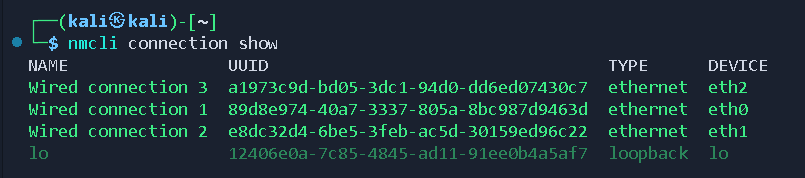

---

### 9.4 Activacion de forwarding IPv4 en Kali

Para que Kali funcione como router, se habilito el reenvio de paquetes IPv4.

Comando temporal:

```bash
sudo sysctl -w net.ipv4.ip_forward=1
```

Verificacion:

```bash
cat /proc/sys/net/ipv4/ip_forward
```

Resultado esperado:

```text
1
```

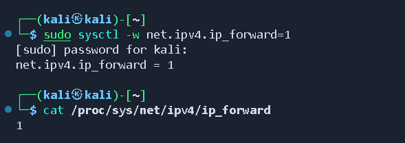

---

### 9.5 Configuracion permanente del forwarding

Para que Kali conserve el reenvio IPv4 activo despues de reiniciar, se creo un archivo permanente dentro de `/etc/sysctl.d/`.

Comando aplicado:

```bash
echo "net.ipv4.ip_forward=1" | sudo tee /etc/sysctl.d/99-ip-forward.conf
```

Luego se aplicaron todas las configuraciones de `sysctl`:

```bash
sudo sysctl --system
```

Verificacion:

```bash
cat /proc/sys/net/ipv4/ip_forward
```

Resultado esperado:

```text
1
```

Interpretacion:

- `1` significa que Kali esta reenviando paquetes IPv4 entre interfaces.
- `0` significa que Kali no esta actuando como router y Windows no podra llegar a Lubuntu.


---

### 9.6 Reglas de forwarding con iptables

Se permitio el reenvio de trafico entre interfaces:

```bash
sudo iptables -P FORWARD ACCEPT
```

Opcionalmente, se agregaron reglas explicitas entre las redes del proyecto:

```bash
sudo iptables -A FORWARD -i eth0 -o eth1 -s 192.168.52.0/24 -d 192.168.102.0/24 -j ACCEPT
sudo iptables -A FORWARD -i eth1 -o eth0 -s 192.168.102.0/24 -d 192.168.52.0/24 -j ACCEPT
```

Verificacion:

```bash
sudo iptables -L -v -n
```

Resultado esperado:

```text
Chain FORWARD (policy ACCEPT)
```

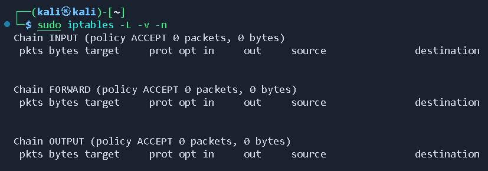

---

### 9.7 Tabla de rutas en Kali

Comando utilizado:

```bash
ip route
```

Resultado obtenido:

```text
default via 10.0.4.2 dev eth2 proto dhcp src 10.0.4.15 metric 102
10.0.4.0/24 dev eth2 proto kernel scope link src 10.0.4.15 metric 102
192.168.52.0/24 dev eth0 proto kernel scope link src 192.168.52.10 metric 104
192.168.102.0/24 dev eth1 proto kernel scope link src 192.168.102.1 metric 105
```

Interpretacion:

- Kali conoce directamente la red Host-Only `192.168.52.0/24` por `eth0`.
- Kali conoce directamente la red interna `192.168.102.0/24` por `eth1`.
- Kali tiene salida opcional a internet por NAT mediante `eth2`.


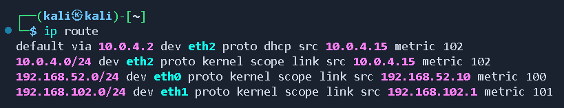

---

## 10. Configuracion aplicada en Lubuntu Cliente

### 10.1 Verificacion de interfaz

Comando utilizado:

```bash
ip -br addr
```

Inicialmente, la interfaz aparecio activa pero sin IPv4:

```text
enp0s3 UP
```

Esto fue normal porque la Red Interna no tiene DHCP. Por eso se configuro una IP estatica.

---

### 10.2 Configuracion con nmcli

La configuracion definitiva de Lubuntu se realizo con `nmcli`, para que la IP estatica no se pierda al apagar o reiniciar la maquina virtual.

Configuracion final requerida:

```text
Interfaz: enp0s3
Nombre de conexion: LAN_GOMEZ
IP: 192.168.102.20/24
Gateway: 192.168.102.1
```

Comandos aplicados en orden correcto:

```bash
# Ver interfaces y estado de NetworkManager
ip -br addr
nmcli device status
sudo systemctl enable --now NetworkManager

# Crear la conexion asociada a la interfaz de red interna
sudo nmcli connection add type ethernet ifname enp0s3 con-name LAN_GOMEZ

# Asignar primero direccion IP y gateway
sudo nmcli connection modify LAN_GOMEZ ipv4.addresses 192.168.102.20/24
sudo nmcli connection modify LAN_GOMEZ ipv4.gateway 192.168.102.1

# Luego cambiar el metodo IPv4 a manual
sudo nmcli connection modify LAN_GOMEZ ipv4.method manual

# Configuracion adicional
sudo nmcli connection modify LAN_GOMEZ ipv6.method ignore
sudo nmcli connection modify LAN_GOMEZ connection.interface-name enp0s3
sudo nmcli connection modify LAN_GOMEZ connection.autoconnect yes

# Reiniciar la conexion
sudo nmcli connection down LAN_GOMEZ
sudo nmcli connection up LAN_GOMEZ
```

Si existia un segundo adaptador NAT temporal como `enp0s8`, se desconecto para que no interfiriera con la practica:

```bash
sudo nmcli device disconnect enp0s8
```

Verificacion final:

```bash
ip -br addr
ip route
```

Resultado obtenido/esperado:

```text
lo      UNKNOWN  127.0.0.1/8 ::1/128
enp0s3  UP       192.168.102.20/24
enp0s8  UP       sin IPv4
```

```text
default via 192.168.102.1 dev enp0s3 proto static metric 102
192.168.102.0/24 dev enp0s3 proto kernel scope link src 192.168.102.20 metric 102
```

Interpretacion:

- Lubuntu tiene IP estatica en la red interna `LAN_GOMEZ`.
- El gateway de Lubuntu es `192.168.102.1`, que pertenece a Kali en `eth1`.
- El trafico hacia redes externas sale por Kali.

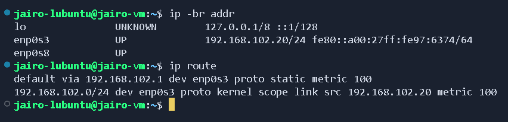

---

## 11. Configuracion aplicada en Windows Host

### 11.1 Configuracion del adaptador Host-Only

En Windows se configuro el adaptador **VirtualBox Host-Only Ethernet Adapter** con IP estatica:

```text
Direccion IP: 192.168.52.1
Mascara: 255.255.255.0
Gateway: vacio
DNS: vacio
```

Comando de verificacion:

```powershell
ipconfig
```

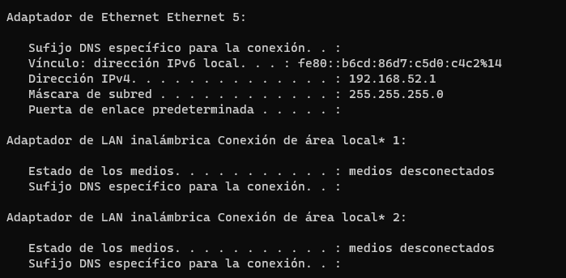

---

### 11.2 Ruta estatica hacia la red de Lubuntu

Windows no conoce directamente la red `192.168.102.0/24`, por lo que se agrego una ruta estatica usando como siguiente salto al router Kali.

Comando utilizado en PowerShell como administrador:

```powershell
route -p add 192.168.102.0 mask 255.255.255.0 192.168.52.10
```

Verificacion:

```powershell
route print
```

Ruta esperada:

```text
192.168.102.0    255.255.255.0    192.168.52.10    192.168.52.1
```

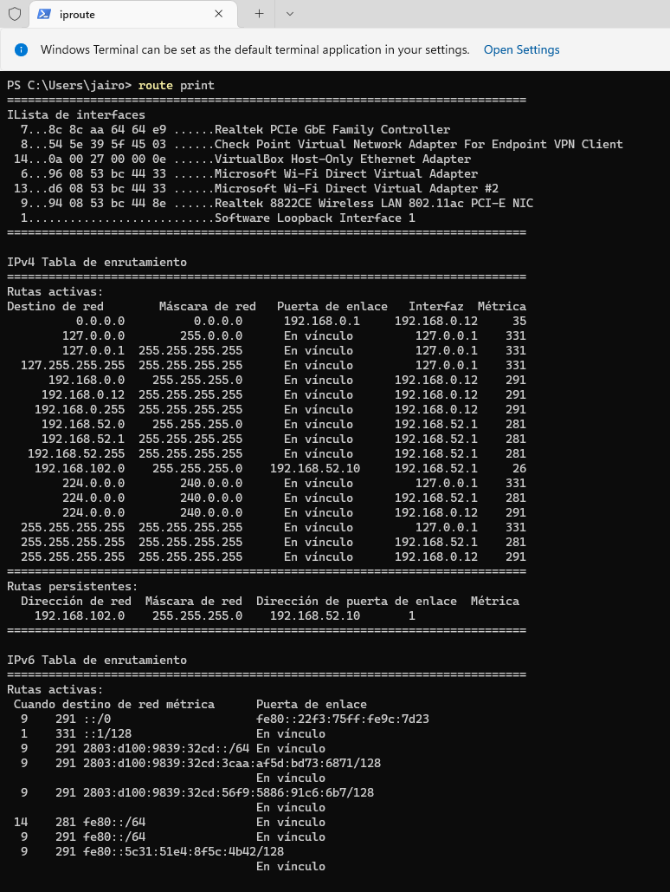

---

### 11.3 Permitir ICMP en firewall de Windows

Para permitir respuestas ICMP en Windows se agrego la siguiente regla:

```powershell
netsh advfirewall firewall add rule name="Permitir ICMPv4 VirtualBox" protocol=icmpv4:8,any dir=in action=allow
```

---

## 12. Pruebas de conectividad

### 12.1 Matriz de pruebas realizadas

| Origen | Destino | Comando | Resultado esperado | Estado |
|---|---|---|---|---|
| Windows | Kali eth0 | `ping 192.168.52.10` | Respuesta exitosa | Exitoso |
| Kali | Windows Host-Only | `ping 192.168.52.1` | Respuesta exitosa | Exitoso |
| Kali | Lubuntu | `ping 192.168.102.20` | Respuesta exitosa | Exitoso |
| Lubuntu | Kali eth1 | `ping 192.168.102.1` | Respuesta exitosa | Exitoso |
| Lubuntu | Kali eth0 | `ping 192.168.52.10` | Respuesta exitosa | Exitoso |
| Windows | Lubuntu | `ping 192.168.102.20` | Respuesta exitosa pasando por Kali | Exitoso |
| Windows | Lubuntu | `tracert -d 192.168.102.20` | Salto 1 Kali, salto 2 Lubuntu | Exitoso |

---

### 12.2 Evidencia de ping Windows hacia Kali

Comando:

```powershell
ping 192.168.52.10
```

Resultado obtenido:

```text
Respuesta desde 192.168.52.10: bytes=32 tiempo<1m TTL=64
Paquetes: enviados = 4, recibidos = 4, perdidos = 0
```

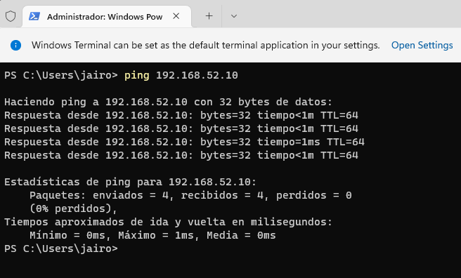

---

### 12.3 Evidencia de ping Windows hacia Lubuntu

Comando:

```powershell
ping 192.168.102.20
```

Resultado obtenido:

```text
Respuesta desde 192.168.102.20: bytes=32 tiempo<1m TTL=63
Paquetes: enviados = 4, recibidos = 4, perdidos = 0
```

Interpretacion:

El valor `TTL=63` indica que el paquete paso por un router. En este caso, el router fue Kali, por lo que el TTL se redujo en 1 al atravesar el dispositivo de capa 3.

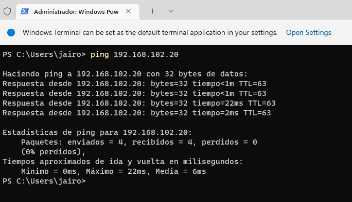

---

### 12.4 Evidencia de tracert Windows hacia Lubuntu

Comando:

```powershell
tracert -d 192.168.102.20
```

Resultado obtenido:

```text
Traza a 192.168.102.20 sobre caminos de 30 saltos como maximo.

  1    <1 ms    <1 ms    <1 ms  192.168.52.10
  2     1 ms    <1 ms    <1 ms  192.168.102.20

Traza completa.
```

Interpretacion:

La traza demuestra que el trafico no llega directamente desde Windows a Lubuntu. Primero pasa por Kali `192.168.52.10`, y luego llega al cliente Lubuntu `192.168.102.20`.

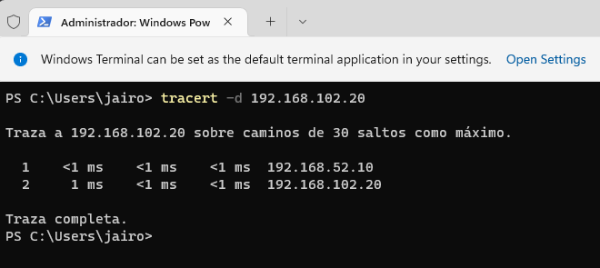

---

### 12.5 Pruebas desde Lubuntu

Comandos recomendados:

```bash
ping 192.168.102.1
ping 192.168.52.10
ping 192.168.52.1
```

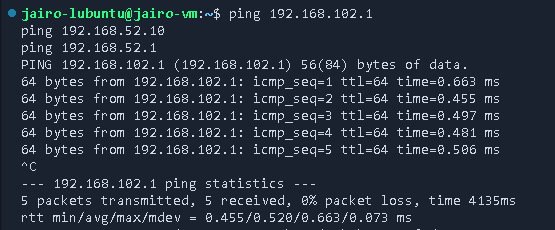
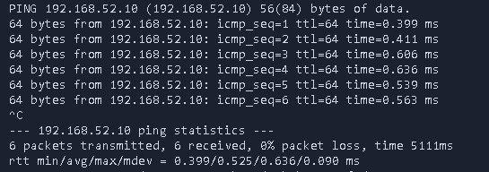
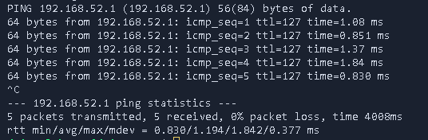

---

### 12.6 Pruebas desde Kali

Comandos recomendados:

```bash
ping 192.168.52.1
ping 192.168.102.20
```

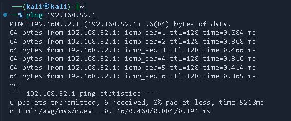
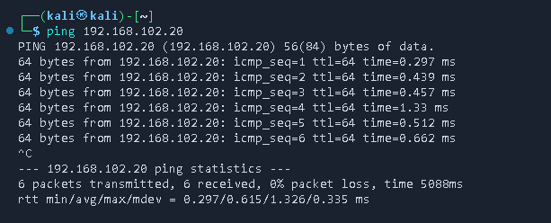

---

## 13. Analisis con Wireshark

### 13.1 Objetivo del analisis

El objetivo del analisis con Wireshark es observar el comportamiento del trafico cuando Windows se comunica con una maquina ubicada en otra red. Para esta practica se capturo trafico ICMP y ARP generado por las pruebas de `ping` y `tracert`.

---

### 13.2 Interfaz para captura de datos:

En Windows tenemos herramientas que nos permite capturar datos en redes, por ejemplo wireshark en el cual utiliza la interfaz:

```text
VirtualBox Host-Only Ethernet Adapter
```

Esta interfaz permite observar el trafico entre Windows y Kali.

#### Interfaz de Wireshark

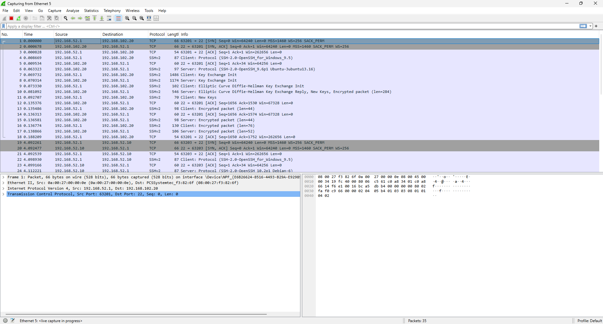

---

### 13.3 Filtros utilizados

| Objetivo | Filtro Wireshark |
|---|---|
| Ver paquetes de ping | `icmp` |
| Ver resolucion ARP | `arp` |
| Ver trafico entre Windows y Lubuntu | `ip.addr == 192.168.52.1 && ip.addr == 192.168.102.20` |
| Ver trafico relacionado con Kali Host-Only | `ip.addr == 192.168.52.10` |
| Ver trafico relacionado con Lubuntu | `ip.addr == 192.168.102.20` |
| Ver trafico de Windows | `ip.addr == 192.168.52.1` |

---

### 13.4 Captura de trafico ICMP

Procedimiento:

1. Abrir Wireshark en Windows.
2. Seleccionar la interfaz `VirtualBox Host-Only Ethernet Adapter`.
3. Iniciar captura.
4. Ejecutar en PowerShell:

```powershell
ping 192.168.102.20
```

5. Aplicar filtro:

```text
icmp
```

Resultado esperado:

- Se deben observar paquetes `Echo request` desde Windows hacia Lubuntu.
- Se deben observar paquetes `Echo reply` desde Lubuntu hacia Windows.
- El trafico pasa por Kali, ya que Windows envia la trama Ethernet hacia la MAC de Kali en la red Host-Only.

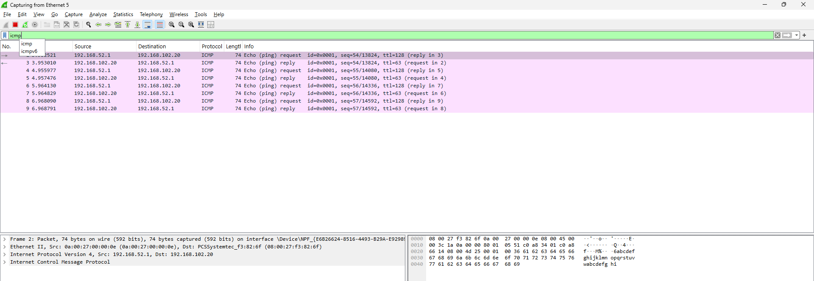

---

### 13.5 Captura de trafico ARP

Procedimiento:

1. Iniciar captura en Wireshark.
2. Limpiar cache ARP si se desea generar nuevamente solicitudes ARP.
3. Ejecutar ping desde Windows hacia Kali o Lubuntu.
4. Aplicar filtro:

```text
arp
```

Resultado esperado:

- Windows utiliza ARP para conocer la direccion MAC de Kali `192.168.52.10`.
- Windows no busca directamente la MAC de Lubuntu, porque Lubuntu esta en otra red.
- Para llegar a otra red, Windows entrega la trama al gateway Kali.

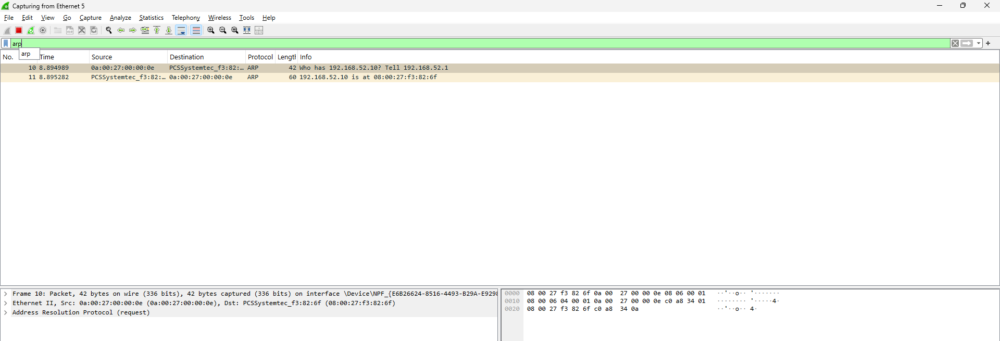

---

### 13.6 Explicacion de protocolos observados

#### ICMP

El comando `ping` utiliza el protocolo **ICMP**. Este protocolo permite enviar mensajes de tipo `Echo request` y recibir respuestas `Echo reply`. En este proyecto se uso para comprobar conectividad entre Windows, Kali y Lubuntu.

#### ARP

ARP se utiliza para resolver una direccion IP local a una direccion MAC. Por ejemplo, Windows necesita conocer la MAC de Kali para enviarle tramas dentro de la red Host-Only.

#### Direccion MAC destino cuando el trafico va hacia otra red

Cuando Windows envia trafico hacia `192.168.102.20`, no utiliza como MAC destino la MAC de Lubuntu, porque Lubuntu esta en otra red. Windows utiliza como MAC destino la direccion MAC de Kali en la interfaz Host-Only, porque Kali es el siguiente salto para llegar a la red `192.168.102.0/24`.

#### TTL

El TTL disminuye en 1 cuando el paquete pasa por un router. En la prueba realizada, el ping hacia Lubuntu respondio con `TTL=63`, lo cual confirma que el paquete atraveso Kali antes de llegar a Windows.

---

### 13.7 Analisis escrito de Wireshark

> En esta seccion se deben pegar capturas de Wireshark y explicar brevemente que se observa.

#### Captura 1: ICMP Windows hacia Lubuntu

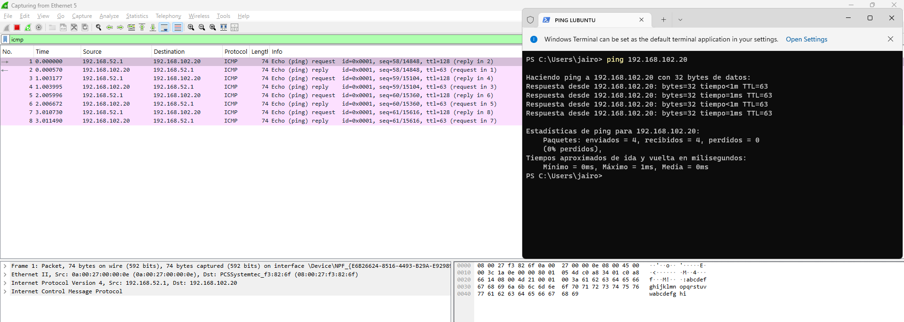

Explicacion:

```text
En esta captura se observan paquetes ICMP Echo Request y Echo Reply. El origen logico es Windows y el destino logico es Lubuntu. Aunque la IP destino es 192.168.102.20, la trama de capa 2 se envia hacia Kali porque es el router de salida desde la red 192.168.52.0/24.
```

#### Captura 2: ARP Windows hacia Kali

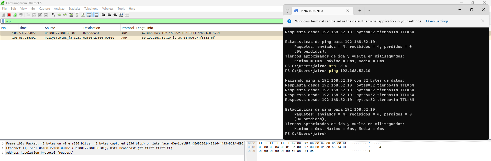

Explicacion:

```text
En esta captura se observa la resolucion ARP para identificar la MAC asociada a 192.168.52.10. Esta IP corresponde a Kali en la red Host-Only. Windows necesita esta MAC para enviar paquetes hacia redes externas mediante Kali.
```

#### Captura 3: Tracert hacia Lubuntu

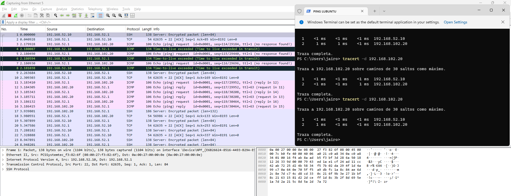

Explicacion:

```text
El tracert demuestra que el primer salto es 192.168.52.10, correspondiente al router Kali. El segundo salto es 192.168.102.20, correspondiente al cliente Lubuntu. Esto confirma que la comunicacion entre Windows y Lubuntu se realiza mediante enrutamiento.
```

---

### 16.6 Tabla de direccionamiento IP utilizada

| Equipo | Interfaz / Adaptador | Red | IP/CIDR | Gateway | Funcion |
|---|---|---|---|---|---|
| Windows Host | VirtualBox Host-Only Ethernet Adapter | Host-Only | 192.168.52.1/24 | Vacio | Host fisico y punto de pruebas |
| Kali Router | eth0 | Host-Only | 192.168.52.10/24 | No aplica | Interfaz hacia Windows |
| Kali Router | eth1 | LAN_GOMEZ | 192.168.102.1/24 | No aplica | Gateway de Lubuntu |
| Kali Router | eth2 | NAT | 10.0.4.15/24 | 10.0.4.2 | Internet opcional |
| Lubuntu Cliente | enp0s3 | LAN_GOMEZ | 192.168.102.20/24 | 192.168.102.1 | Cliente Linux |

---

### 16.7 Como conectarse a las VM por SSH

**Habilitar SSH en Kali**

```bash
sudo apt update
sudo apt install openssh-server -y
sudo systemctl enable --now ssh
```

Conexion desde Windows:

```powershell
ssh kali@192.168.52.10
```


**Habilitar SSH en Lubuntu**

```bash
sudo apt update
sudo apt install openssh-server -y
sudo systemctl enable --now ssh
```

Conexion desde Windows:

```powershell
ssh jairo-lubuntu@192.168.102.20
```

---


## 18. Conclusiones tecnicas

La practica permitio implementar una red fisica simulada con sistemas operativos reales virtualizados. Kali funciono correctamente como router Linux al tener dos interfaces en redes distintas y el reenvio IPv4 habilitado. La computadora Windows pudo comunicarse con Lubuntu mediante una ruta estatica que apuntaba hacia Kali como siguiente salto.

La prueba de `ping` desde Windows hacia Lubuntu confirmo conectividad extremo a extremo con 0% de perdida. Ademas, la prueba `tracert` demostro que el trafico paso primero por `192.168.52.10`, correspondiente a Kali, antes de llegar a `192.168.102.20`, correspondiente a Lubuntu.

Finalmente, el analisis con Wireshark permite evidenciar el uso de ICMP para las pruebas de conectividad, ARP para la resolucion de direcciones MAC dentro de la red local y la reduccion del TTL cuando un paquete atraviesa un router.

---
