# Manual Técnico — Tarea 3: Configuración de VLANs y VTP en Red Corporativa

**Nombre:** Jairo Adelso Gomez Hernandez
**Carnet:** 201902672  
**Curso:** Redes de Computadoras 1  
**Repositorio:** `Redes1_1S_2026_201902672/Tarea3_201902672`  
**Entorno de Simulación:** Cisco Packet Tracer  

---

## 1. Resumen

En este documento se muestra configuración e implementación de **VLANs (Virtual Local Area Networks)** y el protocolo **VTP (VLAN Trunking Protocol)** en una red corporativa segmentada por departamentos. La tarea integra tres departamentos (Ventas, Administración y Mercadeo) mediante una arquitectura de red virtual que optimiza el tráfico, mejora la seguridad y permite la administración centralizada de VLANs.

---

## 2. Objetivos Técnicos

1. Diseñar y segmentar la red corporativa en tres VLANs independientes según la estructura departamental.
2. Configurar el protocolo **VTP (VLAN Trunking Protocol)** para sincronización automática de VLANs.
3. Establecer un switch como **Servidor VTP** (Central_Server) y otros como **Clientes VTP** (Ventas, Mercadeo).
4. Configurar un switch en modo **VTP Transparent** (Administración) para independencia local.
5. Implementar **troncal (trunk)** entre switches para permitir tráfico de múltiples VLANs.
6. Validar la segmentación de la red y el aislamiento de broadcast entre departamentos.
7. Demostrar la convergencia de la red mediante pruebas de conectividad y análisis de paquetes.

---

## 3. Arquitectura de Red Corporativa

### 3.1 Estructura Lógica de VLANs

La red corporativa se segmenta en tres VLANs independientes, cada una representando un departamento:

| VLAN ID | Nombre | Departamento | Rol | Switchs Asociados |
| :---: | :--- | :--- | :--- | :--- |
| **10** | ventas | Ventas | Operativo | VENTAS |
| **20** | admin | Administración | Dirección | ADMIN |
| **30** | merca | Mercadeo | Estrategia | MERCA |

### 3.2 Topología Física de Switches

```
                    ┌─────────────────────────┐
                    │   Central_Server (VTP)  │
                    │   Servidor VTP          │
                    └────────────┬────────────┘
                                 │ Troncal
                    ┌────────────┼────────────┐
                    │            │            │
           ┌────────▼────────┐  │   ┌─────────▼──────────┐
           │  VENTAS      │  │   │  MERCA         │
           │  VTP Cliente    │  │   │  VTP Cliente      │
           │  VLAN 10        │  │   │  VLAN 30          │
           └─────────────────┘  │   └───────────────────┘
                                │
                    ┌───────────▼────────────┐
                    │  ADMIN              │
                    │  VTP Transparent       │
                    │  VLAN 20 (Local)       │
                    └────────────────────────┘
```

---

## 4. Requerimientos y Estándares Aplicados

### 4.2 Protocolos de Configuración

#### 4.2.1 VTP (VLAN Trunking Protocol)

VTP es un protocolo de capa 2 que sincroniza automáticamente la configuración de VLANs entre múltiples switches, eliminando la necesidad de configurar manualmente cada VLAN en cada dispositivo.

**Modos de operación VTP:**

- **Servidor:** Autoridad central que crea, modifica y elimina VLANs. Estos cambios se propagan a los clientes.
- **Cliente:** Sincroniza automáticamente con el servidor. No puede crear ni modificar VLANs localmente.
- **Transparent:** Funciona de manera independiente. No sincroniza ni acepta cambios de otros switches, pero sí reenvía anuncios VTP.

#### 4.2.2 Trunking (Enlace de Red Troncal)

Los puertos troncales permiten que múltiples VLANs transiten por un único enlace entre switches mediante el etiquetado IEEE 802.1Q.

---

## 5. Configuración de VLANs

### 5.1 Creación de VLANs en el Servidor VTP

A continuación se documenta el procedimiento de creación de las tres VLANs en el switch **Central_Server** (Servidor VTP):

#### Paso 1: Acceder al modo de configuración global

```cisco
enable
configure terminal
```

#### Paso 2: Crear VLAN 10 (Ventas)

```cisco
vlan 10
name ventas
exit
```

#### Paso 3: Crear VLAN 20 (Administración)

```cisco
vlan 20
name admin
exit
```

#### Paso 4: Crear VLAN 30 (Mercadeo)

```cisco
vlan 30
name merca
exit
```

#### Paso 5: Guardar configuración

```cisco
end
copy running-config startup-config
```

**Captura de pantalla de la creación de VLANs:**

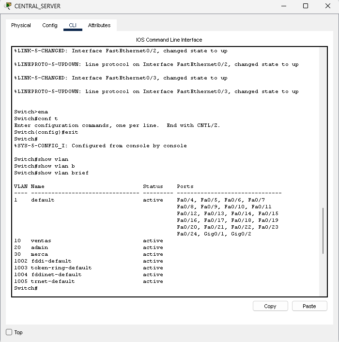

---

### 5.2 Asignación de Puertos a VLANs

#### En Switch Ventas (VENTAS)

Asignar puertos de acceso a VLAN 10:

```cisco
enable
configure terminal
interface range FastEthernet 0/1 - 5
switchport mode access
switchport access vlan 10
exit
```

#### En Switch Mercadeo (MERCA)

Asignar puertos de acceso a VLAN 30:

```cisco
enable
configure terminal
interface range FastEthernet 0/1 - 5
switchport mode access
switchport access vlan 30
exit
```

#### En Switch Administración (ADMIN)

Asignar puertos de acceso a VLAN 20:

```cisco
enable
configure terminal
interface range FastEthernet 0/1 - 5
switchport mode access
switchport access vlan 20
exit
```

**Captura de pantalla de asignación de puertos a VLANs:**

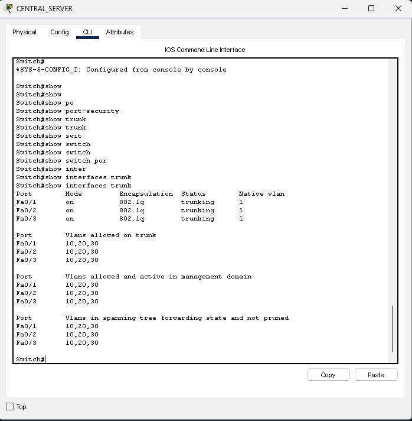

---

## 6. Configuración de VTP (VLAN Trunking Protocol)

### 6.1 Configuración del Servidor VTP (Central_Server)

#### Paso 1: Establecer modo VTP Servidor

```cisco
enable
configure terminal
vtp mode server
```

#### Paso 2: Habilitar VTP versión 2

```cisco
vtp version 2
```

#### Paso 3: Configurar dominio VTP

```cisco
vtp domain tarea3
vtp password 201902672
```

#### Paso 4: Guardar configuración

```cisco
end
copy running-config startup-config
```

**Configuración completa del Servidor VTP:**

```cisco
enable
configure terminal
vtp version 2
vtp mode server
vtp domain tarea3
vtp password 201902672
```

**Captura de pantalla de la configuración del Servidor VTP:**

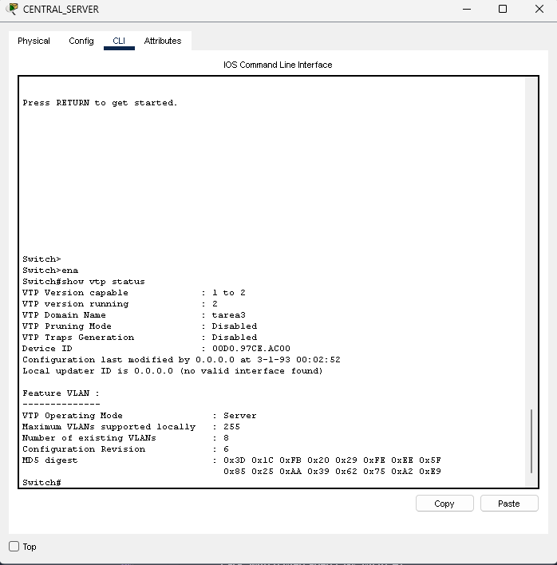
---

### 6.2 Configuración de Clientes VTP (VENTAS y MERCA)

#### Para Switch Ventas (VENTAS)

```cisco
enable
configure terminal
vtp version 2
vtp mode client
vtp domain tarea3
vtp password 201902672
exit
```

#### Para Switch Mercadeo (MERCA)

```cisco
enable
configure terminal
vtp version 2
vtp mode client
vtp domain tarea3
vtp password 201902672
exit

```

**Captura de pantalla de la configuración de Clientes VTP:**


---

### 6.3 Configuración de Modo Transparent VTP (ADMIN)

El switch de administración se configura en modo **Transparent** para mantener independencia en su configuración local:

```cisco
enable
configure terminal
vtp version 2
vtp mode transparent
vtp domain tarea3
vtp password 201902672
exit
```

**Acción requerida:** Como el switch Administración está en modo Transparent, es necesario crear la VLAN 20 localmente:

```cisco
enable
configure terminal
vlan 20
name admin
exit
```

**Captura de pantalla de la configuración de Transparent VTP:**


---

## 7. Configuración de Troncales (Trunking)

Los enlaces troncales interconectan los switches y permiten que múltiples VLANs transiten por un único enlace físico mediante etiquetado 802.1Q.

### 7.1 Configurar Puerto Troncal en Central_Server

```cisco
enable
configure terminal
interface fa 0/24
switchport mode trunk
switchport trunk allowed vlan 10,20,30

```

### 7.2 Configurar Puerto Troncal en VENTAS

```cisco
enable
configure terminal
interface fa 0/24
switchport mode trunk
switchport trunk allowed vlan 10,20,30
```

### 7.3 Configurar Puerto Troncal en MERCA

```cisco
enable
configure terminal
interface fa 0/24
switchport mode trunk
switchport trunk allowed vlan 10,20,30
```

### 7.4 Configurar Puerto Troncal en ADMIN

```cisco
enable
configure terminal
interface fa 0/24
switchport mode trunk
switchport trunk allowed vlan 10,20,30
```

**Captura de pantalla de la configuración de puertos troncales:**


---

## 8. Asignación de Direcciones IP a Dispositivos Finales

Se configuraron direcciones IP estáticas a los equipos terminales según su pertenencia a VLAN:

### .1 Departamento Ventas (VLAN 10)

| Equipo | Dirección IP | Máscara |   |
| :--- | :---: | :---: | :---: |
| PC1_VENTAS | `192.168.1.1` | 255.255.255.0 |
| PC2_VENTAS | `192.168.1.2` | 255.255.255.0 |
| PC3_VENTAS | `192.168.1.3` | 255.255.255.0 |

**Captura de pantalla de configuración Ventas:**

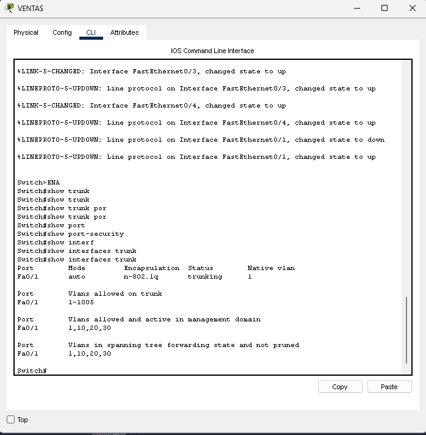

---

### 9.2 Departamento Administración (VLAN 20)

| Equipo | Dirección IP | Máscara | Puerta de Enlace |
| :--- | :---: | :---: | :---: |
| PC1_ADMIN | `192.168.1.6` | 255.255.255.0 |

**Captura de pantalla de configuración Administración:**

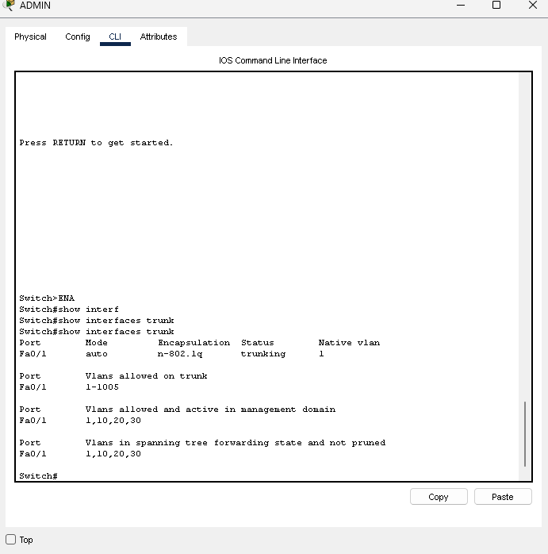

---

### 9.3 Departamento Mercadeo (VLAN 30)

| Equipo | Dirección IP | Máscara | Puerta de Enlace |
| :--- | :---: | :---: | :---: |
| PC1_MERCA | `192.168.1.4` | 255.255.255.0 |
| PC2_MERCA | `192.168.1.5` | 255.255.255.0 |

**Captura de pantalla de configuración Mercadeo:**

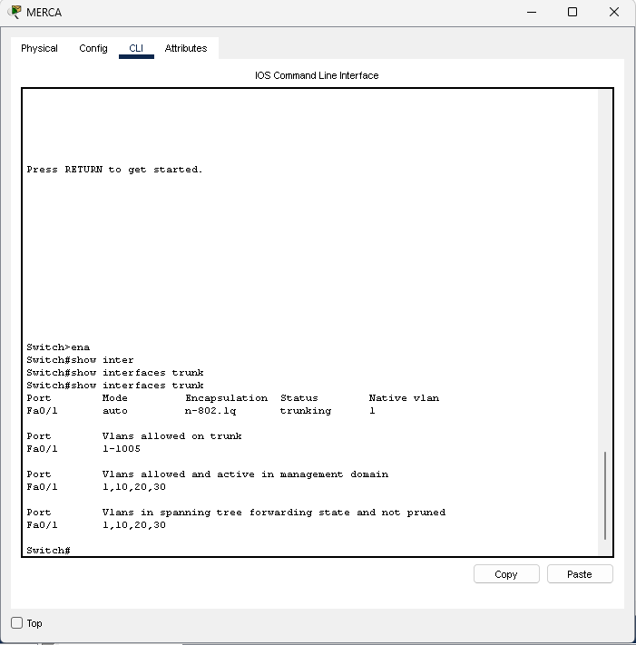

---

## 10. Validación de Configuración VTP

### 10.1 Verificación de Sincronización VTP

#### Comando para visualizar estado VTP

```cisco
show vtp status
```

**Salida esperada en Servidor VTP:**

```
VTP Version capable             : 1 to 2
VTP version running             : 2
VTP Domain Name                 : tarea3
VTP Pruning Mode                : Disabled
VTP Traps Generation            : Disabled
Device ID                       : 00D0.97CE.AC00
Configuration last modified by 0.0.0.0 at 3-1-93 00:02:52
Local updater ID is 0.0.0.0 (no valid interface found)

Feature VLAN : 
--------------
VTP Operating Mode                : Server
Maximum VLANs supported locally   : 255
Number of existing VLANs          : 8
Configuration Revision            : 6
MD5 digest                        : 0x3D 0x1C 0xFB 0x20 0x29 0xFE 0xEE 0x5F 
                                    0x85 0x25 0xAA 0x39 0x62 0x75 0xA2 0xE9 
```

**Captura de pantalla del estado VTP en Servidor:**

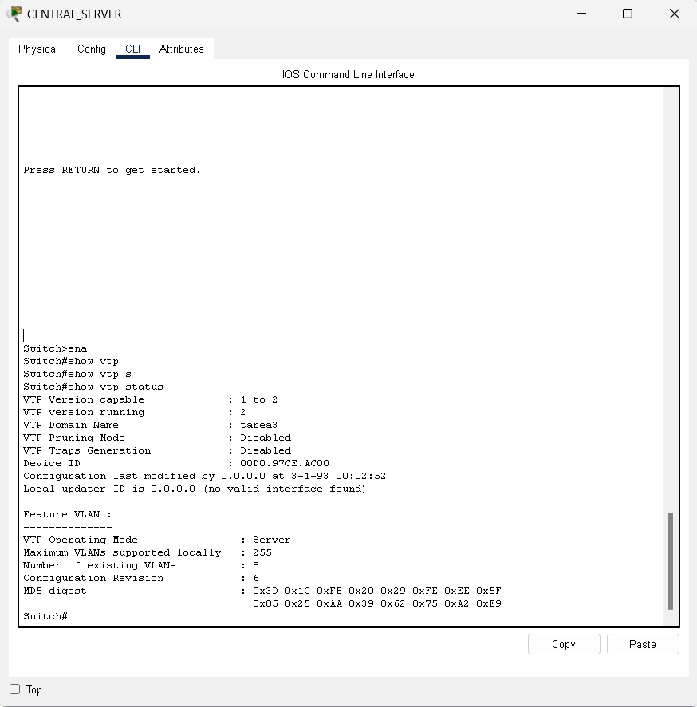

---

### 10.2 Verificación de VLANs Sincronizadas

#### Comando para listar VLANs

```cisco
show vlan brief
```

**Salida esperada en todos los switches Clientes:**

```
VLAN Name                             Status    Ports
---- -------------------------------- --------- -------------------------------
1    default                          active    Fa0/4, Fa0/5, Fa0/6, Fa0/7
                                                Fa0/8, Fa0/9, Fa0/10, Fa0/11
                                                Fa0/12, Fa0/13, Fa0/14, Fa0/15
                                                Fa0/16, Fa0/17, Fa0/18, Fa0/19
                                                Fa0/20, Fa0/21, Fa0/22, Fa0/23
                                                Fa0/24, Gig0/1, Gig0/2
10   ventas                           active    
20   admin                            active    
30   merca                            active    
1002 fddi-default                     active    
1003 token-ring-default               active    
1004 fddinet-default                  active    
1005 trnet-default                    active    
```

**Captura de pantalla de VLANs en Switch Clientes:**

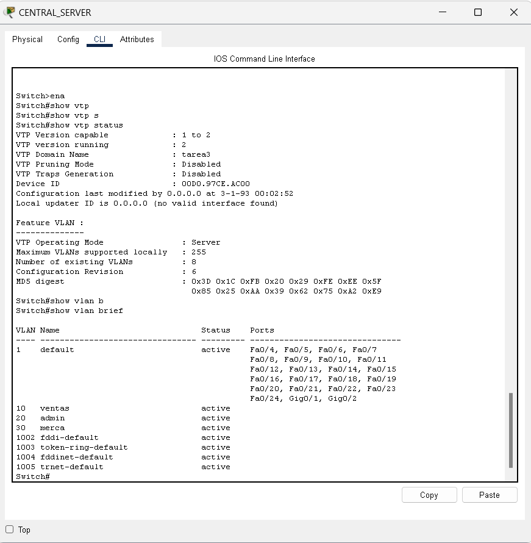

---

## 11. Validación de Conectividad

### 11.1 Pruebas dentro de la misma VLAN

#### Ping: Ventas a Ventas

Ping desde PC2_VENTAS a PC1_VENTAS:

```
C:\> ping 192.168.1.1
```

**Resultado esperado:** Éxito (0% pérdida)

**Captura de pantalla:**

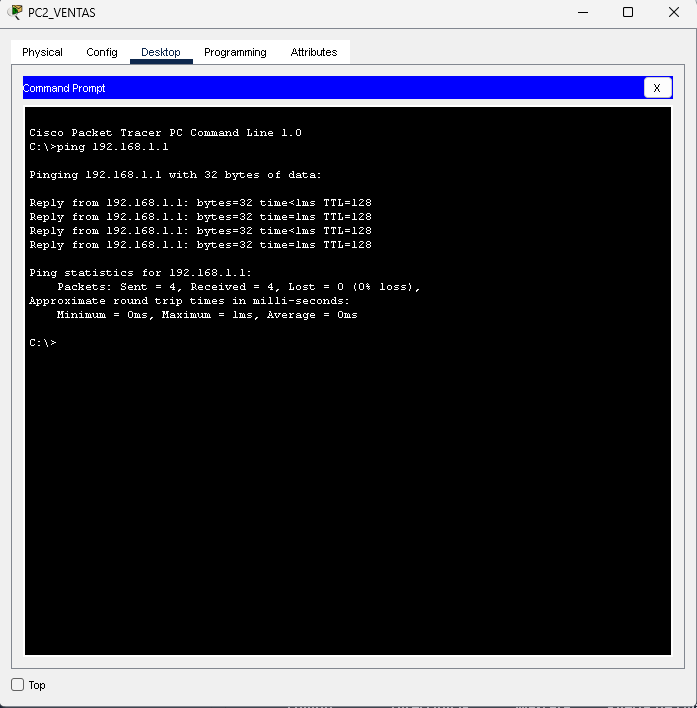

---

#### Ping: Mercadeo a Mercadeo

Ping desde PC2_MERCA a PC1_MERCA:

```
C:\> ping 192.168.1.4
```

**Resultado esperado:** Éxito (0% pérdida)

**Captura de pantalla:**

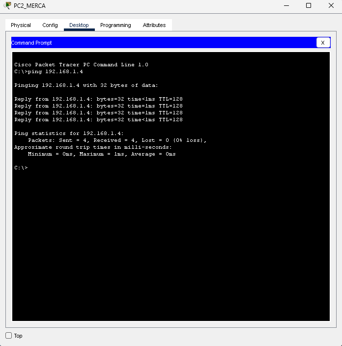

---

### 11.2 Pruebas entre VLANs diferentes

#### Ping: Ventas a Administración (sin router)

Ping desde PC1_VENTAS a PC1_ADMIN:

```
C:\> ping 192.168.1.6
```

**Resultado esperado:** Fallo (Destino inalcanzable)

**Justificación:** Sin un router configurado, las VLANs están completamente aisladas y no pueden comunicarse entre sí.

**Captura de pantalla:**

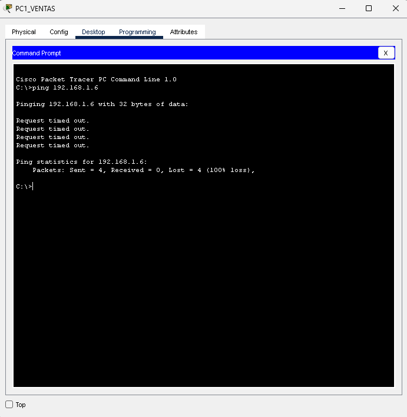

---

## 13. Topología de Red Implementada

### 13.1 Diagrama de Topología

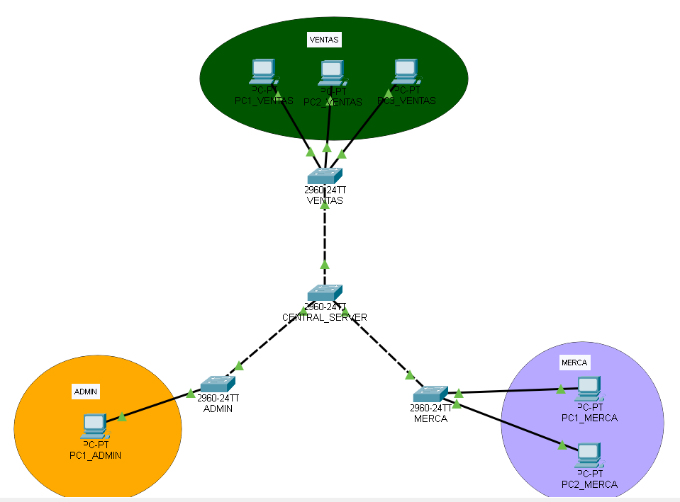

---

## 15. Conclusiones y Observaciones Técnicas

### 15.1 Beneficios de la Implementación VTP

- **Automatización:** Elimina la necesidad de configurar manualmente VLANs en cada switch.
- **Escalabilidad:** Al agregar nuevos switches clientes, automáticamente reciben la configuración de VLANs.
- **Consistencia:** Garantiza que todos los switches tengan la misma configuración de VLANs.
- **Seguridad:** El aislamiento de VLANs restringe el acceso entre departamentos.
